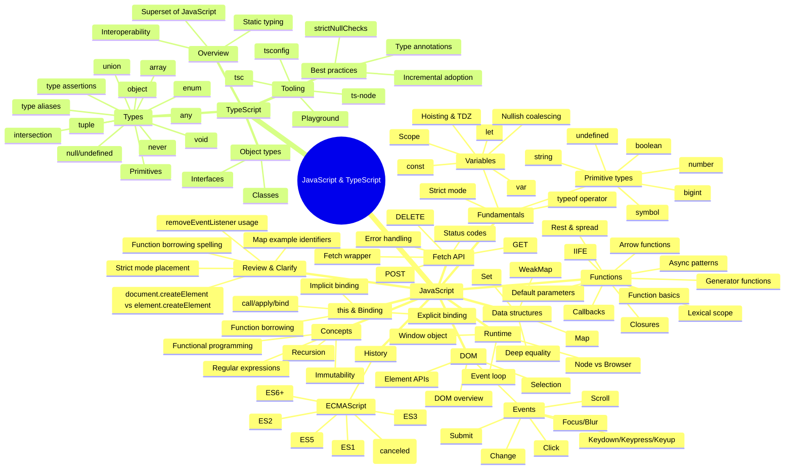

# Complete JavaScript and TypeScript Notes

This document consolidates the learning notes and annotated examples in this repository into one searchable reference. It preserves the full source notes while adding context about what each section contains, how the examples are intended to be used, and where the original material lives.

> [!IMPORTANT]
> The long breakdown files are educational notebooks. Their snippets cover browser, Node.js, and TypeScript contexts and are not necessarily designed to run together as one application. Run a focused example in the environment described by its surrounding notes.

## How to use this document

1. Start with the **concept map** for a high-level view.
2. Read the **handbook** when you need a concise explanation of a concept.
3. Follow a **roadmap** to turn the material into deliberate practice.
4. Consult the **complete annotated notes** for the full collection of examples and commentary.
5. Review the **mini-project examples** to see several concepts working together in browser code.

## Source index

| Section | Original source | Purpose |
| --- | --- | --- |
| Handbook | [`javascript-typescript-handbook.md`](javascript-typescript-handbook.md) | Concise JS/TS reference |
| Concept map | [`javascript-typescript-mindmap.md`](javascript-typescript-mindmap.md) | Visual topic navigation |
| JavaScript roadmap | [`javascript-roadmap.md`](javascript-roadmap.md) | JavaScript practice plan |
| TypeScript roadmap | [`typescript-roadmap.md`](typescript-roadmap.md) | TypeScript practice plan |
| JavaScript notebook | [`javascript-breakdown.js`](javascript-breakdown.js) | Full annotated JavaScript examples |
| TypeScript notebook | [`typescript-breakdown.notes.ts`](typescript-breakdown.notes.ts) | Full annotated TypeScript examples |
| Compiler configuration | [`tsconfig.json`](tsconfig.json) | TypeScript compiler settings |
| Guessing game | [`number-guessing-game v 1.0.0/script.js`](number-guessing-game%20v%201.0.0/script.js) | DOM and state example |
| Brew, Buddy & Burn | [`brew-buddy-burn v 1.0.0/script.js`](brew-buddy-burn%20v%201.0.0/script.js) | Validation and calculations example |
| Data fetcher | [`paginated-data-fetcher/script.js`](paginated-data-fetcher/script.js) | Generators and async example |

---

## JavaScript and TypeScript Handbook

A structured reference that explains the core JavaScript language, browser APIs, asynchronous execution, data structures, runtime behavior, and the TypeScript type system. Use this section for concept-first study and short, focused examples.

**Original source:** [`javascript-typescript-handbook.md`](javascript-typescript-handbook.md)

# JavaScript & TypeScript Handbook

A structured, detailed handbook for the existing JavaScript and TypeScript notes in this repository. This is organized for quick scanning, deeper study, and future expansion.

## Table of Contents

- [JavaScript](#javascript)
  - [1. Fundamentals](#1-fundamentals)
    - [1.1 Variables: `var`, `let`, `const`](#11-variables-var-let-const)
    - [1.2 Scope, Hoisting, and the TDZ](#12-scope-hoisting-and-the-tdz)
    - [1.3 Nullish Coalescing (`??`)](#13-nullish-coalescing-)
    - [1.4 Primitive Types](#14-primitive-types)
    - [1.5 Strict Mode](#15-strict-mode)
    - [1.6 `typeof`](#16-typeof)
  - [2. Functions](#2-functions)
    - [2.1 Function Declarations vs Expressions](#21-function-declarations-vs-expressions)
    - [2.2 Arrow Functions](#22-arrow-functions)
    - [2.3 Default Parameters](#23-default-parameters)
    - [2.4 Rest and Spread](#24-rest-and-spread)
    - [2.5 Closures and Lexical Scope](#25-closures-and-lexical-scope)
    - [2.6 IIFE (Immediately Invoked Function Expressions)](#26-iife-immediately-invoked-function-expressions)
    - [2.7 Generator Functions](#27-generator-functions)
    - [2.8 Callbacks and Async Patterns](#28-callbacks-and-async-patterns)
  - [3. `this` and Binding](#3-this-and-binding)
    - [3.1 Implicit Binding](#31-implicit-binding)
    - [3.2 Explicit Binding (`call`, `apply`, `bind`)](#32-explicit-binding-call-apply-bind)
    - [3.3 Function Borrowing](#33-function-borrowing)
  - [4. DOM](#4-dom)
    - [4.1 DOM Overview](#41-dom-overview)
    - [4.2 DOM Selection APIs](#42-dom-selection-apis)
    - [4.3 DOM Element APIs](#43-dom-element-apis)
    - [4.4 DOM Events](#44-dom-events)
  - [5. Fetch API](#5-fetch-api)
    - [5.1 GET, POST, DELETE](#51-get-post-delete)
    - [5.2 Error Handling](#52-error-handling)
    - [5.3 Status Codes](#53-status-codes)
    - [5.4 A Basic Fetch Wrapper](#54-a-basic-fetch-wrapper)
  - [6. Data Structures](#6-data-structures)
    - [6.1 Map](#61-map)
    - [6.2 WeakMap](#62-weakmap)
    - [6.3 Set](#63-set)
    - [6.4 Deep Equality](#64-deep-equality)
  - [7. Core Concepts](#7-core-concepts)
    - [7.1 Immutability](#71-immutability)
    - [7.2 Functional Programming](#72-functional-programming)
    - [7.3 Recursion](#73-recursion)
    - [7.4 Regular Expressions](#74-regular-expressions)
  - [8. Runtime & Environment](#8-runtime--environment)
    - [8.1 Window (Browser Global)](#81-window-browser-global)
    - [8.2 Event Loop](#82-event-loop)
    - [8.3 Browser vs Node.js](#83-browser-vs-nodejs)
  - [9. ECMAScript History](#9-ecmascript-history)
- [TypeScript](#typescript)
  - [1. What TypeScript Is](#1-what-typescript-is)
  - [2. Running TypeScript](#2-running-typescript)
  - [3. TS/JS Interoperability](#3-tsjs-interoperability)
  - [4. Installing & Configuring](#4-installing--configuring)
  - [5. Type System](#5-type-system)
    - [5.1 Primitive Types](#51-primitive-types)
    - [5.2 Object Types (Interfaces & Classes)](#52-object-types-interfaces--classes)
    - [5.3 Advanced Types](#53-advanced-types)
    - [5.4 Best Practices](#54-best-practices)

---

# JavaScript

## 1. Fundamentals

### 1.1 Variables: `var`, `let`, `const`

**What they are:**
- `var` is the original JavaScript variable declaration. It is **function-scoped** and can be **redeclared** and **reassigned**.
- `let` is **block-scoped** and can be **reassigned**, but **cannot be redeclared** in the same scope.
- `const` is **block-scoped** and cannot be **reassigned** or **redeclared**. (Note: objects declared with `const` can still have their internal properties mutated.)

**When to use:**
- Use `const` by default for values that should not be reassigned.
- Use `let` for values that must be reassigned.
- Avoid `var` in modern code unless you need legacy behavior.

**Example:**
```js
var count = 1;
let name = "Ada";
const pi = 3.14159;
```

### 1.2 Scope, Hoisting, and the TDZ

**Scope:**
- **Function scope** means the variable exists throughout the entire function.
- **Block scope** means the variable exists only inside `{ ... }` blocks.

**Hoisting:**
- Declarations are moved to the top of their scope during compilation.
- `var` is hoisted and initialized to `undefined`.
- `let` and `const` are hoisted but **not initialized**, which leads to the **Temporal Dead Zone (TDZ)**.

**TDZ (Temporal Dead Zone):**
- The time between entering a scope and the moment a `let` or `const` variable is declared.
- Accessing the variable in this window throws a `ReferenceError`.

**Example:**
```js
console.log(a); // undefined (var is hoisted and initialized)
var a = 10;

console.log(b); // ReferenceError (TDZ)
let b = 20;
```

### 1.3 Nullish Coalescing (`??`)

**Purpose:**
- Provide a fallback only when the left side is `null` or `undefined`.
- Unlike `||`, it does not treat `0`, `false`, or `""` as missing.

**Example:**
```js
const lastName = null;
const displayName = lastName ?? "Unknown"; // "Unknown"
```

### 1.4 Primitive Types

JavaScript has the following **primitive types**:
- `string`
- `number`
- `bigint`
- `boolean`
- `undefined`
- `symbol`
- `null` (special case: `typeof null` is `"object"` for historical reasons)

**Examples:**
```js
const name = "JavaScript"; // string
const age = 30; // number
const big = 123n; // bigint
const isReady = true; // boolean
let missing; // undefined
const id = Symbol("id"); // symbol
const empty = null; // null
```

### 1.5 Strict Mode

**What it does:**
- Enables a stricter parsing and error handling in JavaScript.
- Prevents common mistakes like implicit globals and duplicate parameters.

**How to enable:**
- At the top of a file: `"use strict";`
- Or inside a function to limit scope.

**Example:**
```js
"use strict";

function strictExample() {
  // strict mode applies here
}
```

### 1.6 `typeof`

**Purpose:**
- Returns a string representing the type of a value.

**Common results:**
- `typeof "hello"` → `"string"`
- `typeof 42` → `"number"`
- `typeof true` → `"boolean"`
- `typeof undefined` → `"undefined"`
- `typeof Symbol()` → `"symbol"`
- `typeof function() {}` → `"function"`
- `typeof null` → `"object"` (legacy quirk)

---

## 2. Functions

### 2.1 Function Declarations vs Expressions

**Declarations:**
- `function greet() { ... }`
- Hoisted entirely, so they can be called before they appear.

**Expressions:**
- `const greet = function() { ... }`
- Not hoisted in the same way; the variable is hoisted but not initialized.

### 2.2 Arrow Functions

**Key traits:**
- Shorter syntax.
- Do **not** have their own `this`, `arguments`, or `prototype`.

**Example:**
```js
const add = (a, b) => a + b;
```

### 2.3 Default Parameters

**What they do:**
- Provide fallback values when an argument is `undefined`.

**Example:**
```js
function greet(name = "World") {
  return `Hello, ${name}!`;
}
```

### 2.4 Rest and Spread

**Rest:**
- Collects remaining arguments into an array.

**Spread:**
- Expands an iterable into individual values.

**Example:**
```js
function sum(...nums) {
  return nums.reduce((total, n) => total + n, 0);
}

const values = [1, 2, 3];
console.log(...values); // 1 2 3
```

### 2.5 Closures and Lexical Scope

**Lexical scope:**
- A function can access variables defined in its outer scope.

**Closure:**
- When an inner function **remembers** variables from its creation scope, even after the outer function finishes.

**Example:**
```js
function outer() {
  const count = 0;
  return function inner() {
    return count + 1;
  };
}
```

### 2.6 IIFE (Immediately Invoked Function Expressions)

**Purpose:**
- Create a private scope to avoid polluting globals.

**Example:**
```js
(function () {
  const secret = "hidden";
})();
```

### 2.7 Generator Functions

**Purpose:**
- Pause and resume execution with `yield`.

**Example:**
```js
function* idGenerator() {
  yield 1;
  yield 2;
}

const gen = idGenerator();
console.log(gen.next()); // { value: 1, done: false }
```

### 2.8 Callbacks and Async Patterns

**Callbacks:**
- Functions passed into other functions and executed later.

**Async examples:**
- `setTimeout`, `fetch`, event listeners, file access.

**Example:**
```js
setTimeout(() => {
  console.log("Delayed");
}, 1000);
```

---

## 3. `this` and Binding

### 3.1 Implicit Binding

**Rule:**
- If a function is called as a method, `this` refers to the object before the dot.

**Example:**
```js
const user = {
  name: "Ada",
  greet() {
    return `Hi ${this.name}`;
  },
};
```

### 3.2 Explicit Binding (`call`, `apply`, `bind`)

**Purpose:**
- Force what `this` should be inside a function.

**Differences:**
- `call` invokes immediately with arguments.
- `apply` invokes immediately with arguments as an array.
- `bind` returns a new function with `this` fixed.

### 3.3 Function Borrowing

**What it is:**
- Reusing a method from one object on another via `call`, `apply`, or `bind`.

**Example:**
```js
const person = { name: "A", greet() { return this.name; } };
const other = { name: "B" };
console.log(person.greet.call(other)); // "B"
```

---

## 4. DOM

### 4.1 DOM Overview

**DOM (Document Object Model):**
- A tree-like representation of HTML.
- JavaScript can query and modify this structure.

### 4.2 DOM Selection APIs

**Common methods:**
- `document.getElementById()`
- `document.getElementsByClassName()`
- `document.querySelector()`
- `document.querySelectorAll()`

### 4.3 DOM Element APIs

**Common operations:**
- `element.classList.add/remove/toggle`
- `element.getAttribute()` / `setAttribute()`
- `element.textContent` / `innerHTML`
- `element.style.property`
- `element.remove()`

### 4.4 DOM Events

**Event patterns:**
- `addEventListener(event, handler)`
- `removeEventListener(event, handler)` (requires the **same handler reference**)

**Common events:**
- `click`, `change`, `focus`, `blur`, `keydown`, `scroll`, `submit`

---

## 5. Fetch API

### 5.1 GET, POST, DELETE

**GET:** retrieve data.
**POST:** send data.
**DELETE:** remove data.

### 5.2 Error Handling

- `fetch()` only rejects on network errors.
- For HTTP errors, check `response.ok`.

### 5.3 Status Codes

Common HTTP statuses:
- 200 OK
- 201 Created
- 204 No Content
- 400 Bad Request
- 401 Unauthorized
- 403 Forbidden
- 404 Not Found
- 500 Internal Server Error

### 5.4 A Basic Fetch Wrapper

```js
async function fetchWrapper(url, options) {
  const response = await fetch(url, options);
  if (!response.ok) {
    throw new Error("Network response was not ok");
  }
  return response.json();
}
```

---

## 6. Data Structures

### 6.1 Map

**What it is:**
- A key/value collection where keys can be any type.

**Why use it:**
- Predictable iteration order.
- Keys aren’t limited to strings.

### 6.2 WeakMap

**What it is:**
- A Map where keys must be objects and are **weakly referenced**.

**Why use it:**
- Useful for private data or caches that should be garbage collected.

### 6.3 Set

**What it is:**
- A collection of unique values.

**Common uses:**
- Deduplicating arrays.
- Fast membership checks.

### 6.4 Deep Equality

**Goal:**
- Compare objects by value rather than reference.

**Typical approach:**
- Recursively compare keys and values.

---

## 7. Core Concepts

### 7.1 Immutability

**Definition:**
- Once data is created, it is not changed in place.

**Why it matters:**
- Easier reasoning.
- Avoids unintended side effects.

### 7.2 Functional Programming

**Key ideas:**
- Pure functions
- Higher-order functions
- Immutability

### 7.3 Recursion

**Definition:**
- A function calling itself until a base case is met.

**Common examples:**
- Factorials
- Fibonacci sequences

### 7.4 Regular Expressions

**Definition:**
- Patterns for matching text.

**Core building blocks:**
- Literals (`/abc/`)
- Character classes (`/[aeiou]/`)
- Quantifiers (`+`, `*`, `{n}`)
- Anchors (`^`, `$`)

---

## 8. Runtime & Environment

### 8.1 Window (Browser Global)

**What it is:**
- The global object in browsers.
- Provides access to DOM, storage, location, and more.

### 8.2 Event Loop

**Purpose:**
- Coordinates synchronous code, macrotasks, and microtasks.
- Keeps the JS runtime responsive while handling async work.

### 8.3 Browser vs Node.js

**Browser:**
- Has DOM APIs and `window`.
- Focused on UI and events.

**Node.js:**
- Runs server-side.
- Provides filesystem, networking, and process APIs.

---

## 9. ECMAScript History

**ECMAScript** is the standard JavaScript implements.

**Milestones:**
- ES1 (1997): First standard.
- ES2 (1998): Minor fixes.
- ES3 (1999): Regular expressions, better string handling.
- ES4: Canceled.
- ES5 (2009): Strict mode, JSON, array methods.
- ES6/ES2015+: Classes, modules, arrow functions, let/const, etc.

---

# TypeScript

## 1. What TypeScript Is

TypeScript is a **superset of JavaScript** that adds **static typing** and other language features. It compiles to JavaScript, so it runs anywhere JavaScript runs.

**Why it matters:**
- Catches type errors earlier.
- Improves tooling (autocomplete, refactorings).
- Helps maintain large codebases.

---

## 2. Running TypeScript

**Typical workflow:**
1. Write TypeScript in `.ts` files.
2. Compile with `tsc`.
3. Run the output `.js` in Node.js or a browser.

**Direct execution:**
- `ts-node` lets you run `.ts` directly without a separate compile step.

---

## 3. TS/JS Interoperability

**Key idea:**
- Any valid JavaScript is valid TypeScript.
- You can incrementally migrate JS → TS.

**Type definitions:**
- Many JS libraries publish `.d.ts` files so TypeScript can understand them.

---

## 4. Installing & Configuring

**Install globally:**
```bash
npm install -g typescript
```

**Initialize config:**
```bash
tsc --init
```

**Common `tsconfig.json` options:**
- `target`
- `module`
- `strict`
- `outDir`
- `rootDir`
- `include` / `exclude`

---

## 5. Type System

### 5.1 Primitive Types

- `string`, `number`, `boolean`
- `null`, `undefined`
- `symbol`, `bigint`

### 5.2 Object Types (Interfaces & Classes)

**Interfaces:**
- Describe the shape of objects.
- Useful for structural typing.

**Classes:**
- Define blueprints with fields and methods.
- Support inheritance and encapsulation.

### 5.3 Advanced Types

**Examples:**
- `union` (`string | number`)
- `intersection` (`A & B`)
- `tuple` (`[string, number]`)
- `enum`
- `type aliases`
- `never` for impossible values

### 5.4 Best Practices

- Enable `strict` / `strictNullChecks` in most projects.
- Prefer explicit types at public boundaries.
- Keep type definitions close to the data they describe.

---

## JavaScript Concept Map

A Mermaid-based overview of how the repository's JavaScript and TypeScript topics relate. Use it to choose a topic, then follow the corresponding handbook or annotated-source section for details.

**Original source:** [`javascript-typescript-mindmap.md`](javascript-typescript-mindmap.md)

# JavaScript & TypeScript Concept Map

This mind map groups the existing JavaScript and TypeScript notes into a navigable concept structure.
It is designed to make relationships between topics easier to see and to highlight where to add or refine explanations.



## Suggested navigation pattern
- Use this map as the top-level index.
- Link each node to a dedicated section or file (if you want to split the notes later).
- Use the **Review & Clarify** branch as a backlog for tightening explanations and examples.

---

## JavaScript Practice Roadmap

A practice-first sequence that turns the JavaScript reference material into exercises, checkpoints, and a final integration project.

**Original source:** [`javascript-roadmap.md`](javascript-roadmap.md)

# JavaScript Learning Roadmap (Practice-First)

This roadmap is based on the topics covered in `javascript-breakdown.js` and turns them into a practical learning path.

## How to use this roadmap

- Move step by step.
- Build the mini-practice before moving forward.
- Keep one folder per step and commit your work.

---

## Step 1: Variables, Scope, and Hoisting

### Learn
- `var`, `let`, `const`
- Declaration vs initialization
- Block scope vs function scope
- Hoisting and Temporal Dead Zone (TDZ)
- Nullish coalescing (`??`)

### Practice
1. Create `01-variables.js` with 8-10 examples using `var`, `let`, and `const`.
2. Write one snippet that fails because of TDZ, then fix it.
3. Build a small `profile` object and safely default missing fields with `??`.

### Checkpoint
- You can explain when **not** to use `var`.
- You can predict which lines fail before running the file.

---

## Step 2: Primitive Types and Core Values

### Learn
- `string`, `number`, `undefined`, `null`, `boolean`, `bigint`
- Template literals
- `typeof` basics

### Practice
1. Create `02-types.js` and log examples of each primitive.
2. Convert user input strings to numbers and handle invalid values.
3. Create one `bigint` exercise using values larger than `Number.MAX_SAFE_INTEGER`.

### Checkpoint
- You understand when `bigint` is useful.
- You can avoid accidental string-number concatenation bugs.

---

## Step 3: DOM Fundamentals

### Learn
- `document.querySelector`
- Selecting elements by id/class
- Reading/updating text and values

### Practice
1. Build a one-page “Live Greeting” app:
   - Input for name
   - Button to update greeting text
2. Add validation for empty input.

### Checkpoint
- You can select elements reliably and update the UI from JS.

---

## Step 4: Events and Event Objects

### Learn
- `addEventListener`
- Common events: `click`, `change`, `focus`, `blur`, keyboard events, `submit`
- `event.target`, `event.currentTarget`, `event.type`
- `preventDefault`, `stopPropagation`

### Practice
1. Build a form with name + email.
2. On submit:
   - Prevent default
   - Validate both fields
   - Show inline errors
3. Add a click handler to parent + child to observe propagation.

### Checkpoint
- You can explain bubbling and stop it only when truly needed.

---

## Step 5: Forms + Validation Flow

### Learn
- Form submission lifecycle
- Basic client-side validation patterns
- User-friendly error states

### Practice
1. Create `contact-form-practice/`:
   - Required fields
   - Email format check
   - Success message after valid submit
2. Disable submit button while processing (simulate delay).

### Checkpoint
- Form cannot be submitted with invalid data.
- User sees clear errors and success state.

---

## Step 6: Async JavaScript and Fetch

### Learn
- Promises, `.then/.catch`
- `async/await`
- Fetching JSON data
- Basic error handling

### Practice
1. Fetch users from `https://jsonplaceholder.typicode.com/users`.
2. Render names in a list.
3. Add loading and error UI states.

### Checkpoint
- You can write the same flow with both promise chains and async/await.

---

## Step 7: Iterators and Generators

### Learn
- `function*`
- `yield`
- `.next()` and `done/value`
- Incremental data processing

### Practice
1. Build a generator that yields tasks one by one.
2. Create a loop that “processes” each task with a delay.
3. Compare full-array processing vs incremental generator processing.

### Checkpoint
- You can describe why generators help with controlled iteration.

---

## Step 8: Integration Mini-Project

### Build
Create one browser app that combines the core topics:
- DOM updates
- Event handling
- Form validation
- Fetch data
- Simple async state management

Suggested idea: **“User Search Dashboard”**
- Input for username
- Button to fetch users
- Filter list live
- Show loading/error/empty states

### Done definition
- No uncaught console errors
- Clear UI feedback for all states
- Code split into small reusable functions

---

## Step 9: Review and Improve

### Practice
- Refactor repeated logic into helpers.
- Add comments only where intent is not obvious.
- Add one “stretch” feature (sorting, pagination, dark mode, etc.).

### Final checkpoint
- You can independently build small DOM apps without copy-pasting tutorials.

---

## TypeScript Practice Roadmap

A progressive TypeScript study plan covering setup, annotations, object types, narrowing, function contracts, interoperability, and project-level refactoring.

**Original source:** [`typescript-roadmap.md`](typescript-roadmap.md)

# TypeScript Learning Roadmap (Practice-First)

This roadmap is based on the topics covered in `typescript-breakdown.notes.ts` and organizes them into a practical sequence.

## How to use this roadmap

- Complete each step in order.
- Keep strict mode on while learning.
- Treat every type error as a learning opportunity.

---

## Step 1: TypeScript Setup and Tooling

### Learn
- What TypeScript is and why it helps
- `tsc` compile flow (`.ts` -> `.js`)
- `ts-node` for fast local execution
- Role of `tsconfig.json`

### Practice
1. Initialize a sandbox project with `npm init -y`.
2. Install TypeScript and run `npx tsc --init`.
3. Create `hello.ts`, compile it, and run JS output with Node.
4. Run the same file with `ts-node`.

### Checkpoint
- You can explain when to use `tsc` vs `ts-node`.
- You can locate key compiler options in `tsconfig.json`.

---

## Step 2: Primitive Types and Annotations

### Learn
- `string`, `number`, `boolean`, `undefined`, `null`, `void`
- Type inference vs explicit annotations
- Why strict null checks matter

### Practice
1. Create `01-primitives.ts` with explicit types.
2. Write 5 functions with typed parameters and return types.
3. Enable strict checks and fix all reported errors.

### Checkpoint
- You avoid `any` for beginner-level code.
- You know how null/undefined affect function design.

---

## Step 3: Object Types, Interfaces, and Type Aliases

### Learn
- Object type annotations
- `interface` for reusable object shapes
- `type` aliases for unions/tuples and clarity

### Practice
1. Model `User`, `Product`, and `Order` with interfaces.
2. Create a typed function that formats an order summary.
3. Add optional properties and test narrowing logic.

### Checkpoint
- You can choose between interface vs type alias with confidence.

---

## Step 4: Arrays, Tuples, and Enums

### Learn
- `T[]` and `Array<T>`
- Tuples for fixed positions/types
- Enums and when they help readability

### Practice
1. Build `02-collections.ts` with typed arrays and tuples.
2. Create an enum for status (`Pending`, `Active`, `Done`) and consume it.
3. Add a function that safely reads tuple values.

### Checkpoint
- You can enforce shape and order constraints in data collections.

---

## Step 5: Top Types (`unknown` vs `any`) and Safer Narrowing

### Learn
- Risks of `any`
- `unknown` as safer alternative
- Type narrowing with `typeof`, `in`, and custom guards

### Practice
1. Write `parseInput(value: unknown)` and return normalized output.
2. Replace `any` with `unknown` in one sample and add guards.
3. Create one custom type guard function.

### Checkpoint
- You can process unknown data without disabling type safety.

---

## Step 6: Functions, Return Types, and API Contracts

### Learn
- Parameter typing
- Return type design
- Function signatures as contracts

### Practice
1. Build a small “billing utils” module with typed functions.
2. Add edge cases (empty arrays, invalid inputs).
3. Ensure return types reflect all outcomes (including errors).

### Checkpoint
- Function signatures are self-documenting and predictable.

---

## Step 7: TS/JS Interoperability

### Learn
- Using JS files in TS projects
- Type-checking JavaScript with `// @ts-check` + JSDoc
- Gradual migration strategies

### Practice
1. Take one plain JS utility file and type-check it with JSDoc.
2. Convert that utility to `.ts` incrementally.
3. Compare DX improvements (autocomplete, errors, refactor safety).

### Checkpoint
- You can migrate JS to TS without big-bang rewrites.

---

## Step 8: Real Mini-Project in TypeScript

### Build
Create a small CLI or browser app using strict types.

Suggested ideas:
- **Task Tracker CLI** (typed task model, filters, persistence simulation)
- **Budget Planner** (typed categories, totals, validations)

### Requirements
- No `any` in app code
- Reusable interfaces/types in separate files
- Clear error-handling path
- Project compiles with `npx tsc` cleanly

---

## Step 9: Quality Pass and Refactoring

### Practice
- Tighten types (remove broad unions where possible).
- Enable additional tsconfig checks if currently off.
- Rename unclear types for readability.
- Add short docs/comments to public utility functions.

### Final checkpoint
- You can design types first, then implement logic with fewer runtime surprises.

---

## Complete Annotated JavaScript Notes

The repository's complete exploratory JavaScript notebook. Comments explain each concept next to executable examples. Some snippets intentionally demonstrate errors or depend on browser DOM elements, so treat this as study material rather than as one program to execute from top to bottom.

**Original source:** [`javascript-breakdown.js`](javascript-breakdown.js)

````javascript
/* JAVASCRIP BREAKDOWN */

const { log } = require("console");

const title = "JavaScript Breakdown";

console.log(title);

/* 1. Variables */
// There are three ways to declare a variable in JavaScript: var, let, and const. The main differences between them are their scope and whether they can be reassigned or not.
// var: function-scoped, can be reassigned and redeclared
// let: block-scoped, can be reassigned but not redeclared
// const: block-scoped, cannot be reassigned or redeclared
// Declaration vs Initialization: Declaration is the process of creating a variable, while initialization is the process of assigning a value to a variable.

{
  // var (legacy)

  var nameFlorentinoVar = "Florentino";
  var ageVar = 25;
  var isMaleVar = true;

  console.log(nameFlorentinoVar); // Florentino
  console.log(ageVar); // 25
  console.log(isMaleVar); // true

  // let (block scope)

  let nameFlorentinoLet = "Florentino";
  let ageLet = 25;
  let isMaleLet = true;

  console.log(nameFlorentinoLet); // Florentino
  console.log(ageLet); // 25
  console.log(isMaleLet); // true

  // const (block scope)

  const nameFlorentinoConst = "Florentino";
  const ageConst = 25;
  const isMaleConst = true;

  console.log(nameFlorentinoConst); // Florentino
  console.log(ageConst); // 25
  console.log(isMaleConst); // true

  // Temporal Dead Zone (TDZ): let and const are hoisted but not initialized

  console.log(lastNameFlorentino); // ReferenceError: Cannot access 'lastNameFlorentino' before initialization
  let lastNameFlorentino = "Ariza";

  // Hoisting: var is hoisted and initialized with undefined

  console.log(nameFermina); // undefined
  var nameFermina = "Daza";

  // ?? (Nullish Coalescing Operator): returns the right-hand operand when the left-hand operand is null or undefined

  let lastNameFermina = null;
  let result = lastNameFermina ?? "Daza";
  console.log(result); // Daza
}

/* 1.2. Primitive Types */

{
  // 1.2.1 .String: String is a primitive type that holds a sequence of characters. String in Javascript is written within a pair of single quotation marks '', double quotation marks "", or backticks `` (template literals). All types of quotes can be used to contain a string but only if the starting quote is the same as the end quote.

  const backticksString = "backticks";

  const stringExample = "This is a string";
  const stringExampleTwo = "This is another string";
  const stringExampleThree = `This is a string with ${backticksString}`;
  const stringExampleFour = "This is " + "a concatenated string";

  console.log(stringExample); // This is a string
  console.log(stringExampleTwo); // This is another string
  console.log(stringExampleThree); // This is a string with backticks
  console.log(stringExampleFour); // This is a concatenated string

  // 1.2.2. Undefined: Whenever a variable is declared but not initialized or assigned a value, then it is stored as undefined. A function returns undefined if a value was not returned. A method or statement also returns undefined if the variable that is being evaluated does not have an assigned value.

  // 1.2.3. Number: The Number data type in JavaScript represents floating-point numbers, such as 37 or -9.25. The Number constructor provides constants and methods to work with numbers, and values of other types can be converted to numbers using the Number() function.

  // 1.2.4. Bigint: BigInt is a built-in JavaScript object that allows you to work with integers of arbitrary size. Unlike the Number type, which can accurately represent integers only within the range of ±2^53 , BigInt can handle integers far beyond this limit. This makes it particularly useful for applications requiring high precision with very large numbers, such as cryptography or scientific computations.

  // Bigint examples:

  const previouslyMaxSafeInteger = 9007199254740991n;
  console.log(previouslyMaxSafeInteger);

  const alsoHuge = BigInt(9007199254740991);
  console.log(alsoHuge); // 9007199254740991n

  const hugeString = BigInt("9007199254740991");
  console.log(hugeString); // 9007199254740991n

  const hugeHex = BigInt("0x1fffffffffffff");
  console.log(hugeHex); // 9007199254740991n

  const hugeOctal = BigInt("0o377777777777777777");
  console.log(hugeOctal); // 9007199254740991n

  const hugeBin = BigInt(
    "0b11111111111111111111111111111111111111111111111111111"
  );
  console.log(hugeBin); // 9007199254740991n

  // When tested against typeof, a BigInt value (bigint primitive) will give "bigint":

  typeof 1n === "bigint"; // true
  typeof BigInt("1") === "bigint"; // true

  // A BigInt value can also be wrapped in an Object:

  typeof Object(1n) === "object"; // true
}

/* 2. DOM */

// DOM (Document Object Model) is a programming interface for web documents. It represents the structure of a document as a tree of objects, allowing programming languages to manipulate the content, structure, and style of web pages.

/* 2.1 DOM - Events */

// All the JS Events:
// https://developer.mozilla.org/en-US/docs/Web/Events
{
  // Change Event: occurs when the value of an element has been changed

  const inputChanged = document.querySelector("#input");
  inputChanged.addEventListener("change", function (event) {
    console.log(event.target.value);
  });

  // Click Event: occurs when an element is clicked

  const buttonClicked = document.querySelector("#button-button-clicked");
  buttonClicked.addEventListener("click", function (event) {
    console.log("Button clicked");
  });

  // DOMContentLoaded Event: occurs when the initial HTML document has been completely loaded and parsed

  document.addEventListener("DOMContentLoaded", function (event) {
    console.log("DOM fully loaded and parsed");
  });

  // Event bubbling and propagation: when an event happens on an element, it first runs the handlers on it, then on its parent, then all the way up on other ancestors

  document.addEventListener("click", function (event) {
    console.log("Document clicked");
    event.stopPropagation();
  });

  // Event details: event.target, event.currentTarget, event.type

  const buttonEventDetails = document.querySelector("#button-event-details");
  buttonEventDetails.addEventListener("click", function (event) {
    console.log(event.target); // event.target: the element that triggered the event
    console.log(event.currentTarget); // event.currentTarget: the element that the event listener is attached to
    console.log(event.type); // event.type: the type of event that occurred
  });

  // Focus/Blur Event: occurs when an element gets or loses focus

  const inputFocused = document.querySelector("#input-focused");
  inputFocused.addEventListener("focus", function (event) {
    console.log("Input focused");
  });

  inputFocused.addEventListener("blur", function (event) {
    console.log("Input blurred");
  });

  // Keydown/Keypress/Keyup Event: occurs when a key is pressed/released

  const inputKey = document.querySelector("#input-key");
  inputKey.addEventListener("keydown", function (event) {
    console.log("Keydown event");
  });

  inputKey.addEventListener("keypress", function (event) {
    console.log("Keypress event");
  });

  inputKey.addEventListener("keyup", function (event) {
    console.log("Keyup event");
  });

  // Scroll Event: occurs when an element's scroll position changes

  document.addEventListener("scroll", function (event) {
    console.log("Document scrolled");
  });

  // Submit Event: occurs when a form is submitted

  const formSubmitted = document.querySelector("#form-submitted");
  formSubmitted.addEventListener("submit", function (event) {
    event.preventDefault();
    console.log("Form submitted");
    // We can here, for example:
    //Redirect to another page
    window.location.href = "https://www.google.com";
    // Send data to a server
    const formData = new FormData(formSubmitted);

    fetch("https://example.com/submit", {
      method: "POST",
      body: formData,
    })
      .then((response) => response.json())
      .then((data) => {
        console.log("Success:", data);
      })
      .catch((error) => {
        console.error("Error:", error);
      });

    // Validate the form
    const nameToValidate = document.querySelector("#name");
    const emailToValidate = document.querySelector("#email");
    let isValid = true;

    if (!nameToValidate.value.trim()) {
      isValid = false;
      console.error("Name is required");
    }

    if (!emailToValidate.value.trim()) {
      isValid = false;
      console.error("Email is required");
    }

    if (!isValid) {
      return;
    }
  });

  // element.addEventListener(event, callback): adds an event listener to an element

  const buttonEventToListen = document.querySelector("#button-event-to-listen");

  buttonEventToListen.addEventListener("click", function (event) {
    console.log("Button clicked");
  });

  // element.removeEventListener(event, callback): removes an event listener from an element

  const buttonEventToRemove = document.querySelector("#button-event-to-remove");

  buttonEventToRemove.removeEventListener("click", function (event) {
    console.log("Button clicked");
  });

  // event.preventDefault(): prevents the default behavior of an event. Used in Submit Event example
}

/* 2.2 DOM - HTML Element */

// The HTMLElement interface represents any HTML element. It inherits properties and methods from the Element and Node interfaces. All HTML elements in the DOM are instances of the HTMLElement interface or one of its subclasses. Some frameworks like React or Angular use virtual DOMs, which are in-memory representations of the actual DOM. They allow for efficient updates and rendering of UI components by minimizing direct manipulation of the real DOM.
{
  // element.classList.add(className): adds a class to an element

  const elementClassListAdd = document.querySelector("#element-class-list-add");
  elementClassListAdd.classList.add("active");

  // element.classList.remove(className): removes a class from an element

  const elementClassListRemove = document.querySelector(
    "#element-class-list-remove"
  );
  elementClassListRemove.classList.remove("active");

  // element.classList.toggle(className): toggles a class on an element

  const elementClassListToggle = document.querySelector(
    "#element-class-list-toggle"
  );
  elementClassListToggle.classList.toggle("active");

  // element.classList.contains(className): checks if an element has a class

  const elementClassListContains = document.querySelector(
    "#element-class-list-contains"
  );
  console.log(elementClassListContains.classList.contains("active")); // true

  // element.classList.replace(oldClassName, newClassName): replaces a class on an element

  const elementClassListReplace = document.querySelector(
    "#element-class-list-replace"
  );
  elementClassListReplace.classList.replace("active", "inactive");

  // element.getAttribute(attribute): gets the value of an attribute

  const elementGetAttribute = document.querySelector("#element-get-attribute");
  console.log(elementGetAttribute.getAttribute("id")); // element-get-attribute

  // element.setAttribute(attribute, value): sets the value of an attribute

  const elementSetAttribute = document.querySelector("#element-set-attribute");
  elementSetAttribute.setAttribute("id", "new-id");

  // element.style.property = value: sets the value of a style property

  const elementStyle = document.querySelector("#element-style");
  elementStyle.style.color = "red";

  // element.textContent: sets the text content of an element

  const elementTextContent = document.querySelector("#element-text-content");
  elementTextContent.textContent = "New text content";

  // element.value: sets the value of an input element

  const elementValue = document.querySelector("#element-value");
  elementValue.value = "New value";

  // element.innerHTML: sets the HTML content of an element

  const elementInnerHTML = document.querySelector("#element-inner-html");
  elementInnerHTML.innerHTML = "<strong>New HTML content</strong>";

  // element.remove(): removes an element from the DOM

  const elementRemove = document.querySelector("#element-remove");
  elementRemove.remove();

  // HTMLElement: represents any HTML element

  const element = document.querySelector("#element");
  console.log(element); // <div id="element"></div>

  // element.insertAdjacentHTML(position, text): inserts HTML content relative to an element. The position can be 'beforebegin', 'afterbegin', 'beforeend', 'afterend'.

  const elementInsertAdjacentHTML = document.querySelector(
    "#element-insert-adjacent-html"
  );
  elementInsertAdjacentHTML.insertAdjacentHTML(
    "afterend",
    "<p>New paragraph</p>"
  );

  // element.appendChild(childElement): appends a child element to a parent element

  const parentElementAppend = document.querySelector("#parent-element-append");
  const childElementAppend = document.createElement("child-element-append");

  parentElementAppend.appendChild(childElementAppend);

  // element.removeChild(childElement): removes a child element from a parent element

  const parentElementRemove = document.querySelector("#parent-element-remove");
  const childElementRemove = document.querySelector("#child-element-remove");

  parentElementRemove.removeChild(childElementRemove);

  // element.replaceChild(newChildElement, oldChildElement): replaces a child element with a new child element

  const parentElementReplace = document.querySelector(
    "#parent-element-replace"
  );
  const newChildElementReplace = document.createElement(
    "new-child-element-replace"
  );
  const oldChildElementReplace = document.querySelector(
    "#old-child-element-replace"
  );

  parentElementReplace.replaceChild(
    newChildElementReplace,
    oldChildElementReplace
  );

  // element.createElement(): creates an element with the specified tag name

  const newElementCreateElement = document.createElement("div");
  newElementCreateElement.textContent = "New element created";
  newElementCreateElement.style.color = "000";

  console.log(newElementCreateElement); // <div>New element created</div>
}

/* 2.3 DOM - Selection */
{
  // NodeList: represents a collection of nodes. It is an array-like object but not an array

  const nodeListElements = document.querySelectorAll(".elements-node-list");

  nodeListElements.forEach(function (element) {
    console.log(element);
  }); // NodeList

  // NodeList to Array: converts a NodeList to an array

  const nodeListToArray = document.querySelectorAll(".elements-node-list");
  const arrayElements = Array.from(nodeListToArray);

  console.log(arrayElements); // Array

  arrayElements.forEach(function (element) {
    console.log(element);
  }); // Array

  // document: represents the entire HTML document

  console.log(document); // HTMLDocument

  // document.body: represents the body element

  console.log(document.body); // HTMLBodyElement

  // document.head: represents the head element

  console.log(document.head); // HTMLHeadElement

  // document.documentElement: represents the root element of the document

  console.log(document.documentElement); // HTMLHtmlElement

  // document.getElementById(id): gets an element by its id

  const elementById = document.getElementById("element-by-id");
  console.log(elementById); // HTMLElement

  // document.getElementsByClassName(className): gets elements by their class name

  const elementsByClassName = document.getElementsByClassName(
    "elements-by-class-name"
  );
  console.log(elementsByClassName); // HTMLCollection

  // document.querySelector(selector): gets the first element that matches the selector

  const elementQuerySelector = document.querySelector(
    "#element-query-selector"
  );
  console.log(elementQuerySelector); // HTMLElement

  // document.querySelectorAll(selector): gets all elements that match the selector

  const elementsQuerySelectorAll = document.querySelectorAll(
    ".elements-query-selector-all"
  );
  console.log(elementsQuerySelectorAll); // NodeList

  // element.children: gets the child elements of an element

  const parentElementChildren = document.querySelector(
    "#parent-element-children"
  );
  console.log(parentElementChildren.children); // HTMLCollection

  // element.firstElementChild: gets the first child element of an element

  const parentElementFirstElementChild = document.querySelector(
    "#parent-element-first-element-child"
  );
  console.log(parentElementFirstElementChild.firstElementChild); // HTMLElement

  // element.lastElementChild: gets the last child element of an element

  const parentElementLastElementChild = document.querySelector(
    "#parent-element-last-element-child"
  );
  console.log(parentElementLastElementChild.lastElementChild); // HTMLElement

  // element.closest(selector): gets the closest ancestor of an element that matches the selector

  const elementClosest = document.querySelector("#element-closest");
  console.log(elementClosest.closest(".parent-element-closest")); // HTMLElement
}

/* 3. Fetch API */
{
  // DELETE Request: deletes data from a server

  fetch("https://jsonplaceholder.typicode.com/posts/1", {
    method: "DELETE",
  })
    .then((response) => response.json())
    .then((data) => {
      console.log(data);
    });

  // GET Request: gets data from a server

  fetch("https://jsonplaceholder.typicode.com/posts")
    .then((response) => response.json())
    .then((data) => {
      console.log(data);
    });

  // POST Request: sends data to a server

  fetch("https://jsonplaceholder.typicode.com/posts", {
    method: "POST",
    body: JSON.stringify({
      title: "foo",
      body: "bar",
      userId: 1,
    }),
    headers: {
      "Content-type": "application/json; charset=UTF-8",
    },
  })
    .then((response) => response.json())
    .then((data) => {
      console.log(data);
    });

  // Error Handling: handles errors when fetching data is important because fetch() does not reject the promise on HTTP errors and to avoid unexpected behavior or breaking the application

  fetch("https://jsonplaceholder.typicode.com/posts/1")
    .then((response) => {
      if (!response.ok) {
        throw new Error("Network response was not ok");
      }
      return response.json();
    })
    .then((data) => {
      console.log(data);
    })
    .catch((error) => {
      console.error("There was a problem with your fetch operation:", error);
    });

  // Fetch wrapper: creates a wrapper function for fetch() to handle errors

  async function fetchWrapper(url, options) {
    const response = await fetch(url, options);
    if (!response.ok) {
      throw new Error("Network response was not ok");
    }
    return response.json();
  }

  // Response status codes: 200 OK, 201 Created, 204 No Content, 400 Bad Request, 401 Unauthorized, 403 Forbidden, 404 Not Found, 500 Internal Server Error

  function handleResponse(response) {
    switch (response.status) {
      case 200:
        console.log("OK: The request was successful.");
        // Handle the response data here
        break;
      case 201:
        console.log("Created: The resource was successfully created.");
        // Handle post-creation logic here
        break;
      case 204:
        console.log(
          "No Content: The request was successful, but there's no content to return."
        );
        // Handle cases where no response body is expected
        break;
      case 400:
        console.log(
          "Bad Request: The request could not be understood or was missing required parameters."
        );
        break;
      case 401:
        console.log("Unauthorized: Authentication is required.");
        break;
      case 403:
        console.log(
          "Forbidden: You don't have permission to access this resource."
        );
        break;
      case 404:
        console.log("Not Found: The requested resource could not be found.");
        // Handle 404 - Not Found response here
        document.body.innerHTML = `<h1>404 Not Found</h1><p>The page you're looking for does not exist.</p>`;
        break;
      case 500:
        console.log(
          "Internal Server Error: There was a problem with the server."
        );
        break;
      default:
        console.log("Unhandled status code:", response.status);
        break;
    }
  }

  // Example usage
  fetch("https://example.com/some-resource")
    .then((response) => handleResponse(response))
    .catch((error) => {
      console.error("There was an error with the request:", error);
    });
}

/* 4. Functions */

{
  // 1. Arrow Function ()=> : a shorter syntax for writing function expressions

  const arrowFunction = () => {
    console.log("Arrow function");
  };

  arrowFunction(); // Arrow function

  // 2. ?. (Optional Chaining): accesses nested properties without the need to validate each reference in the chain

  const userOptionChaining = {
    name: "Florentino",
    address: {
      city: "Cartagena",
    },
  };

  console.log(userOptionChaining?.address?.city); // Cartagena

  // The expression userOptionChaining?.address?.city checks if userOptionChaining and userOptionChaining.address exist. If they do, it accesses the city property.
  // If any part of the chain (e.g., userOptionChaining or userOptionChaining.address) is null or undefined, it returns undefined instead of throwing an error.

  // 3. Asynchronous callbacks: executes a function asynchronously after a certain time or event has passed. Many functions provided by browsers, especially the most interesting ones, can potentially take a long time, and therefore, are asynchronous. For example: setTimeout, setInterval, addEventListener, fetch.

  // Making HTTP requests using fetch(): Fetch is a modern API for making HTTP requests in the browser. It is asynchronous and returns a Promise that resolves to the Response object representing the response to the request.

  fetch("https://jsonplaceholder.typicode.com/posts")
    .then((response) => response.json())
    .then((data) => {
      console.log(data);
    });

  // Accessing a user’s camera or microphone using getUserMedia(): getUserMedia() is an asynchronous function that prompts the user for permission to access their camera or microphone. It returns a Promise that resolves to a MediaStream object representing the user's audio and video streams.

  navigator.mediaDevices
    .getUserMedia({ video: true, audio: true })
    .then((stream) => {
      console.log("User granted access to camera and microphone");
    })
    .catch((error) => {
      console.error("Error accessing camera and microphone:", error);
    });

  // Asking a user to select files using showOpenFilePicker(): showOpenFilePicker() is an asynchronous function that prompts the user to select files from their device. It returns a Promise that resolves to an array of File objects representing the selected files.

  const filePicker = document.querySelector("#file-picker");

  filePicker.addEventListener("click", async function (event) {
    try {
      const [fileHandle] = await window.showOpenFilePicker();
      const file = await fileHandle.getFile();
      console.log("Selected file:", file.name);
    } catch (error) {
      console.error("Error selecting file:", error);
    }
  });

  // SetTimeout: executes a function after a specified delay. It is commonly used to create a delay before running a function or to schedule a function to run in the future.

  setTimeout(() => {
    console.log("Asynchronous callback");
  }, 1000);

  const buttonAsynchronousCallback = document.querySelector(
    "#button-asynchronous-callback"
  );
  buttonAsynchronousCallback.addEventListener("click", function (event) {
    setTimeout(() => {
      console.log("Button clicked asynchronously");
    }, 1000);
  });

  // 4. Callback patterns: Callbacks can be used to handle asynchronous operations, such as fetching data from a server or waiting for user input.

  function fetchDataCallback(callback) {
    setTimeout(() => {
      const data = "Data fetched";
      callback(data);
    }, 1000);
  } // Callback function

  fetchDataCallback((data) => {
    console.log(data);
  }); // Data fetched

  // 5. Closures: Closures in JavaScript allow a function to "remember" and access variables from its lexical scope, even when the function is executed outside that scope. This happens because JavaScript functions form a closure (cierre o clausura) over the scope in which they were created, keeping a reference to that scope even after the outer function has returned. When outerFunction is called, this variable is created and stored in the function's scope. However, outerFunction also defines an inner function (innerFunction) which can access outerVariable.

  // Lexical scoping: Before one can make an intuition of closures in JavaScript, it’s important to first get the hang of the term ‘lexical environment’. In simple words, the lexical environment for a function f simply refers to the environment enclosing that function’s definition in the source code. This environment consists of all the variables that are in scope at the time of the function’s definition. The lexical environment is determined by the location of the function in the source code, and it is fixed at the time of the function’s creation.

  function outerFunction() {
    const outerVariable = "Outer variable";

    function innerFunction() {
      const innerVariable = "Inner variable";
      console.log(outerVariable); // Outer variable
    }

    return innerFunction;
  }

  // 6. Generator functions: Generator functions are a special type of function that can pause and resume their execution. They are defined using the function* syntax and yield keyword. This is useful in various scenarios, such as dealing with asynchronous code, streaming data, or implementing complex iteration behaviors. Generator functions are defined using the function* (with an asterisk) syntax, followed by a block of code. Inside the function, the yield keyword is used to pause the function and return a value to the caller.

  function* generatorFunction() {
    yield 1;
    yield 2;
    yield 3;
  }

  const generator = generatorFunction();
  console.log(generator.next()); // { value: 1, done: false }
  console.log(generator.next()); // { value: 2, done: false }
  console.log(generator.next()); // { value: 3, done: false }
  console.log(generator.next()); // { value: undefined, done: true }

  // 7. Hoisting: Hoisting is a JavaScript mechanism where variables and function declarations are moved to the top of their containing scope before code execution. This means that you can use a variable or function before it has been declared.

  console.log(hoistedVariable); // undefined
  var hoistedVariable = "Hoisted variable";

  // 8. Immediately Invoked Function Expression (IIFE): an anonymous function that is executed immediately after it is defined. It is wrapped in parentheses to prevent it from being treated as a function declaration.

  (() => {})(); // IIFE

  (function () {
    console.log("IIFE");
  })(); // IIFE

  // 9. Lexical scope: Lexical scope is a scope in JavaScript that is determined by the placement of variables and functions in the code. It allows inner functions to access variables from their outer function, even after the outer function has finished executing. See closures example.

  // 10. Passing functions as arguments: Functions can be passed as arguments to other functions, allowing for dynamic behavior and code reusability.

  function sayHello(name) {
    return `Hello, ${name}!`;
  }

  function sayHelloToUser(sayHelloFunction, name) {
    return sayHelloFunction(name);
  }

  console.log(sayHelloToUser(sayHello, "Florentino")); // Hello, Florentino!

  // 11. Basic functions: Functions in JavaScript are defined using the function keyword, followed by the function name, parameters, and function body.

  function basicFunctionGreet(fullname) {
    return `Hello, ${fullname}!`;
  }

  console.log(basicFunctionGreet("Florentino")); // Hello, Florentino!

  // 12. Default parameters: Default parameters allow us to specify default values for function parameters in case no value is provided when the function is called.

  function greetDefaultParameters(name = "World") {
    return `Hello, ${name}!`;
  }

  console.log(greetDefaultParameters()); // Hello, World!
  console.log(greetDefaultParameters("Florentino")); // Hello, Florentino!

  // 13. Implicit return: Arrow functions with a single expression can have an implicit return, meaning the return keyword and curly braces are omitted.

  const implicitReturn = (name) => `Hello, ${name}!`;

  // 14. yield: The yield keyword is used inside generator functions to pause the function and return a value to the caller. It allows the function to be paused and resumed, enabling complex iteration behaviors and asynchronous code handling.

  function* generatorFunctionYield() {
    yield 1;
    yield 2;
    yield 3;
  }

  const generatorYield = generatorFunctionYield();

  console.log(generatorYield.next()); // { value: 1, done: false }
  console.log(generatorYield.next()); // { value: 2, done: false }
  console.log(generatorYield.next()); // { value: 3, done: false }

  // yield* : The yield* keyword is used inside generator functions to delegate the execution to another generator function or iterable object. It allows for nested iteration and delegation of generator functions.

  function* generatorFunctionYieldNested() {
    yield* [1, 2, 3];
  }

  const generatorYieldNested = generatorFunctionYieldNested();

  console.log(generatorYieldNested.next()); // { value: 1, done: false }
  console.log(generatorYieldNested.next()); // { value: 2, done: false }
  console.log(generatorYieldNested.next()); // { value: 3, done: false }

  // 15. rest parameters: Rest parameters allow a function to accept an indefinite number of arguments as an array. They are denoted by three dots (...) followed by the parameter name.

  function sum(...numbers) {
    return numbers.reduce((total, num) => total + num, 0);
  }

  console.log(sum(1, 2, 3)); // 6

  // spread operator: The spread operator allows an iterable (e.g., an array) to be expanded into individual elements. It is denoted by three dots (...) followed by the iterable.

  const numbers = [1, 2, 3];
  console.log(...numbers); // 1 2 3

  // 16. Function Burrowing: Function borrowing allows us to use the methods of one object on a different object without having to make a copy of that method and maintain it in two separate places. It is accomplished through the use of .call(), .apply(), or .bind(), all of which exist to explicitly set this on the method we are borrowing.

  // Example with .call()

  const person = {
    name: "Florentino",
    greet: function () {
      return `Hello, ${this.name}!`;
    },
  };

  const anotherPerson = {
    name: "Fermina",
  };

  console.log(person.greet.call(anotherPerson)); // Hello, Fermina!

  // Example with .apply()

  const numbersApply = [1, 2, 3];

  function sumApply(a, b, c) {
    return a + b + c;
  }

  console.log(sumApply.apply(null, numbersApply)); // 6

  // Example with .bind()

  const personBind = {
    name: "Florentino",
    greet: function () {
      return `Hello, ${this.name}!`;
    },
  };

  const anotherPersonBind = {
    name: "Fermina",
  };

  const greetAnotherPerson = personBind.greet.bind(anotherPersonBind);
  console.log(greetAnotherPerson()); // Hello, Fermina!

  // Whe to use .call(), .apply(), or .bind(): .call() and .apply() are used when you want to invoke a function immediately, while .bind() is used when you want to create a new function that, when called, has its this keyword set to the provided value.

  // 17. Explicit binding: Explicit binding is when you use the call or apply methods to explicitly set the value of this in a function. Explicit Binding can be applied using call(), apply(), and bind(). The difference between explicit binding and function burrow is that in explicit binding, you are setting the value of this to a specific object, whereas in function burrow, you are borrowing a method from another object.

  // For example:

  const personExplicitBinding = {
    name: "Florentino",
    greet: function () {
      return `Hello, ${this.name}!`;
    },
  };

  const anotherPersonExplicitBinding = {
    name: "Fermina",
  };

  console.log(personExplicitBinding.greet.call(anotherPersonExplicitBinding)); // Hello, Fermina!

  // 18. Implicit binding: Implicit binding is when you use the this keyword to refer to the object that the function is a method of. In other words, the object that the function is called on is the object that this refers to. This is the default behavior in JavaScript.

  // For example:

  const personImplicitBinding = {
    name: "Florentino",
    greet: function () {
      return `Hello, ${this.name}!`;
    },
  };

  console.log(personImplicitBinding.greet()); // Hello, Florentino!
}

/* 5. Miscellaneous */

{
  // 1. Built-in objects: Built-in objects, or “global objects”, are those built into the language specification itself. There are numerous built-in objects with the JavaScript language, all of which are accessible at the global scope. Some examples are: Number, Math, Date, String, Error, Function, Boolean.

  // 2. Currying: Currying is a technique in functional programming where a function with multiple arguments is transformed into a sequence of nested functions, each taking a single argument. This allows for partial application of the function, where some arguments are provided upfront, and the rest are provided later.

  function multiplyCurrying(a) {
    return function (b) {
      return a * b;
    };
  }

  const multiplyByTwo = multiplyCurrying(2);
  console.log(multiplyByTwo(3)); // 6

  // 3. Deep equal" is a technique used to compare two objects to see if they are identical in terms of their properties and values, even when the objects contain nested structures such as arrays or other objects. Unlike shallow comparison (using ===), which checks only if two variables point to the same reference in memory, deep equal goes further to recursively compare the values inside the objects.

  const benjamin1 = {
    name: "Benjamin Button",
    age: 25, // Looks younger, but is older
    history: {
      birthYear: 1918,
      looksLike: "Young adult",
      lifeEvents: ["Joins Navy", "Falls in love"],
    },
  };

  const benjamin2 = {
    name: "Benjamin Button",
    age: 25, // Same age, same situation
    history: {
      birthYear: 1918,
      looksLike: "Young adult",
      lifeEvents: ["Joins Navy", "Falls in love"],
    },
  };

  // Deep Equal Function
  function deepEqual(obj1, obj2) {
    if (obj1 === obj2) return true;

    if (
      typeof obj1 !== "object" ||
      typeof obj2 !== "object" ||
      obj1 === null ||
      obj2 === null
    ) {
      return false;
    }

    const keys1 = Object.keys(obj1);
    const keys2 = Object.keys(obj2);

    if (keys1.length !== keys2.length) {
      return false;
    }

    for (let key of keys1) {
      if (!keys2.includes(key) || !deepEqual(obj1[key], obj2[key])) {
        return false;
      }
    }

    return true;
  }

  console.log(deepEqual(benjamin1, benjamin2)); // true (They are the same even with nested objects)

  // Deep Equal Usage:
  console.log(deepEqual({ a: 1, b: { c: 2 } }, { a: 1, b: { c: 2 } })); // true
  console.log(deepEqual({ a: 1, b: { c: 2 } }, { a: 1, b: { c: 3 } })); // false
  console.log(deepEqual([1, 2, [3, 4]], [1, 2, [3, 4]])); // true
  console.log(deepEqual([1, 2, [3, 4]], [1, 2, [4, 3]])); // false
  // Deep Equal can be particularly useful in scenarios such as testing, data validation, and state management in applications. It helps ensure that complex data structures are accurately compared for equality.

  // 4. ECMAScript: ECMAScript is the standard upon which JavaScript is based. It specifies the core features of the language, such as syntax, types, and built-in objects. JavaScript is an implementation of ECMAScript, which means that it follows the rules and guidelines set by the ECMAScript standard.
  // The main versions of ECMAScript are:
  // ECMAScript 1 (ES1): The first version of ECMAScript, released in 1997, established the basic syntax and features of the language.
  // ES1 was released in June 1997 and laid the foundation for the JavaScript language. It introduced the core features and syntax that are still used in modern JavaScript today. In 1997 the main browser was Netscape navigator 4.0, which had limited support for JavaScript. ES1 aimed to standardize the language and provide a consistent set of features across different browsers. JavaScript was primarily used for simple client-side scripting tasks, such as form validation and basic interactivity, it existed before from 1995, and it was created by Brendan Eich at Netscape Communications Corporation, as a solution to add interactivity to web pages. However, it was not standardized until the release of ES1.
  // This is the basic ES1 syntax:
  // var x = 5;
  // var y = 10;
  // var sum = x + y;
  // console.log(sum); // Output: 15
  // The basic methods of ES1 are:
  // alert(): displays an alert dialog with a specified message.
  // prompt(): displays a dialog that prompts the user for input.
  // confirm(): displays a dialog that asks the user to confirm an action.
  // parseInt(): converts a string to an integer.
  // parseFloat(): converts a string to a floating-point number.
  // isNaN(): checks if a value is NaN (Not-a-Number).
  // eval(): evaluates a string as JavaScript code.
  // escape(): encodes a string for use in a URL.
  // unescape(): decodes a string that was encoded with escape().
  // The basic objects of ES1 are:
  // Object: the base object from which all other objects inherit.
  // Array: a collection of values that can be accessed by index.
  // String: a sequence of characters.
  // Number: a numeric value.
  // Boolean: a value that can be either true or false.
  // Date: a representation of a date and time.
  // Math: a collection of mathematical functions and constants.
  // RegExp: a representation of a regular expression.
  // Function: a callable object that can be invoked with arguments.
  // Error: a representation of an error that can be thrown and caught.
  // The basic control structures of ES1 are:
  // if...else: a conditional statement that executes different code blocks based on a condition.
  // switch: a conditional statement that executes different code blocks based on the value of an expression.
  // for: a loop that iterates over a sequence of values.
  // while: a loop that continues to execute as long as a condition is true.
  // do...while: a loop that executes at least once and continues to execute as long as a condition is true.
  // try...catch: a statement that handles exceptions and errors.

  // ECMAScript 2 (ES2): Released in 1998, this version made minor revisions and corrections to the ES1 specification.
  //  The corrections included clarifications on the behavior of certain features and the addition of some new features, such as the ability to use Unicode characters in identifiers.
  // ES2 was released in June 1998, just a year after ES1. It was a minor update to the ECMAScript standard that focused on fixing issues and making small improvements to the language. At that time, Internet Explorer 4.0 and Netscape Navigator 4.0 were the dominant browsers, and both had limited support for JavaScript. ES2 aimed to address some of the inconsistencies and ambiguities in the ES1 specification and provide a more stable foundation for future versions of the language.
  // Here're the new features:
  // Unicode Support: ES2 improved support for Unicode characters in identifiers, allowing developers to use a wider range of characters in variable and function names.
  // Specification Corrections: ES2 made several corrections and clarifications to the ES1 specification, addressing ambiguities and inconsistencies in the original document.
  // Overall, ES2 was a minor update to the ECMAScript standard that focused on improving the existing features and fixing issues from the previous version.

  // ECMAScript 3 (ES3): Released in 1999, ES3 introduced several new features, such as regular expressions, better string handling, and improved error handling.
  // ECMAScript 4 (ES4): This version was never officially released due to disagreements among the JavaScript community. However, many of its proposed features were later incorporated into ES5 and ES6.
  // ECMAScript 5 (ES5): Released in 2009, ES5 introduced several important features, such as strict mode, JSON support, and new array methods like forEach, map, filter, and reduce.
  // Here're some of the key features of ES5:
  // Strict Mode: A way to opt in to a restricted variant of JavaScript, which helps catch common coding mistakes and "unsafe" actions.
  // JSON Support: Native support for parsing and stringifying JSON data using the JSON object.
  // New Array Methods: Several new methods were added to the Array prototype, including forEach, map, filter, reduce, and some.

  // 5. ECMAScript 6 (ES6): ECMAScript 6, also known as ES6 or ECMAScript 2015, introduced many new features to JavaScript, such as arrow functions, classes, template literals, and destructuring assignments. It was a major update to the language and laid the foundation for modern JavaScript development.
  // Some of the key features of ES6 include:
  // Arrow functions: A shorter syntax for writing function expressions.
  // Classes: A new syntax for creating objects and handling inheritance.
  // Template literals: A new way to create strings using backticks (`) and allowing for embedded expressions.
  // Destructuring assignments: A way to extract values from arrays or objects and assign them to variables.
  // Modules: A way to organize code into reusable modules using the import and export keywords.
  // Promises: A new way to handle asynchronous operations in JavaScript.
  // Let and const: New keywords for declaring variables with block scope and constants.

  // 6. Event Loop: The event loop is a fundamental concept in JavaScript that allows the runtime environment to efficiently handle asynchronous operations. It ensures that tasks are executed in the correct order and that the application remains responsive to user interactions.

  /*
    ───────────────────────────┐
┌─>│           timers          │
│  └─────────────┬─────────────┘
│  ┌─────────────┴─────────────┐
│  │     pending callbacks     │
│  └─────────────┬─────────────┘
│  ┌─────────────┴─────────────┐
│  │       idle, prepare       │
│  └─────────────┬─────────────┘      ┌───────────────┐
│  ┌─────────────┴─────────────┐      │   incoming:   │
│  │           poll            │<─────┤  connections, │
│  └─────────────┬─────────────┘      │   data, etc.  │
│  ┌─────────────┴─────────────┐      └───────────────┘
│  │           check           │
│  └─────────────┬─────────────┘
│  ┌─────────────┴─────────────┐
└──┤      close callbacks      │
   └───────────────────────────┘
  */

  // Each box will be referred to as a "phase" of the event loop.

  // Each phase has a FIFO queue of callbacks to execute. While each phase is special in its own way, generally, when the event loop enters a given phase, it will perform any operations specific to that phase, then execute callbacks in that phase's queue until the queue has been exhausted or the maximum number of callbacks has executed. When the queue has been exhausted or the callback limit is reached, the event loop will move to the next phase, and so on.

  // Since any of these operations may schedule more operations and new events processed in the poll phase are queued by the kernel, poll events can be queued while polling events are being processed. As a result, long running callbacks can allow the poll phase to run much longer than a timer's threshold.

  // There is a slight discrepancy between the Windows and the Unix/Linux implementation, but that's not important for this demonstration. The most important parts are here. There are actually seven or eight steps, but the ones we care about — ones that Node.js actually uses - are those above.

  /*
   Phases Overview:
   1. timers: this phase executes callbacks scheduled by setTimeout() and setInterval().
   2. pending callbacks: executes I/O callbacks deferred to the next loop iteration.
   3. idle, prepare: only used internally.
   4. poll: retrieve new I/O events; execute I/O related callbacks (almost all with the exception of close callbacks, the ones scheduled by timers, and setImmediate()); node will block here when appropriate.
   5. check: setImmediate() callbacks are invoked here.
   6. close callbacks: some close callbacks, e.g. socket.on('close', ...).
   */

  // Between each run of the event loop, Node.js checks if it is waiting for any asynchronous I/O or timers and shuts down cleanly if there are not any.

  // 7. Event loop phases: The event loop in JavaScript consists of several phases, including the callback queue, microtask queue, and rendering. These phases work together to process tasks and ensure that the application remains responsive and performs well.

  // 8. IIFE (Immediately Invoked Function Expression): An IIFE is a common JavaScript pattern that involves defining and immediately executing a function. It is often used to create a new scope for variables and avoid polluting the global namespace.

  (function () {
    console.log("IIFE executed");
  })();

  // 9. Inmutability: Inmutability is a key concept in functional programming that refers to the idea that data should not be changed once it is created. Instead of modifying existing data, new data structures are created with the desired changes. This approach helps prevent bugs and makes code easier to reason about.

  // Inmutability Example:
  const originalArray = [1, 2, 3];

  // Add an element to the original array
  const newArray = [...originalArray, 4];

  console.log(originalArray); // [1, 2, 3]
  console.log(newArray); // [1, 2, 3, 4]

  // Inmutability - Original character object
  const aldoRaine = {
    name: "Aldo Raine",
    rank: "Lieutenant",
    mission: "Take down Nazis",
    team: ["Donny Donowitz", "Hugo Stiglitz", "Omar Ulmer"],
  };

  // Let's say Aldo Raine gets promoted to 'Captain' and completes his mission.
  // Instead of modifying the original object, we'll create a new one with the updated info.

  const updatedAldoRaine = {
    ...aldoRaine, // Spread the original object
    rank: "Captain", // Update the rank
    mission: "Mission Accomplished", // Update the mission status
  };

  console.log(aldoRaine);
  // Output:
  // {
  //   name: 'Aldo Raine',
  //   rank: 'Lieutenant',
  //   mission: 'Take down Nazis',
  //   team: ['Donny Donowitz', 'Hugo Stiglitz', 'Omar Ulmer']
  // }

  console.log(updatedAldoRaine);
  // Output:
  // {
  //   name: 'Aldo Raine',
  //   rank: 'Captain',
  //   mission: 'Mission Accomplished',
  //   team: ['Donny Donowitz', 'Hugo Stiglitz', 'Omar Ulmer']
  // }

  // Now, let's say we want to add a new member to Aldo Raine's team but keep immutability. This time we'll create a new object with an updated team.

  // Aldo Raine recruits a new member to his team
  const newTeamMember = "Archie Hicox";

  // Create a new object with the updated team (without mutating the original one)
  const fullyUpdatedAldoRaine = {
    ...updatedAldoRaine,
    team: [...updatedAldoRaine.team, newTeamMember], // Create a new array with the new team member
  };

  console.log(fullyUpdatedAldoRaine);
  // Output:
  // {
  //   name: 'Aldo Raine',
  //   rank: 'Captain',
  //   mission: 'Mission Accomplished',
  //   team: ['Donny Donowitz', 'Hugo Stiglitz', 'Omar Ulmer', 'Archie Hicox']
  // }

  // 10. Regular Expressions

  // Regular expressions (regex or regexp) are patterns used to match character combinations in strings. They are a powerful tool for text processing and validation in JavaScript and other programming languages. They are primarily used for string searching and manipulation, making them extremely useful in various programming tasks, such as validation, parsing, and text processing. In JavaScript, regular expressions can be created using either the RegExp constructor or by using literal notation enclosed in slashes.

  /*
  Basic Syntax
    Literals: Characters that match themselves. For example, the regex /abc/ matches the string "abc".

    Metacharacters:
    Special characters that have specific meanings. For example:
      .: Matches any single character except newline.
      ^: Matches the beginning of a string.
      $: Matches the end of a string.
      *: Matches 0 or more repetitions of the preceding element.
      +: Matches 1 or more repetitions of the preceding element.
      ?: Matches 0 or 1 occurrence of the preceding element.
      []: Matches any one character within the brackets.
      |: Acts as an OR operator.

    Quantifiers:
      {n}: Matches exactly n occurrences of the preceding element.
      {n,}: Matches n or more occurrences.
      {n,m}: Matches between n and m occurrences.
      Escape Characters: Use \ to escape metacharacters. For example, \. matches a literal period.

    Flags
    Regular expressions can have flags that modify their behavior:
      i: Case-insensitive matching.
      g: Global matching (find all matches).
      m: Multiline matching.
  */

  // Regular Expression Example: Matching a Simple Pattern
  const regexSimplePattern = /hello/;
  const strSimplePattern = "hello world";
  console.log(regexSimplePattern.test(strSimplePattern)); // true. the regex /hello/ checks if the substring "hello" exists in the string "hello world".

  // Regular Expression Example: Using Metacharacters
  const regexMetacharacters = /h.llo/;
  const str1Metacharacters = "hello";
  const str2Metacharacters = "hallo";
  console.log(regexMetacharacters.test(str1Metacharacters)); // true. The . matches any character, so both "hello" and "hallo" return true.
  console.log(regexMetacharacters.test(str2Metacharacters)); // true. The . matches any character, so both "hello" and "hallo" return true.

  // Regular Expression Example: Anchors: Start and End of String
  const regexStart = /^hello/; // Matches "hello" at the start
  const regexEnd = /world$/; // Matches "world" at the end
  console.log(regexStart.test("hello world")); // true. The caret (^) asserts position at the start
  console.log(regexEnd.test("hello world")); // true. The dollar sign ($) asserts position at the end.

  // Regular Expression Example: Using Character Classes
  const regexCharacterClasses = /[aeiou]/; // Matches any vowel
  const strCharacterClasses = "sky";
  console.log(regexCharacterClasses.test(strCharacterClasses)); // false. The brackets [] define a character class, matching any character inside them.
  const str2CharacterClasses = "sky is blue";
  console.log(regexCharacterClasses.test(str2CharacterClasses)); // true. The brackets [] define a character class, matching any character inside them.

  // Regular Expression Example: Quantifiers
  const regexQuantifiers = /\d+/; // Matches one or more digits
  const strQuantifiers = "There are 123 apples";
  console.log(strQuantifiers.match(regexQuantifiers)); // ["123"] Here, \d matches any digit, and + ensures it matches one or more occurrences.

  // Regular Expression Example: Global and Case-Insensitive Flags
  const regexFlags = /hello/gi; // Case-insensitive and global match
  const strFlags = "Hello hello HeLLo";
  console.log(strFlags.match(regexFlags)); // ["Hello", "hello", "HeLLo"] Using the g flag finds all occurrences, while i makes the match case-insensitive.

  // Regular Expression Example: Validating Input. We can use regex to validate formats, like email addresses. In this case, the regex checks for a basic email format with local and domain parts:
  const emailRegex = /^[^\s@]+@[^\s@]+\.[^\s@]+$/;
  const emailExample1 = "example@example.com";
  const emailExample2 = "invalid-email.com";
  console.log(emailRegex.test(emailExample1)); // true
  console.log(emailRegex.test(emailExample2)); // false.

  // 11. Functional programming: Functional programming is a programming paradigm that treats computation as the evaluation of mathematical functions and avoids changing state and mutable data. It emphasizes the use of pure functions, higher-order functions, and immutable data structures to create more predictable and maintainable code. In JavaScript, many libraries (such as Ramda or Lodash) are built to provide functional utilities and make functional programming easier to apply in day-to-day code.

  // Functional programming principles:
  // 11.1. Pure functions: Functions that always produce the same output for the same input and have no side effects. Example:
  function add(a, b) {
    return a + b;
  }
  console.log(add(2, 3)); // 5

  // 11.2. Higher-order functions: Functions that take other functions as arguments or return functions as results. Example:

  function multiplyByTwo(value) {
    return value * 2;
  }

  function operateOnNumber(number, operation) {
    return operation(number);
  }
  console.log(operateOnNumber(5, multiplyByTwo)); // 10

  // 11.3. Immutability: Data that cannot be changed after it is created. Instead of modifying existing data, new data structures are created with the desired changes. Example:
  const numbers = [1, 2, 3];
  const doubledNumbers = numbers.map((number) => number * 2);
  console.log(doubledNumbers); // [2, 4, 6]

  // 11.4. Recursion: A technique where a function calls itself to solve smaller instances of the same problem. One of the most powerful and elegant concept of functions, recursion is when a function invokes itself. Such a function is called a recursive function. As recursion happens, the underlying code of the recursive function gets executed again and again until a terminating condition, called the base case, gets fulfilled. As you dive into the world of algorithms, you’ll come across recursion in many many instances. Recursion is a programming pattern that is useful in situations when a task can be naturally split into several tasks of the same kind, but simpler. Or when a task can be simplified into an easy action plus a simpler variant of the same task. Or, as we’ll see soon, to deal with certain data structures. Examples:

  // Two ways of thinking:
  function pow(x, n) {
    let result = 1;

    // multiply result by x n times in the loop
    for (let i = 0; i < n; i++) {
      result *= x;
    }

    return result;
  }
  console.log(pow(2, 3));

  // The same using recursion
  function pow(x, n) {
    if (n == 1) {
      return x;
    } else {
      return x * pow(x, n - 1);
    }
  }
  console.log(pow(2, 3)); // 8

  // Factorial using recursion
  function factorialRecursion(n) {
    if (n === 0) {
      return 1;
    } else {
      return n * factorialRecursion(n - 1);
    }
  }
  console.log(factorialRecursion(5)); // 120

  function fibonacci(n) {
    if (n <= 1) {
      return n;
    }
    return fibonacci(n - 1) + fibonacci(n - 2);
  }

  console.log(fibonacci(6)); // 8

  // Generate the first 15 Fibonacci numbers
  for (let i = 0; i < 15; i++) {
    console.log(fibonacci(i)); // 0, 1, 1, 2, 3, 5, 8, 13, 21, 34, 55, 89, 144, 233, 377
  }

  // 12. Map: A Map is a data structure in JavaScript that stores key-value pairs. Unlike objects, keys in a Map can be any type, not just strings or symbols. A Map is typically used when you need to manage dynamic key-value associations. Key Features of Map:
  //Can have keys of any type, including objects and functions.
  // Maintains the insertion order of key-value pairs.
  // Provides built-in methods to interact with the collection, like .set(), .get(), .delete(), .has(), etc.
  // Often used for scenarios where you need a dictionary-like structure with flexibility.

  const map = new Map();
  map.set(key, value); // Adds a key-value pair
  map.get(key); // Retrieves the value for a key
  map.delete(key); // Deletes a key-value pair
  map.has(key); // Checks if a key exists

  const userRoles = new Map();

  // Add key-value pairs
  userRoles.set("Alice", "Admin");
  userRoles.set("Bob", "Editor");

  // Retrieve a value by its key
  console.log(userRoles.get("Alice")); // "Admin"

  // Check if a key exists
  console.log(userRoles.has("Bob")); // true

  // Delete a key
  userRoles.delete("Bob");

  // Iterating over the map
  for (const [key, value] of userRoles) {
    console.log(`${key}: ${value}`);
  }
  // Output:
  // Alice: Admin

  // 13. Weak map: The WeakMap object is a collection of key/value pairs in which the keys are weakly referenced. The keys must be objects, and the values can be arbitrary values. The WeakMap object is similar to the Map object, but with some key differences. The keys in a WeakMap are weakly referenced, meaning that they do not prevent the garbage collector from collecting them if there are no other references to the key. This makes WeakMap useful for scenarios where you want to associate data with objects without preventing those objects from being garbage collected. The WeakMap object is not iterable, so it does not have methods like keys(), values(), or entries(). It is used for private data storage, caching, and memoization.

  // WeakMap - Example:

  const weakMap = new WeakMap();

  const key = { id: 1 };
  const value = "Data associated with the key";

  weakMap.set(key, value);

  console.log(weakMap.get(key)); // "Data associated with the key"

  // 14. Primitive types: In JavaScript, there are six primitive data types: string, number, bigint, boolean, undefined, and symbol. These types are immutable and have corresponding wrapper objects (e.g., String, Number) that provide additional functionality.

  // 14.1 String: Represents a sequence of characters enclosed in single or double quotes. Example:
  const stringPrimitive = "Hello, World!";
  console.log(stringPrimitive); // Hello, World!

  // 14.2 Number: Represents numeric data, including integers and floating-point numbers. Example:
  const numberPrimitive = 42;
  console.log(numberPrimitive); // 42

  // 14.3 BigInt: Represents integers with arbitrary precision. Example:
  const bigIntPrimitive = 1234567890123456789012345678901234567890n;
  console.log(bigIntPrimitive); // 1234567890123456789012345678901234567890n

  // 14.4 Boolean: Represents a logical value, either true or false. Example:
  const booleanPrimitive = true;
  console.log(booleanPrimitive); // true

  // 14.5 Undefined: Represents an undefined value. Example:
  let undefinedPrimitive;
  console.log(undefinedPrimitive); // undefined

  // 14.6 Symbol: Represents a unique and immutable value used as an identifier for object properties. Example:
  const symbolPrimitive = Symbol("description");
  console.log(symbolPrimitive); // Symbol(description)

  // 15. Set: The Set object is a collection of unique values, where each value may occur only once. It is useful for storing and managing unique values, such as removing duplicates from an array or checking for the presence of specific values.

  const uniqueNumbers = new Set([1, 2, 3, 1, 2, 3]);
  console.log(uniqueNumbers); // Set { 1, 2, 3 }

  uniqueNumbers.add(4);
  console.log(uniqueNumbers); // Set { 1, 2, 3, 4 }

  uniqueNumbers.add("1");
  console.log(uniqueNumbers); // Set { 1, 2, 3, 4, '1' }

  // 16. Strict mode: Strict mode is a feature in JavaScript that allows you to place a program or a function in a "strict" operating context. It helps catch common coding errors and makes the code more secure and optimized. Strict mode can be enabled at the global level or within a specific function. It is different than typescript, because typescript is a superset of javascript, and strict mode is a feature of javascript. And typescript has its own strict mode and with strict mode JavaScript didn't have the same features, like typescript, e.g. types.

  // Enable strict mode at the global level
  ("use strict");
  // Example of strict mode behavior:
  // Variables must be declared before being used
  // Assigning a value to an undeclared variable throws an error
  // Deleting a variable or function throws an error
  // Duplicates in object literals or function parameters throw an error
  // The this keyword is undefined in functions not called as methods
  // In strict mode, var can be used to declare variables, but let and const are recommended for block-scoped variables
  // Strict mode can be enabled at the global level by adding the "use strict" directive at the beginning of a script or function. This enables strict mode for the entire script or function and helps catch common coding errors and improve code quality.

  // Enable strict mode within a function
  function strictFunction() {
    "use strict";
    // Strict mode code here
    // Example of strict mode behavior:
    // Variables must be declared before being used
    // Assigning a value to an undeclared variable throws an error
    // Deleting a variable or function throws an error
    // Duplicates in object literals or function parameters throw an error
    // The this keyword is undefined in functions not called as methods
    // Strict mode can also be enabled within a specific function by adding the "use strict" directive at the beginning of the function body. This enables strict mode only within that function and helps catch errors specific to that function.
  }

  // 17. Window: The window object represents the browser window or tab that contains the JavaScript code. It provides access to the browser's properties and methods, such as the document object, location, history, and more. The window object is the global object in client-side JavaScript and is accessible from any part of the code.

  // Window - Accessing window properties
  console.log(window.innerWidth); // Current window width
  console.log(window.innerHeight); // Current window height
  console.log(window.location.href); // Current URL
  console.log(window.navigator.userAgent); // User agent string, e.g., browser information
  console.log(window.document.title); // Document title
  console.log(window.localStorage); // Local storage object
  console.log(window.alert); // Alert function
  console.log(window.confirm); // Confirm function
  console.log(window.prompt); // Prompt function
  console.log(window.history); // Browser history object
  console.log(window.document); // Document object
  console.log(window.document.body); // Body element
  console.log(window.document.documentElement); // Root element, e.g., <html>
  console.log(window.document.getElementById("elementId")); // Get element by ID
  console.log(window.document.querySelector(".elementClass")); // Query selector
  console.log(window.document.querySelectorAll(".elementClass")); // Query selector all
  console.log(window.document.createElement("div")); // Create element
  console.log(window.document.getElementById("elementId").remove()); // Remove element
  console.log(
    (window.document.getElementById("elementId").textContent =
      "New text content")
  ); // Set text content
  console.log(
    (window.document.getElementById("elementId").value = "New value")
  ); // Set value
  console.log(
    (window.document.getElementById("elementId").innerHTML =
      "<strong>New HTML content</strong>")
  ); // Set inner HTML
  console.log(
    window.document
      .getElementById("elementId")
      .insertAdjacentHTML("afterend", "<p>New paragraph</p>")
  ); // Insert adjacent HTML
  console.log(
    window.document.getElementById("elementId").appendChild(childElement)
  ); // Append child
  console.log(
    window.document.getElementById("elementId").removeChild(childElement)
  ); // Remove child
  console.log(
    window.document
      .getElementById("elementId")
      .replaceChild(newChildElement, oldChildElement)
  ); // Replace child
  console.log(window.document.querySelectorAll(".elementsNodeList")); // Query selector all

  // Window - Main features of the window object:
  // Access to browser properties: The window object provides access to various browser properties, such as the current URL, user agent string, and window dimensions.
  // Access to browser methods: The window object provides access to browser methods, such as alert, confirm, and prompt, for displaying messages and interacting with users.
  // Access to the document object: The window object contains the document object, which represents the current HTML document and provides methods for interacting with the DOM.
  // Access to browser history: The window object provides access to the browser's history object, which allows navigation through the browser history.
  // Access to local storage: The window object provides access to the local storage object, which allows data to be stored locally in the browser.

  // 18. This: The this keyword in JavaScript refers to the object that the function is a method of. It allows functions to access and operate on the object's properties and methods. The value of this is determined by how a function is called, and it can vary depending on the context in which the function is executed.

  // This - Example 1: Method context
  const personThisMethodContext = {
    name: "Alice",
    greet() {
      console.log(`Hello, my name is ${this.name}`);
    },
  };
  personThisMethodContext.greet(); // Hello, my name is Alice

  // This - Example 2: Function context
  function greetThisFunctionContext() {
    console.log(`Hello, my name is ${this.name}`);
  }

  const personThisFunctionContext = {
    name: "Bob",
    greet: greetThisFunctionContext,
  };

  greetThisFunctionContext(); // Hello, my name is undefined
  personThisFunctionContext.greet(); // Hello, my name is Bob

  // When use it in arrow functions this refers to the parent object:

  const personThisArrowFunctionContext = {
    name: "Charlie",
    greet: () => {
      console.log(`Hello, my name is ${this.name}`);
    },

    greet2: function () {
      console.log(`Hello, my name is ${this.name}`);
    },
  };

  personThisArrowFunctionContext.greet(); // Hello, my name is undefined. In this case this refers to the parent object of the arrow function, which is the global object (window in browsers).

  // This - Example 3: Constructor context
  function PersonThisConstructorContext(name) {
    this.name = name;
    this.greet = function () {
      console.log(`Hello, my name is ${this.name}`);
    };
  }

  // This - Example 3: Constructor context - Create a new instance of Person
  const aliceConstructorContext = new PersonThisConstructorContext("Alice");
  aliceConstructorContext.greet(); // Hello, my name is Alice

  // This - Example 4: Event handler context
  const buttonThisEventHandlerContext = document.getElementById("button");
  buttonThisEventHandlerContext.addEventListener("click", function () {
    console.log(`Button clicked by ${this.id}`); // In event handlers, this refers to the element that triggered the event. In this case, this refers to the button element that was clicked.

    // This - Example 5: Using it alone: When used alone, this refers to the global object (window in browsers, global in Node.js). In strict mode, this will be undefined when used alone in a function.
    function logThis() {
      console.log(this);
    }
  });

  // 19. typeof operator: The typeof operator in JavaScript returns the data type of a variable or expression. It is useful for checking the type of a value and handling different data types appropriately.

  // typeof - Example 1: Checking data types
  console.log(typeof "Shalom"); // string
  console.log(typeof 38); // number
  console.log(typeof true); // boolean
  console.log(typeof undefined); // undefined
  console.log(typeof null); // object
  console.log(typeof Symbol("תֵאוּר")); // symbol
  console.log(typeof { name: "David" }); // object
  console.log(typeof [3, 5, 8]); // object
  console.log(typeof function () {}); // function

  // typeof - Example 2: Handling different data types
  function greetTypeof(name) {
    if (typeof name === "string") {
      console.log(`Hello, ${name}!`);
    } else {
      console.log("Please provide a valid name.");
    }
  }
  greetTypeof("Alice"); // Hello, Alice!
  greetTypeof(38); // Please provide a valid name.

  // typeof - Example 3: Checking for null
  const valueNull = null;
  if (valueNull === null) {
    console.log("Value is null");
  } else {
    console.log("Value is not null");
  }

  // typeof - Example 4: Checking for undefined
  let valueUndefined;
  if (typeof valueUndefined === "undefined") {
    console.log("Value is undefined");
  } else {
    console.log("Value is defined");
  }

  // typeof - Example 5: Checking for functions
  function sayHelloTypeof() {
    console.log("Hello, World!");
  }

  if (typeof sayHelloTypeof === "function") {
    console.log("sayHello is a function");
  } else {
    console.log("sayHello is not a function");
  }

  // typeof - Example 6: Checking for objects
  const personTypeof = { name: "Alice" };
  if (typeof personTypeof === "object") {
    console.log("person is an object");
  }

  // typeof - Example 7: Checking for arrays
  const numbersTypeof = [1, 2, 3];
  if (Array.isArray(numbersTypeof)) {
    console.log("numbers is an array");
  }

  // typeof - Example 8: Checking for numbers
  const ageTypeof = 25;
  if (typeof ageTypeof === "number") {
    console.log("age is a number");
  }

  // typeof - Example 9: Checking for strings
  const messageTypeof = "Hello, World!";
  if (typeof messageTypeof === "string") {
    console.log("message is a string");
  }

  // typeof - Example 10: Checking for booleans
  const isActiveTypeof = true;
  if (typeof isActiveTypeof === "boolean") {
    console.log("isActive is a boolean");
  }

  // typeof - Example 11: Checking for symbols
  const idTypeof = Symbol("id");
  if (typeof idTypeof === "symbol") {
    console.log("id is a symbol");
  }

  // typeof - Example 12: Checking for BigInt
  const bigNumberTypeof = 1234567890123456789012345678901234567890n;
  if (typeof bigNumberTypeof === "bigint") {
    console.log("bigNumber is a bigint");
  }

  // 20. Bitwise operators: Bitwise operators in JavaScript are used to perform bitwise operations on binary representations of numbers. They work at the bit level and are used to manipulate and extract specific bits from numbers. Bitwise operators are rarely used in everyday programming but can be useful for low-level operations and optimizations. Bitwise operators treat arguments as 32-bits (zeros & ones) and work on the level of their binary representation. Ex. Decimal number 9 has a binary representation of 1001. Bitwise operators perform their operations on such binary representations, but they return standard JavaScript numerical values.

  // Bitwise operators in JavaScript are as follows:
  // & (AND)
  // | (OR)
  // ^ (XOR)
  // ~ (NOT)
  // << (Left SHIFT)
  // >> (Right SHIFT)
  // >>> (Zero-Fill Right SHIFT)

  // Bitwise operators - Example 1: Bitwise AND (&)
  const aBitwiseAND = 5; // 101
  const bBitwiseAND = 3; // 011
  console.log(aBitwiseAND & bBitwiseAND); // 1 (001)

  // Bitwise operators - Example 2: Bitwise OR (|)
  const aBitwiseOR = 5; // 101
  const bBitwiseOR = 3; // 011
  console.log(aBitwiseOR | bBitwiseOR); // 7 (111)

  // Bitwise operators - Example 3: Bitwise XOR (^)
  const aBitwiseXOR = 5; // 101
  const bBitwiseXOR = 3; // 011
  console.log(aBitwiseXOR ^ bBitwiseXOR); // 6 (110)

  // Bitwise operators - Example 4: Bitwise NOT (~)
  const aBitwiseNOT = 5; // 101
  console.log(~aBitwiseNOT); // -6 (-110)

  // Bitwise operators - Example 5: Left SHIFT (<<)
  const aLeftSHIFT = 5; // 101
  console.log(aLeftSHIFT << 1); // 10 (1010)

  // Bitwise operators - Example 6: Right SHIFT (>>)
  const aRightSHIFT = 5; // 101
  console.log(aRightSHIFT >> 1); // 2 (10)

  // Bitwise operators - Example 7: Zero-Fill Right SHIFT (>>>)
  const aZeroFillRightSHIFT = -5; // -101
  console.log(aZeroFillRightSHIFT >>> 1); // 2147483645 (01111111111111111111111111111011)
}

/* 6. Modules */

{
  // 0. As our application grows bigger, we want to split it into multiple files, so called “modules”. A module may contain a class or a library of functions for a specific purpose. Modules encapsulate all sorts of code like functions and variables and expose all this to other files. Generally, we use it to break our code into separate files to make it more maintainable. They were introduced into JavaScript with ECMAScript 6. There are two types of modules in JavaScript: ES Modules and CommonJS modules. ES Modules are the standard for working with modules in JavaScript and are supported in modern browsers and Node.js. CommonJS modules are used in Node.js and provide a way to organize code into separate files. Modules can be imported and exported using the import and export keywords.
  // A module is just a file. One script is one module. As simple as that.
  // Modules can load each other and use special directives export and import to interchange functionality, call functions of one module from another one:
  // export: keyword labels variables and functions that should be accessible from outside the current module.
  // import: allows the import of functionality from other modules.
  // For instance, if we have a file sayHi.js exporting a function:
  // 📁 sayHi.js
  // export function sayHi(user) {
  //   alert(`Hello, ${user}!`);
  // }
  // Then we can import it in another file:
  // 📁 main.js
  // import {sayHi} from './sayHi.js';
  // alert(sayHi); // function...
  // sayHi('John'); // Hello, John!s
  // 1. ES Modules: ES Modules (ECMAScript Modules) are a standard for working with modules in JavaScript. They provide a way to organize and structure code by splitting it into separate files, each containing a module. ES Modules use the import and export keywords to define dependencies between modules and share code between them.
  // ES Modules - Examples:
  // ES Modules - Exporting a module
  // math.js
  // export const sum = (a, b) => a + b;
  // export const subtract = (a, b) => a - b;
  // ES Modules - Importing a module
  // import { sum, subtract } from './math.js';
  // console.log(sum(5, 3)); // 8
  // console.log(subtract(5, 3)); // 2
  // ES Modules - Exporting default: In addition to named exports, ES Modules also support default exports. A default export is a single value or function that is exported as the default export of a module. When importing a module with a default export, you can choose any name for the imported value.
  // math.js
  // const sum = (a, b) => a + b;
  // const subtract = (a, b) => a - b;
  // export default { sum, subtract };
  // ES Modules - Importing a default export
  // import math from './math.js';
  // console.log(math.sum(5, 3)); // 8
  // console.log(math.subtract(5, 3)); // 2
  // ES Modules - Dynamic imports: Dynamic imports allow you to import modules asynchronously at runtime, rather than statically at compile time. This can be useful for loading modules conditionally or on-demand, reducing the initial load time of an application.
  // const module = await import('./math.js');
  // console.log(module.sum(5, 3)); // 8
  // console.log(module.subtract(5, 3)); // 2
  // 2. Importing from libraries: ES Modules can also be used to import code from external libraries and modules. Many libraries and frameworks provide ES Modules for easy integration into JavaScript projects.
  // Importing from libraries - Importing a library module
  // import { sum, subtract } from 'library-module';
  // console.log(sum(5, 3)); // 8
  // Importing from libraries - Importing a library default export
  // import library from 'library-module';
  // console.log(library.sum(5, 3)); // 8
  // Importing from libraries - Importing a library dynamically
  // const module = await import('library-module');
  // console.log(module.sum(5, 3)); // 8
  // 3. Module bundlers (empaquetador): Module bundlers are tools that combine multiple modules and dependencies into a single file or bundle. They help manage dependencies, optimize code, and improve performance by reducing the number of HTTP requests needed to load a web application.
  // Module bundlers (empaquetador) - Examples of module bundlers:
  // Webpack: A popular module bundler that supports ES Modules, CommonJS, and AMD modules. It can bundle JavaScript, CSS, and other assets, and provides features like code splitting, hot module replacement, and tree shaking.
  // Rollup: A module bundler designed for building JavaScript libraries and packages. It focuses on tree shaking and generates smaller, more optimized bundles compared to other bundlers.
  // Parcel: A zero-configuration module bundler that supports ES Modules, CommonJS, and other module formats. It automatically handles dependencies, code splitting, and optimizations, making it easy to get started with bundling.
  // Vite: A modern build tool that leverages ES Modules and native browser features for fast development and optimized production builds. It provides instant server start, hot module replacement, and optimized bundling for modern web applications.
  // Module bundlers - Tree shaking: Tree shaking is a technique used by module bundlers to eliminate dead code or unused code from the final bundle. It works by analyzing the code and dependencies of a module to determine which parts are not used and can be safely removed. Tree shaking helps reduce the size of the bundle and improve performance by removing unnecessary code.
  // 4. Namespace import: In ES Modules, you can import an entire module as a namespace object using the * as syntax. This allows you to access all the exports of the module through the namespace object.
  // Namespace import - Example:
  // math.js
  // export const sum = (a, b) => a + b;
  // export const subtract = (a, b) => a - b;
  // Importing the entire module as a namespace object. This allows you to access all the exports of the module through the math namespace object.
  // import * as math from './math.js';
  // console.log(math.sum(5, 3)); // 8
  // console.log(math.subtract(5, 3)); // 2
  // 5. Package managers: Package managers are tools that help manage dependencies and packages in a project. They automate the process of installing, updating, and removing packages, making it easier to work with external libraries and modules.
  // Package managers - Examples of package managers:
  // npm (Node Package Manager): A popular package manager for JavaScript that is used to install, manage, and publish packages. It is commonly used for Node.js projects and front-end development.
  // Yarn: A fast and secure package manager for JavaScript that is compatible with npm. It provides features like offline installation, deterministic dependency resolution, and parallel package downloads.
  // Package managers - Common commands:
  // npm install package-name: Installs a package locally in the project.
  // npm install -g package-name: Installs a package globally on the system.
  // npm install --save package-name: Installs a package and adds it to the dependencies in package.json.
  // npm install --save-dev package-name: Installs a package and adds it to the devDependencies in package.json.
  // npm update package-name: Updates a package to the latest version.
  // npm uninstall package-name: Uninstalls a package from the project.
  // npm list: Lists all installed packages in the project.
  // npm search package-name: Searches for a package in the npm registry.
  // npm init: Initializes a new project and creates a package.json file.
  // npm run script-name: Runs a script defined in the package.json file.
  // 6.package.json: The package.json file is a metadata file for Node.js projects that contains information about the project, its dependencies, and scripts. It is used by package managers like npm and Yarn to manage project dependencies and scripts.
  // package.json - Example:
  // {
  //   "name": "my-project",
  //   "version": "1.0.0",
  //   "description": "A sample Node.js project",
  //   "main": "index.js",
  //   "scripts": {
  //     "start": "node index.js",
  //     "test": "jest"
  //   },
  //   "dependencies": {
  //     "express": "^4.17.1",
  //     "lodash": "^4.17.21"
  //   },
  //   "devDependencies": {
  //     "jest": "^27.0.6"
  //   }
  // }
  // package.json - Main properties:
  // name: The name of the project.
  // version: The version number of the project.
  // description: A brief description of the project.
  // main: The entry point of the project.
  // scripts: Custom scripts that can be run using npm or Yarn.
  // dependencies: Production dependencies required for the project.
  // devDependencies: Development dependencies required for testing and development.
  // engines: Specifies the versions of Node.js and npm required by the project.
  // license: The license under which the project is distributed.
  // 7. script type="module": In HTML, you can use the script type="module" attribute to indicate that a script is an ES Module. This allows you to use ES Modules directly in the browser without the need for a module bundler. The script type="module" attribute is supported in modern browsers and provides a way to load and execute ES Modules in a web page. In the package.json file, you can specify the type of module using the "type" field.
  // script type="module" - Example:
  // <script type="module" src="main.js"></script>
  // In this example, the script tag loads the main.js file as an ES Module in the browser. The type="module" attribute indicates that the script is an ES Module and should be treated as such by the browser.
  // package.json - Specify module type:
  // {
  //   "type": "module"
  // }
  // 8. Yarn: Yarn is a fast, reliable, and secure package manager for JavaScript. It is compatible with npm and provides additional features like offline installation, deterministic dependency resolution, and parallel package downloads. Yarn is commonly used for managing dependencies in Node.js projects and front-end development. Yarn can be installed using npm or by downloading the Yarn installer from the official website. The main difference between npm and Yarn is that Yarn uses a lockfile (yarn.lock) to ensure deterministic installs, while npm uses a package-lock.json file. At the end both are package managers for JavaScript, and they have their own features and differences, but the choice of which one to use depends on the project requirements and personal preference.
  // CommonJS modules: CommonJS modules are a module format used in Node.js for organizing and structuring code. They use the require() function to import modules and the module.exports object to export values. CommonJS modules are synchronous and are loaded and executed at runtime. CommonJS modules are used in Node.js and provide a way to organize code into separate files and modules. They use the require() function to import modules and the module.exports object to export values. CommonJS modules are synchronous and are loaded and executed
  // CommonJS modules - Example:
  // math.js
  // const sum = (a, b) => a + b;
  // const subtract = (a, b) => a - b;
  // module.exports = { sum, subtract };
  // CommonJS modules - Importing a module
  // const math = require('./math.js');
  // console.log(math.sum(5, 3)); // 8
  // console.log(math.subtract(5, 3)); // 2
}

/* 7. Number */

{
  // 1. .toString(): The .toString() method in JavaScript converts a number to a string. It takes an optional parameter that specifies the base of the number system to use for the conversion. By default, .toString() converts the number to a base-10 string.

  const numberToString = 38;
  console.log(numberToString.toString()); // "38"

  // it is useful on this cases:
  // Converting numbers to strings for display or output
  // Formatting numbers for specific use cases
  // Working with numbers in string format

  // 2. Division reminder (%): The division reminder operator (%) in JavaScript returns the remainder of a division operation. It is useful for checking if a number is divisible by another number or for extracting the last digit of a number.

  const numberDivisionReminder = 17;
  console.log(numberDivisionReminder % 5); // 2

  // Real cases of use:

  // Checking if a number is even or odd

  const numberEven = 10;
  const numberOdd = 15;

  console.log(numberEven % 2 === 0); // true
  console.log(numberOdd % 2 === 0); // false

  function isEven(number) {
    return number % 2 === 0;
  }

  console.log(isEven(10)); // true

  // 3. NaN: NaN (Not-a-Number) is a special value in JavaScript that represents an invalid number. It is returned when a mathematical operation cannot produce a valid result, such as dividing by zero or performing arithmetic with non-numeric values.

  const resultNaN = 0 / 0;
  console.log(resultNaN); // NaN

  // Real cases of use:

  // Checking for invalid or missing values

  const numbersNaN = [10, 20, NaN, 30];

  function calculateAverage(numbers) {
    const filteredNumbers = numbers.filter((num) => !isNaN(num));
    if (filteredNumbers.length === 0) return 0; // Handle case with no valid numbers

    const sum = filteredNumbers.reduce((acc, num) => acc + num, 0);
    return sum / filteredNumbers.length;
  }

  console.log(calculateAverage(numbersNaN)); // 20

  // 4. Number.parseInt(): The Number.parseInt() method in JavaScript parses a string and returns an integer. It is similar to the global parseInt() function, but it is a static method of the Number object. Number.parseInt() is useful for converting strings to integers in a more explicit and predictable way.

  const stringParseInt = "38";
  console.log(Number.parseInt(stringParseInt)); // 38

  // Real cases of use - Parsing User Input in Forms:
  const ageInput = "25"; // User input from a form
  const age = Number.parseInt(ageInput);
  if (age >= 18) {
    console.log("User is an adult.");
  }

  // Real cases of use - Extracting Numbers from URL Parameters:
  const url = "https://example.com/product?id=38";
  const params = new URLSearchParams(url.split("?")[1]);
  const productId = Number.parseInt(params.get("id"));
  console.log(productId); // 38

  // Real cases of use - Parsing CSS Values for Calculations:

  const margin = "15px";
  const marginValue = Number.parseInt(margin);
  console.log(marginValue + 5); // 20

  // Real cases of use - Working with Data from External APIs:
  const apiResponse = { score: "89" }; // API returns score as a string
  const score = Number.parseInt(apiResponse.score);
  console.log(score + 1); // 90

  // Real cases of use - Converting String-Based Measurements in Calculations:
  const discount = "15%";
  const discountValue = Number.parseInt(discount);
  const total = 100;
  const discountedTotal = total - (total * discountValue) / 100;
  console.log(discountedTotal); // 85

  // 5. Numeric separators (_): Numeric separators are a feature in JavaScript that allows you to use underscores (_) as separators in numeric literals. They improve readability by breaking down large numbers into smaller, more manageable parts. Numeric separators make these numbers clearer to developers, reducing errors when reading, verifying, or editing code.

  const largeNumber = 1_000_000;
  console.log(largeNumber); // 1000000

  // Real cases of use - Representing Large Financial Values:
  const annualBudget = 12_000_000; // Easier to read as 12 million
  const transactionAmount = 5_000_000; // 5 million
  console.log(annualBudget + transactionAmount); // 17000000

  // Real cases of use - Setting Time or Date Constants in Milliseconds:
  const oneDayInMs = 86_400_000; // 24 * 60 * 60 * 1000 (milliseconds in a day)
  const fiveMinutesInMs = 300_000; // 5 * 60 * 1000 (milliseconds in five minutes)
  console.log(oneDayInMs); // 86400000
  console.log(fiveMinutesInMs); // 300000

  // Real cases of use - Representing Large Numbers in Scientific Notation:
  const speedOfLight = 299_792_458; // Speed of light in meters per second
  const earthToSunDistance = 149_597_870_700; // Approximate distance in meters
  console.log(speedOfLight); // 299792458
  console.log(earthToSunDistance); // 149597870700

  // Real cases of use - Representing Bitmasks in Readable Chunks:
  const filePermissions = 0b1111_1111_0000; // Binary representation with underscores for clarity
  console.log(filePermissions); // 4080

  // Real cases of use - Setting File Sizes and Data Limits:
  const maxFileSize = 1_073_741_824; // 1 GB in bytes
  const memoryLimit = 4_294_967_296; // 4 GB in bytes
  console.log(maxFileSize); // 1073741824
  console.log(memoryLimit); // 4294967296

  // Real case of use - Internationalization and Currency Conversion Rates:
  const usdToInrRate = 74_325; // Representing rate in paise for INR
  const largeTransactionUSD = 1_000_000; // $1 million USD
  const largeTransactionINR = largeTransactionUSD * usdToInrRate;
  console.log(largeTransactionINR); // 74325000000

  // The Number constructor provides constants and methods to work with numbers, and values of other types can be converted to numbers using the Number() function. In this example: 255 and 255.0 are equivalent, as JavaScript treats both as the same number. 0xff represents 255 in hexadecimal notation. 0b11111111 represents 255 in binary notation. 0.255e3 is 255 in exponential notation. All these different representations are equal to 255 in JavaScript.

  let num1 = 255; // integer
  let num2 = 255.0; // floating-point number with no fractional part
  let num3 = 0xff; // hexadecimal notation
  let num4 = 0b11111111; // binary notation
  let num5 = 0.255e3; // exponential notation

  console.log(num1 === num2); // true
  console.log(num1 === num3); // true
  console.log(num1 === num4); // true
  console.log(num1 === num5); // true
}

/* 8. Objects */

{
  // 1. ... (spread operator): The spread operator (...) in JavaScript is used to expand an iterable (e.g., an array) into individual elements. It allows you to copy and merge arrays, objects, and other iterables easily. The spread operator is commonly used for creating shallow copies of arrays and objects, combining multiple arrays, and passing multiple arguments to functions.

  // Spread operator - Examples:

  // Spread operator - Copying an array

  const numbersSpread = [1, 2, 3];
  const copyNumbers = [...numbersSpread];
  console.log(copyNumbers); // [1, 2, 3]

  // Spread operator - Merging arrays

  const numbers1 = [1, 2];
  const numbers2 = [3, 4];
  const mergedNumbers = [...numbers1, ...numbers2];
  console.log(mergedNumbers); // [1, 2, 3, 4]

  // Spread operator - Copying an object

  const personSpread = { name: "Alice", age: 30 };
  const copyPerson = { ...personSpread };
  console.log(copyPerson); // { name: "Alice", age: 30 }

  // Spread operator - Merging objects

  const person1 = { name: "Alice" };
  const person2 = { age: 30 };
  const mergedPerson = { ...person1, ...person2 };
  console.log(mergedPerson); // { name: "Alice", age: 30 }

  // Spread operator - Passing multiple arguments to a function

  function sum(a, b, c) {
    return a + b + c;
  }

  const numbers = [1, 2, 3];
  console.log(sum(...numbers)); // 6

  // 2. ?. (optional chaining): The optional chaining operator (?.) in JavaScript allows you to safely access nested properties of an object without causing an error if a property is null or undefined. It provides a concise way to handle optional properties and avoid "TypeError: Cannot read property 'x' of undefined" errors.

  // Optional chaining - Examples:

  // Optional chaining - Accessing nested properties

  const personOptionalChaining = {
    name: "Alice",
    address: { city: "New York" },
  };
  console.log(personOptionalChaining.address?.city); // "New York"

  // Optional chaining - Handling missing properties

  const personMissing = { name: "Alice" };
  console.log(personMissing.address?.city); // undefined

  // Optional chaining - Calling methods on optional properties

  const personMethod = {
    name: "Alice",
    greet() {
      return `Hello, ${this.name}!`;
    },
  };
  console.log(personMethod.greet?.()); // "Hello, Alice!"

  // Optional chaining - Accessing array elements

  const numbersOptionalChaining = [1, 2, 3];
  console.log(numbersOptionalChaining[2]); // 3
  console.log(numbersOptionalChaining?.[5]); // undefined
  console.log(numbersOptionalChaining[5]); // undefined  This does not use optional chaining, so it assumes numbersOptionalChaining is a defined object or array. If numbersOptionalChaining is null or undefined, trying to access [5] would throw a TypeError.

  // 3. ?? (nullish coalescing): The nullish coalescing operator (??) in JavaScript provides a way to handle default values for null or undefined values. It returns the right-hand operand when the left-hand operand is null or undefined, but not for other falsy values like 0 or an empty string.

  // Nullish coalescing - Examples:

  // Nullish coalescing - Handling default values

  const nameNullishExample = null;
  const defaultNameNullishExample = "Guest";
  console.log(nameNullishExample ?? defaultNameNullishExample); // "Guest"

  // Nullish coalescing - Handling missing properties

  const personNullishExample = { name: "Alice", age: null };
  const ageNullishExample = personNullishExample.age ?? 30;
  console.log(ageNullishExample); // 30

  // 4. Advanced control flow: Advanced control flow in JavaScript refers to using conditional statements, loops, and other control structures to create complex logic and decision-making in code. It involves combining multiple conditions, handling errors, and controlling the flow of execution based on different scenarios. JavaScript supports various control flow statements like if…else, switch, for, and while to manage the execution flow of code.

  // Advanced control flow - Real life code examples:

  // Advanced control flow - Handling user authentication and authorization in web applications:

  function authenticateUser(user) {
    if (user && user.isAuthenticated) {
      return "User is authenticated";
    } else {
      return "User is not authenticated";
    }
  }

  // Advanced control flow - Handling form validation and error messages in user interfaces:

  function validateForm(formData) {
    if (!formData.email) {
      return "Email is required";
    } else if (!formData.password) {
      return "Password is required";
    } else {
      return "Form is valid";
    }
  }

  // Advanced control flow - Implementing search and filtering functionality in web applications:

  function filterProducts(products, query) {
    if (!query) {
      return products;
    }
    return products.filter((product) => product.name.includes(query));
  }

  // Advanced control flow - Implementing complex business logic and rules in applications:

  function calculateDiscount(order) {
    if (order.total >= 100) {
      return order.total * 0.1;
    } else if (order.total >= 50) {
      return order.total * 0.05;
    } else {
      return 0;
    }
  }

  // Advanced control flow - Handling asynchronous operations and error handling in JavaScript:

  async function fetchData(url) {
    try {
      const response = await fetch(url);
      const data = await response.json();
      return data;
    } catch (error) {
      console.error("Error fetching data:", error);
    }
  }

  // 5. Object.entries(): The Object.entries() method in JavaScript returns an array of key-value pairs from an object. It provides an easy way to iterate over the properties of an object and access both the keys and values. Object.entries() returns an array where each element is an array containing a key-value pair.

  // Object.entries - Example:

  const personEntries = { name: "Alice", age: 30 };

  for (const [key, value] of Object.entries(personEntries)) {
    console.log(`${key}: ${value}`);
  }

  // Output:
  // name: Alice
  // age: 30

  // Real cases of use:

  // Object.entries - Iterating over object properties:

  const personProperties = { name: "Alice", age: 30, city: "New York" };

  for (const [key, value] of Object.entries(personProperties)) {
    console.log(`${key}: ${value}`);
  }

  // Object.entries - Converting object properties to an array:

  const personArray = Object.entries(personProperties);
  console.log(personArray); // [["name", "Alice"], ["age", 30], ["city", "New York"]]

  // Object.entries - Filtering object properties based on conditions:

  const personFiltered = Object.entries(personProperties).filter(
    ([key, value]) => key !== "age"
  );
  console.log(personFiltered); // [["name", "Alice"], ["city", "New York"]]

  // 6. Object.keys(): The Object.keys() method in JavaScript returns an array of the keys of an object. It provides a way to access the keys of an object and iterate over them. Object.keys() returns an array of strings where each element is a key of the object. The difference between Object.keys() and Object.entries() is that Object.keys() returns only the keys, while Object.entries() returns both the keys and values.

  // Object.keys - Example:

  const personKeys = { name: "Alice", age: 30 };

  for (const key of Object.keys(personKeys)) {
    console.log(key);
  }

  // Output:
  // name
  // age

  // Real cases of use:

  // Object.keys - Iterating over object keys:

  const personKeysIterate = { name: "Alice", age: 30, city: "New York" };

  for (const key of Object.keys(personKeysIterate)) {
    console.log(key);
  }

  // Object.keys - Checking for the presence of specific keys:

  const hasAgeKey = Object.keys(personKeysIterate).includes("age");

  console.log(hasAgeKey); // true

  // 7. Object.values(): The Object.values() method in JavaScript returns an array of the values of an object. It provides a way to access the values of an object and iterate over them. Object.values() returns an array where each element is a value of the object. The difference between Object.values() and Object.entries() is that Object.values() returns only the values, while Object.entries() returns both the keys and values.

  // Object.values - Example:

  const personValues = { name: "Alice", age: 30 };

  for (const value of Object.values(personValues)) {
    console.log(value);
  }

  // Output:
  // Alice
  // 30

  // 8. Destructuring: Destructuring in JavaScript is a way to extract values from arrays and objects and assign them to variables. It provides a concise syntax for accessing and unpacking values from complex data structures. Destructuring can be used with arrays, objects, and function parameters to simplify code and improve readability.

  // Destructuring - Examples:

  // Destructuring - Destructuring an array

  const numbersDestructuring = [1, 2, 3];

  const [first, second, third] = numbersDestructuring;
  console.log(first); // 1
  console.log(second); // 2
  console.log(third); // 3

  // Destructuring - Destructuring an object

  const personDestructuring = { name: "Alice", age: 30 };

  const { name, age } = personDestructuring;
  console.log(name); // "Alice"
  console.log(age); // 30

  // 9. Dynamic properties: Dynamic properties in JavaScript refer to object properties whose names are determined at runtime. They allow you to access and modify object properties using variables or expressions. Dynamic properties are useful for working with objects whose properties are not known in advance or are generated dynamically.

  // Dynamic properties - Examples:

  // Dynamic properties - Accessing object properties using variables

  const personDynamic = { name: "Alice", age: 30 };

  const propertyName = "name";
  console.log(personDynamic[propertyName]); // "Alice"

  // Dynamic properties - Setting object properties using variables

  const personDynamicSet = {};

  const key = "name";
  const value = "Alice";

  personDynamicSet[key] = value;

  console.log(personDynamicSet); // { name: "Alice" }

  // Dynamic properties - Computed property names

  const keyName = "name";
  const personComputed = { [keyName]: "Alice" };

  console.log(personComputed.name); // "Alice"

  // Real cases of use:

  // Dynamic properties - Handling form data in web applications:

  const formData = new FormData(formElement);

  const data = {};

  for (const [key, value] of formData.entries()) {
    data[key] = value;
  }

  // Dynamic properties - Working with API responses and data transformations:

  const apiResponse = { "user.name": "Alice", "user.age": 30 };

  const transformedData = {};

  for (const key in apiResponse) {
    const newKey = key.split(".")[1];
    transformedData[newKey] = apiResponse[key];
  }

  // Dynamic properties - Generating dynamic CSS styles in web applications:

  const styles = {};
  styles["color"] = "red";

  const fontSize = "16px";
  styles["font-size"] = fontSize;

  // 10. in (operator): The in operator in JavaScript is used to check if a property exists in an object. It returns true if the property is present in the object, either directly on the object or in its prototype chain. The in operator is useful for checking the existence of properties and avoiding errors when accessing object properties.

  // in - Examples:

  // in - Checking if a property exists in an object

  const personIn = { name: "Alice", age: 30 };

  console.log("name" in personIn); // true

  // in - Checking if a property exists in an object's prototype chain

  const personPrototype = { name: "Alice" };

  console.log("name" in personPrototype); // true

  // Real cases of use:

  // in - Checking for required properties in form data:

  const formDataRequired = { name: "Alice", email: "email" };

  if ("name" in formDataRequired && "email" in formDataRequired) {
    console.log("Form data is valid");
  } else {
    console.log("Form data is incomplete");
  }

  // in - Handling optional properties in object transformations:

  const personOptional = { name: "Alice", age: 30 };

  const transformedPerson = {};

  if ("name" in personOptional) {
    transformedPerson.name = personOptional.name;
  }

  if ("age" in personOptional) {
    transformedPerson.age = personOptional.age;
  }

  // in - Checking for specific properties in API responses:

  const apiResponseIn = { name: "Alice", age: 30 };

  if ("name" in apiResponseIn) {
    console.log("Name is present in the API response");
  } else {
    console.log("Name is missing in the API response");
  }

  // 11. Object shorthand: Object shorthand in JavaScript is a concise way to create objects by using variable names as property names. It allows you to define object properties with the same name as the variables used to assign their values. Object shorthand is useful for reducing redundancy and improving code readability when creating objects.

  // Object shorthand - Examples:

  // Object shorthand - Creating an object with variable properties

  const nameShortHand = "Alice";
  const ageShortHand = 30;

  const personShorthand = { nameShortHand, ageShortHand };
  console.log(personShorthand); // { nameShortHand: "Alice", ageShortHand: 30 }

  // Real cases of use:

  // Object shorthand - Simplifying object creation with variable properties:

  const firstName = "Alice";
  const lastName = "Smith";

  const user = { firstName, lastName };
  console.log(user); // { firstName: "Alice", lastName: "Smith" }

  // 12. Property access: Property access in JavaScript refers to accessing and modifying object properties using dot notation (.) or bracket notation ([]). It allows you to read, write, and delete object properties dynamically based on their names. Property access is a fundamental concept in JavaScript and is used extensively when working with objects.

  // Property access - Examples:

  // Property access - Accessing object properties using dot notation

  const personAccess = { name: "Alice", age: 30 };
  console.log(personAccess.name); // "Alice"

  // Property access - Accessing object properties using bracket notation

  const propertyNameAccess = "name";
  console.log(personAccess[propertyNameAccess]); // "Alice"

  // Real cases of use:

  // Property access - Reading object properties dynamically:

  const personDynamicAccess = { name: "Alice", age: 30 };

  const property = "name";
  console.log(personDynamicAccess[property]); // "Alice"

  // Property access - Writing object properties dynamically:

  const personDynamicWrite = {};

  const keyAccess = "name";
  const valueAccess = "Alice";

  personDynamicWrite[keyAccess] = valueAccess;

  console.log(personDynamicWrite); // { name: "Alice" }

  // 13. Set: The Set object in JavaScript is a collection of unique values. It is similar to an array, but with some key differences. Sets are used to store distinct values of any type, whether primitive values or object references. The Set object provides methods for adding, removing, and checking the presence of elements in the set. Sets are commonly used in algorithms and data structures to store unique values and perform set operations.

  // Set - Examples:

  // Set - Creating a new set

  const colorsSet = new Set();

  // Adding elements to the set

  colorsSet.add("red");
  colorsSet.add("green");
  colorsSet.add("blue");

  console.log(colorsSet); // Set { "red", "green", "blue" }

  // Checking the size of the set

  console.log(colorsSet.size); // 3

  // Checking if an element is in the set

  console.log(colorsSet.has("red")); // true

  // Removing an element from the set

  colorsSet.delete("green");

  console.log(colorsSet); // Set { "red", "blue" }

  // Real cases of use:

  // Set - Removing duplicate values from an array:

  const numbersSet = [1, 2, 3, 1, 2, 3, 4, 5];

  const uniqueNumbers = new Set(numbersSet);

  console.log([...uniqueNumbers]); // [1, 2, 3, 4, 5]

  // Set - Checking for unique values in user input:

  const userInput = ["red", "green", "blue", "red", "yellow"];

  const uniqueInput = new Set(userInput);

  console.log([...uniqueInput]); // ["red", "green", "blue", "yellow"]

  // Set - Performing set operations like union, intersection, and difference:

  const setA = new Set([1, 2, 3]);
  const setB = new Set([2, 3, 4]);

  // Union

  const unionSet = new Set([...setA, ...setB]);

  console.log([...unionSet]); // [1, 2, 3, 4]

  // 14. WeakSet: The WeakSet object in JavaScript is a collection of weakly held objects. It is similar to a Set, but with some key differences. WeakSets are used to store weakly held object references, meaning that the garbage collector can remove objects from the set if they are no longer used elsewhere in the program. WeakSets are commonly used to store private or internal object references that should not prevent objects from being garbage collected.

  // WeakSet - Examples:

  // WeakSet - Creating a new weak set

  const usersWeakSet = new WeakSet();

  // Adding objects to the weak set

  const user1 = { name: "Alice" };
  const user2 = { name: "Bob" };

  usersWeakSet.add(user1);
  usersWeakSet.add(user2);

  // Checking if an object is in the weak set

  console.log(usersWeakSet.has(user1)); // true

  // Removing an object from the weak set

  usersWeakSet.delete(user2);

  console.log(usersWeakSet.has(user2)); // false

  // Real cases of use:

  // WeakSet - Storing private object references in classes:

  class PrivateData {
    #users = new WeakSet();

    addUser(user) {
      this.#users.add(user);
    }

    hasUser(user) {
      return this.#users.has(user);
    }

    removeUser(user) {
      this.#users.delete(user);
    }
  }

  const dataSet = new PrivateData();

  const userA = { name: "Alice" };
  const userB = { name: "Bob" };

  dataSet.addUser(userA);
  dataSet.addUser(userB);

  console.log(dataSet.hasUser(userA)); // true

  // WeakSet - Storing internal object references in modules:

  const internalData = new WeakSet();

  function storeData(data) {
    internalData.add(data);
  }

  function hasData(data) {
    return internalData.has(data);
  }

  function removeData(data) {
    internalData.delete(data);
  }

  // WeakSet - Storing temporary object references in functions:

  function processUserData(userData) {
    const temporaryData = new WeakSet();

    temporaryData.add(userData);

    // Perform operations on temporaryData

    temporaryData.delete(userData);
  }

  // 15. Object.is(): The Object.is() method in JavaScript is used to compare two values for strict equality. It returns true if the values are the same, taking into account edge cases like NaN and -0. Object.is() is similar to the strict equality operator (===), but with some key differences. It provides a more accurate comparison for certain values and edge cases.

  // Object.is - Examples:

  console.log(Object.is(1, 1)); // true
  console.log(Object.is(NaN, NaN)); // true
  console.log(Object.is(0, -0)); // false

  // 16. Error objects: Error objects in JavaScript are used to represent and handle errors in code. They provide information about the type of error, the error message, and the stack trace of the error. Error objects are commonly used for error handling, debugging, and logging in JavaScript applications. When a runtime error occurs, a new Error object is created and thrown. With this Error object, we can determine the type of the Error and handle it according to its type. Besides error constructors, Javascript also has other core Error constructors. Like:

  // 16.1 AggregateError - A collection of errors thrown simultaneously. For example
  const errors = [new Error("Error 1"), new Error("Error 2")];

  console.log(new AggregateError(errors)); // AggregateError: Error 1, Error 2

  // 16.2 EvalError - An error regarding the global eval() function. EvalError occurred during the evaluation of a JavaScript expression. For example:

  try {
    throw new EvalError("Error in eval() function");
  } catch (error) {
    console.er;

    // 16.3 InternalError - An internal JavaScript error, often indicating a bug in the engine. Internal error are useful to get information about the internal state of the JavaScript engine. For example:

    try {
      throw new InternalError("Internal error occurred");
    } catch (error) {
      console.error(error); // InternalError: Internal error occurred
    }

    // 16.4 RangeError - A number "out of range" has occurred. For example:

    try {
      throw new RangeError("Number out of range");
    } catch (error) {
      console.error(error); // RangeError: Number out of range
    }
  }
}

/* 9. Promises */

{
  // 0. Asynchronous programming: Asynchronous programming is a technique that enables your program to start a potentially long-running task and still be able to be responsive to other events while that task runs, rather than having to wait until that task has finished. Once that task has finished, your program is presented with the result.

  // 0.1 Many functions provided by browsers, especially the most interesting ones, can potentially take a long time, and therefore, are asynchronous. For example:

  // Making HTTP requests using fetch()
  // Accessing a user’s camera or microphone using getUserMedia()
  // Asking a user to select files using showOpenFilePicker()
  // So even though you may not have to implement your own asynchronous functions very often, you are very likely to need to use them correctly.

  // 0.2 Event Handlers: Asynchronous functions might remind you of event handlers, and if it does, you'd be right. Event handlers are really a form of asynchronous programming: you provide a function (the event handler) that will be called, not right away, but whenever the event happens. If "the event" is "the asynchronous operation has completed", then that event could be used to notify the caller about the result of an asynchronous function call.

  // 0.3 An event handler is a particular type of callback. A callback is just a function that's passed into another function, with the expectation that the callback will be called at the appropriate time. As we just saw, callbacks used to be the main way asynchronous functions were implemented in JavaScript. However, callback-based code can get hard to understand when the callback itself has to call functions that accept a callback. This is a common situation if you need to perform some operation that breaks down into a series of asynchronous functions.

  // 0.4 For these reasons, most modern asynchronous APIs don't use callbacks. Instead, the foundation of asynchronous programming in JavaScript is the Promise object, which represents the eventual completion (or failure) of an asynchronous operation and its resulting value, avoiding the "callback hell" problem.

  // 1. Promise: A Promise in JavaScript represents the eventual completion (or failure) of an asynchronous operation and its resulting value. It provides a way to handle asynchronous code in a more structured and manageable way. Promises have three states: pending, fulfilled, and rejected. A Promise is created using the new Promise() constructor, which takes a function as an argument with two parameters: resolve and reject.

  // Promise - Example:

  const promise = new Promise((resolve, reject) => {
    setTimeout(() => {
      const randomValue = Math.random();
      if (randomValue >= 0.5) {
        resolve(randomValue);
      } else {
        reject(new Error("Value is too low"));
      }
    }, 1000);
  });

  promise
    .then((value) => {
      console.log("Resolved:", value);
    })
    .catch((error) => {
      console.error("Rejected:", error.message);
    });

  // Real cases of use:

  // Promise - Fetching data from an API:

  function fetchData(url) {
    return new Promise((resolve, reject) => {
      fetch(url)
        .then((response) => response.json())
        .then((data) => resolve(data))
        .catch((error) => reject(error));
    });
  }

  fetchData("https://api.example.com/data")
    .then((data) => console.log("Data:", data))
    .catch((error) => console.error("Error:", error));

  // Promise - Handling user authentication and authorization:

  function authenticateUser(credentials) {
    return new Promise((resolve, reject) => {
      if (isValidCredentials(credentials)) {
        resolve("User is authenticated");
      } else {
        reject(new Error("Invalid credentials"));
      }
    });
  }

  authenticateUser({ username: "alice", password: "password" })
    .then((message) => console.log(message))
    .catch((error) => console.error(error.message));

  // Promise - Loading images and resources in web applications:

  function loadImage(url) {
    return new Promise((resolve, reject) => {
      const image = new Image();
      image.onload = () => resolve(image);
      image.onerror = () => reject(new Error("Failed to load image"));
      image.src = url;
    });
  }

  loadImage("image.jpg")
    .then((image) => console.log("Image loaded:", image))
    .catch((error) => console.error("Error loading image:", error));

  // Promise - Handling form submissions and data processing:

  function submitForm(formData) {
    return new Promise((resolve, reject) => {
      if (isValidFormData(formData)) {
        resolve("Form submitted successfully");
      } else {
        reject(new Error("Invalid form data"));
      }
    });
  }

  // 2. States: A Promise in JavaScript can be in one of three states: pending, fulfilled, or rejected. The state of a Promise determines its behavior and the value it resolves to. When a Promise is created, it starts in the pending state. It transitions to the fulfilled state when the asynchronous operation is successful and resolves with a value. It transitions to the rejected state when an error occurs during the operation and rejects with an error.

  // States - Example:

  const promiseState = new Promise((resolve, reject) => {
    setTimeout(() => {
      const randomValue = Math.random();
      if (randomValue >= 0.5) {
        resolve(randomValue);
      } else {
        reject(new Error("Value is too low"));
      }
    }, 1000);
  });

  console.log(promiseState); // Promise { <pending> }

  promiseState
    .then((value) => {
      console.log("Resolved:", value);
      console.log(promiseState); // Promise { 0.625 }
    })
    .catch((error) => {
      console.error("Rejected:", error.message);
      console.log(promiseState); // Promise { <rejected> }
    });

  // 3. new Promise(): The new Promise() constructor in JavaScript is used to create a new Promise object. It takes a function as an argument with two parameters: resolve and reject. The resolve parameter is a function that is called when the asynchronous operation is successful and the Promise is fulfilled. The reject parameter is a function that is called when an error occurs during the operation and the Promise is rejected.

  // new Promise() - Example:

  const promiseNew = new Promise((resolve, reject) => {
    setTimeout(() => {
      const randomValue = Math.random();
      if (randomValue >= 0.5) {
        resolve(randomValue);
      } else {
        reject(new Error("Value is too low"));
      }
    }, 1000);
  });

  promiseNew
    .then((value) => {
      console.log("Resolved:", value);
    })
    .catch((error) => {
      console.error("Rejected:", error.message);
    });

  // Real cases of use:

  // new Promise() - Fetching data from an API:

  function fetchData(url) {
    return new Promise((resolve, reject) => {
      fetch(url)
        .then((response) => response.json())
        .then((data) => resolve(data))
        .catch((error) => reject(error));
    });
  }

  fetchData("https://api.example.com/data")
    .then((data) => console.log("Data:", data))
    .catch((error) => console.error("Error:", error));

  // 4. await keyword: The await keyword in JavaScript is used to pause the execution of an asynchronous function until a Promise is settled (resolved or rejected). It can only be used inside an async function, which allows you to write asynchronous code in a synchronous style. The await keyword simplifies working with Promises and makes asynchronous code easier to read and maintain.

  // await keyword examples:

  function resolveAfter2Seconds(x) {
    return new Promise((resolve) => {
      setTimeout(() => {
        resolve(x);
      }, 2000);
    });
  }

  async function f1() {
    const x = await resolveAfter2Seconds(10);
    console.log(x); // 10
  }

  f1();

  // Real cases of use:

  // await keyword - Fetching data from an API:

  async function fetchData(url) {
    const response = await fetch(url);
    const data = await response.json();
    return data;
  }

  const data = await fetchData("https://api.example.com/data");

  // await keyword - Handling user authentication and authorization:

  async function authenticateUser(credentials) {
    if (isValidCredentials(credentials)) {
      return "User is authenticated";
    } else {
      throw new Error("Invalid credentials");
    }
  }

  try {
    const message = await authenticateUser({
      username: "ernestico",
      password: "password",
    });
    console.log(message);
  } catch (error) {
    console.error(error.message);
  }

  // await keyword - Loading images and resources in web applications:

  async function loadImage(url) {
    const image = new Image();
    image.src = url;
    await new Promise((resolve, reject) => {
      image.onload = resolve;
      image.onerror = reject;
    });
    return image;
  }

  // 5. async/await: The async/await syntax in JavaScript provides a way to write asynchronous code in a synchronous style. It allows you to define asynchronous functions using the async keyword and use the await keyword to pause the execution of asynchronous operations until they are settled (resolved or rejected). async/await simplifies working with Promises and improves the readability and maintainability of asynchronous code.

  // async/await - Examples:

  async function fetchDataAsync(url) {
    const response = await fetch(url);
    const data = await response.json();
    return data;
  }

  fetchDataAsync("https://api.example.com/data");

  async function authenticateUserAsync(credentials) {
    if (isValidCredentials(credentials)) {
      return "User is authenticated";
    } else {
      throw new Error("Invalid credentials");
    }
  }

  // 6. Async Function: An async function in JavaScript is a function that returns a Promise. It allows you to write asynchronous code in a synchronous style using the async/await syntax. An async function can contain one or more await expressions, which pause the execution of the function until the Promise is settled. Async functions simplify working with Promises and make asynchronous code easier to read and maintain.

  // Async function - Example:

  async function fetchDataAsyncFunction(url) {
    const response = await fetch(url);
    const data = await response.json();
    return data;
  }

  fetchDataAsyncFunction("https://api.example.com/data");

  // Async function with error handling:

  async function authenticateUserAsyncFunction(credentials) {
    if (isValidCredentials(credentials)) {
      return "User is authenticated";
    } else {
      throw new Error("Invalid credentials");
    }
  }

  // Async with arrow function: We can create async functions using arrow function syntax. This is useful when defining short asynchronous functions or when using arrow functions in combination with other features like Promises and async/await.

  const fetchDataAsyncArrow = async (url) => {
    const response = await fetch(url);
    const data = await response.json();
    return data;
  };

  // 7. Top-level await: Top-level await is a feature in JavaScript that allows you to use the await keyword outside of async functions at the top level of a module. It simplifies working with asynchronous code in module scripts and provides a more straightforward way to handle asynchronous operations.

  // Note: Top-level await only works at the top level of modules. There is no support for classic scripts or non-async functions. Top-level await enables developers to use the await keyword outside of async functions. It acts like a big async function causing other modules who import them to wait before they start evaluating their body.

  // For more info: https://v8.dev/features/top-level-await

  // Top-level await - Example:

  const responseTopLevelAwait = await fetch("https://api.example.com/data");

  const dataTopLevelAwait = await response.json();

  // export default dataTopLevelAwait;

  // Real cases of use:

  // Top-level await - Fetching data from an API in module scripts:

  // const response = await fetch("https://api.example.com/data");

  // 8. Promises: Promises in JavaScript are used to handle asynchronous operations and provide a way to work with asynchronous code in a more structured and manageable way. A Promise represents the eventual completion (or failure) of an asynchronous operation and its resulting value. Promises have three states: pending, fulfilled, and rejected. A Promise is created using the new Promise() constructor, which takes a function as an argument with two parameters: resolve and reject.

  // Promises - Example:

  const promisePromises = new Promise((resolve, reject) => {
    setTimeout(() => {
      const randomValue = Math.random();
      if (randomValue >= 0.5) {
        resolve(randomValue);
      } else {
        reject(new Error("Value is too low"));
      }
    }, 1000);
  }, 1000);

  promisePromises
    .then((value) => {
      console.log("Resolved:", value);
    })
    .catch((error) => {
      console.error("Rejected:", error.message);
    });

  // Real cases of use:

  // Promises - Fetching data from an API:

  function fetchDataPromises(url) {
    return new Promise((resolve, reject) => {
      fetch(url)
        .then((response) => response.json())
        .then((data) => resolve(data))
        .catch((error) => reject(error));
    });
  }

  // 9. Promise.resolve(): The Promise.resolve() method in JavaScript returns a Promise object that is resolved with a given value. It is a convenient way to create a Promise that is already resolved with a specific value. Promise.resolve() is useful for converting non-Promise values into Promises and simplifying asynchronous code.

  // Promise.resolve() - Example:

  const resolvedPromise = Promise.resolve(42);

  resolvedPromise.then((value) => {
    console.log("Resolved:", value);
  });

  // 10. Promise.reject(): The Promise.reject() method in JavaScript returns a Promise object that is rejected with a given reason. It is a convenient way to create a Promise that is already rejected with a specific error. Promise.reject() is useful for handling errors and failures in asynchronous code.

  // Promise.reject() - Example:

  const rejectedPromise = Promise.reject(new Error("Promise rejected"));

  rejectedPromise.catch((error) => {
    console.error("Rejected:", error.message);
  });

  // 11. Promise.all(): The Promise.all() method in JavaScript takes an iterable of Promises and returns a single Promise that resolves when all of the input Promises have resolved, or rejects with the reason of the first Promise that rejects. It is useful for running multiple asynchronous operations in parallel and waiting for all of them to complete.

  // Promise.all() - Example:

  const promise1 = Promise.resolve(1);
  const promise2 = Promise.resolve(2);
  const promise3 = Promise.resolve(3);

  Promise.all([promise1, promise2, promise3]).then((values) => {
    console.log("Resolved:", values);
  });

  // 12. Promise.any(): The Promise.any() method in JavaScript takes an iterable of Promises and returns a single Promise that resolves as soon as one of the input Promises resolves, or rejects if all of the input Promises reject. It is useful for handling multiple asynchronous operations and waiting for the first one to complete successfully.

  // Promise.any() - Example:

  const promiseAny1 = new Promise((resolve, reject) =>
    setTimeout(resolve, 100, "one")
  );
  const promiseAny2 = new Promise((resolve, reject) =>
    setTimeout(resolve, 200, "two")
  );
  const promiseAny3 = new Promise((resolve, reject) =>
    setTimeout(resolve, 300, "three")
  );

  Promise.any([promiseAny1, promiseAny2, promiseAny3]).then((value) => {
    console.log("Resolved:", value);
  });

  // 13. .then(): The .then() method in JavaScript is used to handle the result of a Promise after it has been resolved. It takes two optional callback functions as arguments: onFulfilled and onRejected. The onFulfilled callback is called when the Promise is resolved, and the onRejected callback is called when the Promise is rejected.

  // .then() - Example:

  const promiseThen = new Promise((resolve, reject) => {
    setTimeout(() => {
      const randomValue = Math.random();
      if (randomValue >= 0.5) {
        resolve(randomValue);
      } else {
        reject(new Error("Value is too low"));
      }
    }, 1000);
  });

  promiseThen
    .then((value) => {
      console.log("Resolved:", value);
    })
    .catch((error) => {
      console.error("Rejected:", error.message);
    });

  // 14. .finally(): The .finally() method in JavaScript is used to run cleanup code after a Promise is settled (resolved or rejected). It is called regardless of the Promise's outcome and allows you to perform cleanup tasks like closing resources, releasing memory, or logging final results.

  // .finally() - Example:

  const promiseFinally = new Promise((resolve, reject) => {
    setTimeout(() => {
      const randomValue = Math.random();
      if (randomValue >= 0.5) {
        resolve(randomValue);
      } else {
        reject(new Error("Value is too low"));
      }
    }, 1000);
  });

  promiseFinally
    .then((value) => {
      console.log("Resolved:", value);
    })
    .catch((error) => {
      console.error("Rejected:", error.message);
    })
    .finally(() => {
      console.log("Cleanup code here");
    });

  // 15. .catch(): The .catch() method in JavaScript is used to handle errors in Promises. It is a shorthand for .then(null, onRejected) and is called when a Promise is rejected. The .catch() method allows you to handle errors in a more concise and readable way.

  // .catch() - Example:

  const promiseCatch = new Promise((resolve, reject) => {
    setTimeout(() => {
      reject(new Error("Promise rejected"));
    }, 1000);
  });

  promiseCatch
    .then((value) => {
      console.log("Resolved:", value);
    })
    .catch((error) => {
      console.error("Rejected:", error.message);
    });
}

/* 10. Strings */

{
  // 1. [] (character access): The square brackets [] in JavaScript are used to access individual characters in a string. You can access characters by their index position, starting from 0 for the first character. The character at a specific index can be retrieved or modified using square brackets notation.

  // [] - Examples:

  // [] - Accessing characters in a string

  const textString = "Hello, Ernestico!";

  console.log(textString[0]); // "H"
  console.log(textString[7]); // "E"
  console.log(textString[13]); // "!"

  // [] - Modifying characters in a string

  const nameString = "Ernestico!";
  nameString[0] = "A"; // This does not modify the string
  console.log(nameString); // "Ernestico!"
  nameString = "A" + nameString.slice(1); // This modifies the string
  console.log(nameString); // "Arnestico!"

  // 2. Template strings: Template strings in JavaScript are a way to create strings that allow for embedded expressions and multi-line strings. They are enclosed in backticks (`) instead of single or double quotes. Template strings support string interpolation, allowing you to embed variables and expressions inside the string using ${...} syntax.

  // Template strings - Examples:

  // Template strings - String interpolation

  const nameTemplate = "Ernestico";
  const greetingTemplate = `Hello, ${nameTemplate}!`;

  console.log(greetingTemplate); // "Hello, Ernestico!"

  // Template strings - Multi-line strings

  const multiLineString = `
    This is a
    multi-line
    string.
  `;
  console.log(multiLineString); // "This is a\nmulti-line\nstring."

  // Template strings - Expressions and calculations

  const number1 = 5;
  const number2 = 10;

  const sumTemplate = `${number1} + ${number2} = ${number1 + number2}`;

  console.log(sumTemplate); // "5 + 10 = 15"

  // 3. Concatenation: Concatenation in JavaScript refers to combining multiple strings into a single string. It is commonly used to build dynamic strings by joining static text with variables, expressions, or other strings. Concatenation can be done using the + operator or template strings.

  // Concatenation - Examples:

  // Concatenation - Using the + operator

  const firstNameConcat = "Ernestico";

  const fullNameConcat = "Hello, " + firstNameConcat + "!";

  console.log(fullNameConcat); // "Hello, Ernestico!"

  // Concatenation - Using template strings

  const lastNameConcat = "Roca";

  const fullNameTemplate = `Hello, ${firstNameConcat} ${lastNameConcat}!`;

  console.log(fullNameTemplate); // "Hello, Ernestico Roca!"

  // Concatenation - Combining multiple strings

  const text1 = "Hello, ";
  const text2 = "Ernestico";

  const messageConcat = text1 + text2 + "!";

  console.log(messageConcat); // "Hello, Ernestico!"

  // 4. .trim(): The .trim() method in JavaScript is used to remove whitespace characters from the beginning and end of a string. It trims leading and trailing spaces, tabs, and line breaks, but not spaces within the string. The .trim() method is useful for cleaning up user input, normalizing strings, and comparing strings without leading or trailing whitespace.

  // .trim() - Examples:

  const textTrim = "   Hello, Ernestico!   ";
  console.log(textTrim.trim()); // "Hello, Ernestico!"

  // .trim() - Removing leading and trailing spaces

  const textLeading = "   Hello, Ernestico!";
  console.log(textLeading.trim()); // "Hello, Ernestico!"

  const textTrailing = "Hello, Ernestico!   ";
  console.log(textTrailing.trim()); // "Hello, Ernestico!"

  // .trim() - Normalizing user input

  const userInput = " Ernestico    ";
  const normalizedInput = userInput.trim();
  console.log(normalizedInput); // "Ernestico"

  // 5. .toUpperCase(): The .toUpperCase() method in JavaScript is used to convert a string to uppercase letters. It returns a new string with all characters converted to uppercase. The .toUpperCase() method is useful for normalizing text, comparing strings case-insensitively, and formatting text in a consistent way.

  // .toUpperCase() - Examples:

  const textUpper = "Hello, Ernestico!";
  console.log(textUpper.toUpperCase()); // "HELLO, ERNESTICO!"

  // 6. .toLowerCase(): The .toLowerCase() method in JavaScript is used to convert a string to lowercase letters. It returns a new string with all characters converted to lowercase. The .toLowerCase() method is useful for normalizing text, comparing strings case-insensitively, and formatting text in a consistent way.

  // .toLowerCase() - Examples:

  const textLower = "Hello, Ernestico!";
  console.log(textLower.toLowerCase()); // "hello, ernestico!"

  // 7. .substring(): The .substring() method in JavaScript is used to extract a substring from a string. It takes two parameters: the starting index (inclusive) and the ending index (exclusive) of the substring. The .substring() method returns a new string containing the characters between the specified indices.

  // .substring() - Examples:

  const textSubstring = "Hello, Ernestico!";
  console.log(textSubstring.substring(7, 16)); // "Ernestico"

  // 8. .startsWith(): The .startsWith() method in JavaScript is used to check if a string starts with a specific substring. It returns true if the string starts with the specified substring, and false otherwise. The .startsWith() method is useful for checking prefixes, patterns, or keywords at the beginning of a string. It is case-sensitive.

  // .startsWith() - Examples:

  const textStartsWith = "Hello, Ernestico!";
  console.log(textStartsWith.startsWith("Hello")); // true
  console.log(textStartsWith.startsWith("Ernestico")); // false
  console.log(textStartsWith.startsWith("H")); // true
  console.log(textStartsWith.startsWith("hello")); // false

  // 9. .split(): The .split() method in JavaScript is used to split a string into an array of substrings based on a specified separator. It takes a separator as an argument and returns an array of substrings. The .split() method is useful for parsing strings, extracting values, and splitting text into smaller parts.

  // .split() - Examples:

  const textSplit = "Hello, Ernestico!";
  console.log(textSplit.split(",")); // ["Hello", " Ernestico!"]
  console.log(textSplit.split(" ")); // ["Hello,", "Ernestico!"]
  console.log(textSplit.split("o")); // ["Hell", ", Ernestic", "!"]

  // 10. .replaceAll(): The .replaceAll() method in JavaScript is used to replace all occurrences of a specified substring with another substring in a string. It takes two parameters: the substring to be replaced and the new substring to replace it with. The .replaceAll() method returns a new string with all occurrences of the specified substring replaced.

  // .replaceAll() - Examples:

  const textReplaceAll = "Hello, Ernestico!";
  console.log(textReplaceAll.replaceAll("Hello", "Hi")); // "Hi, Ernestico!"
  console.log(textReplaceAll.replaceAll("o", "0")); // "Hell0, Ernestic0!"

  // 11. .replace(): The .replace() method in JavaScript is used to replace a specified substring with another substring in a string. It takes two parameters: the substring to be replaced and the new substring to replace it with. The .replace() method replaces only the first occurrence of the specified substring.

  // .replace() - Examples:

  const textReplace = "Hello, Ernestico!";
  console.log(textReplace.replace("Hello", "Hi")); // "Hi, Ernestico!"
  console.log(textReplace.replace("o", "0")); // "Hell0, Ernestico!"

  // 12. .length: The length property in JavaScript is used to get the number of characters in a string. It returns the length of the string as an integer value. The length property is useful for checking the size of a string, iterating over characters, and performing string manipulation operations.

  // length - Examples:

  const textLength = "Hello, Ernestico!";
  console.log(textLength.length); // 17

  // 13. .includes(): The .includes() method in JavaScript is used to check if a string contains a specific substring. It returns true if the string contains the specified substring, and false otherwise. The .includes() method is case-sensitive.

  // .includes() - Examples:

  const textIncludes = "Hello, Ernestico!";
  console.log(textIncludes.includes("Hello")); // true
  console.log(textIncludes.includes("Ernestico")); // true
  console.log(textIncludes.includes("hello")); // false
  console.log(textIncludes.includes("ello")); // true

  // 14. .indexOf(): The .indexOf() method in JavaScript is used to find the index of the first occurrence of a specified substring in a string. It returns the index of the substring if found, and -1 if the substring is not present. The .indexOf() method is case-sensitive.

  // .indexOf() - Examples:

  const textIndexOf = "Hello, Ernestico!";
  console.log(textIndexOf.indexOf("Hello")); // 0
  console.log(textIndexOf.indexOf("Ernestico")); // 7
  console.log(textIndexOf.indexOf("hello")); // -1
  console.log(textIndexOf.indexOf("o")); // 4

  // 15. .endsWith(): The .endsWith() method in JavaScript is used to check if a string ends with a specific substring. It returns true if the string ends with the specified substring, and false otherwise. The .endsWith() method is case-sensitive.

  // .endsWith() - Examples:

  const textEndsWith = "Hello, Ernestico!";
  console.log(textEndsWith.endsWith("Ernestico!")); // true
  console.log(textEndsWith.endsWith("Hello")); // false

  // 16. .charAt(): The .charAt() method in JavaScript is used to get the character at a specific index in a string. It takes an index as an argument and returns the character at that index. The .charAt() method is useful for accessing individual characters in a string.

  // .charAt() - Examples:

  const textCharAt = "Hello, Ernestico!";
  console.log(textCharAt.charAt(0)); // "H"
  console.log(textCharAt.charAt(7)); // "E"
  console.log(textCharAt.charAt(13)); // "!"

  // 17. .at(): The .at() method in JavaScript is used to get the character at a specific index in a string. It takes an index as an argument and returns the character at that index. The .at() method is similar to the .charAt() method but supports negative indices and Unicode characters. The difference between .at() and .charAt() is that .at() returns an empty string for out-of-bounds indices, while .charAt() returns an empty string for negative indices.

  // .at() - Examples:

  const textAt = "Hello, Ernestico!";
  console.log(textAt.at(0)); // "H"
  console.log(textAt.at(7)); // "E"
  console.log(textAt.at(13)); // "!"

  // 18. Null: The null value in JavaScript signifies the deliberate absence of any object value. It is considered as one of JavaScript’s primitive values and a falsy value. Deliberate absence emphasises the intentional use of null to indicate that a variable does not point to any object. This explicit declaration conveys the purposeful nature of null, showing that the variable is meant to be empty or non-existent at execution time. In essence, null is a way to reset a variable, signalling that it should not reference any object.

  // Null examples:

  // Initializing a Variable to Indicate No Value. Why null? It explicitly communicates that the variable is intentionally empty, not undefined by accident.

  let selectedCountry = null;

  // Later in the code
  if (selectedCountry === null) {
    console.log("No country selected yet.");
  }

  // Resetting a Variable. Why null? It signifies the deliberate removal of the object data, indicating that there’s no active session.

  let userSession = {
    id: 123,
    name: "John Doe",
  };

  // When the user logs out
  userSession = null;

  console.log(userSession); // Output: null

  // Representing Missing Data. Why null? It clarifies that the middle name is intentionally left blank, rather than being undefined due to an error.

  let user = {
    firstName: "Alice",
    middleName: null, // Middle name is not provided
    lastName: "Smith",
  };

  console.log(user.middleName); // Output: null
}

/* 11. Syntax */

{
  // 1. try...catch...finally: The try...catch...finally statement in JavaScript is used to handle exceptions and errors in code. It consists of three blocks: try, catch, and finally. The try block contains the code that may throw an exception. The catch block is executed when an exception is thrown, and it handles the error. The finally block is executed after the try and catch blocks, regardless of whether an exception occurred.

  // try...catch...finally - Example:

  try {
    // Code that may throw an exception
    throw new Error("An error occurred");
  } catch (error) {
    // Handle the error
    console.error("Error:", error.message);
  } finally {
    // Cleanup code
    console.log("Finally block executed");
  }

  // Real cases of use:

  // try...catch...finally - Handling file operations in Node.js:

  const fs = require("fs");

  try {
    const data = fs.readFileSync("file.txt", "utf8");
    console.log("File content:", data);
  } catch (error) {
    console.error("Error reading file:", error.message);
  } finally {
    console.log("File operation completed");
  }

  // try...catch...finally - Handling database operations in web applications:

  try {
    const data = await fetchDataFromDatabase();
    console.log("Data from database:", data);
  } catch (error) {
    console.error("Error fetching data:", error.message);
  } finally {
    console.log("Database operation completed");
  }

  // 2. throw: The throw statement in JavaScript is used to throw an exception or error. It interrupts the execution of the code and transfers control to the nearest enclosing try...catch block. The throw statement is useful for signaling errors, handling exceptional conditions, and customizing error messages.

  // throw - Example:

  const ageThrow = -1;

  if (ageThrow < 0) {
    throw new Error("Age cannot be negative");
  }

  // Real cases of use:

  // throw - Validating user input in web forms:

  function validateUserInput(input) {
    if (!input) {
      throw new Error("Input is required");
    }
  }

  // throw - Handling invalid arguments in functions:

  function calculateArea(width, height) {
    if (width <= 0 || height <= 0) {
      throw new Error("Invalid dimensions");
    }
    return width * height;
  }

  // 3. return: The return statement in JavaScript is used to end the execution of a function and specify the value to be returned. It returns the value of the expression following the return keyword to the caller of the function. The return statement is used to provide the output of a function and exit the function's execution.

  // return - Example:

  function sum(a, b) {
    return a + b;
  }

  const result = sum(5, 10);
  console.log(result); // 15

  // Real cases of use:

  // return - Calculating total price in a shopping cart:

  function calculateTotalPrice(items) {
    let total = 0;
    for (const item of items) {
      total += item.price;
    }
    return total;
  }

  // 4. Ternary operator: The ternary operator in JavaScript is a conditional operator that evaluates a condition and returns one of two expressions based on the result of the condition. It consists of three parts: a condition, a true expression, and a false expression. The ternary operator is a concise way to write conditional statements and is often used for simple if-else checks. It is like a shorthand for an if-else statement.

  // Ternary operator - Example:

  const ageTernary = 25;
  const messageTernary =
    ageTernary >= 18 ? "You are an adult" : "You are a minor";

  console.log(messageTernary); // "You are an adult"

  // 5. if...else: The if...else statement in JavaScript is used to execute different blocks of code based on a condition. It consists of an if block, an optional else block, and one or more else if blocks. The if block contains the code to be executed if the condition is true. The else block contains the code to be executed if the condition is false. The else if block allows for multiple conditions to be checked.

  // if...else - Example:

  const temperature = 25;

  if (temperature > 30) {
    console.log("It's hot outside");
  } else if (temperature > 20) {
    console.log("It's warm outside");
  } else {
    console.log("It's cold outside");
  }

  // Real cases of use:

  // if...else - Validating user input in a web form:

  if (input === "") {
    console.log("Input is required");
  } else {
    console.log("Input is valid");
  }

  // if...else - Handling user authentication in a web application:

  if (isValidCredentials(credentials)) {
    console.log("User is authenticated");
  } else {
    console.log("Invalid credentials");
  }

  // 6. for...of: The for...of statement in JavaScript is used to iterate over the elements of an iterable object, such as an array, string, or collection. It provides a concise and readable way to loop through the elements of an iterable without using traditional index-based loops. The for...of statement works with any object that has a Symbol.iterator method. It is commonly used for iterating over arrays, strings, and other iterable objects. The diffence with the for...in loop is that for...of iterates over the values of an iterable, while for...in iterates over the keys or indices.

  // for...of - Example:

  const forOfNumbers = [1, 2, 3, 4, 5];

  for (const number of forOfNumbers) {
    console.log(number); // 1, 2, 3, 4, 5
  }

  // Real cases of use:

  // for...of - Processing items in a shopping cart:

  const shoppingCart = [
    { name: "Product 1", price: 10 },
    { name: "Product 2", price: 20 },
    { name: "Product 3", price: 30 },
  ];

  let totalPrice = 0;

  for (const item of shoppingCart) {
    totalPrice += item.price;
  }

  console.log("Total price:", totalPrice);

  // 7. for (loops): The for loop in JavaScript is used to iterate over a block of code a specified number of times. It consists of three parts: an initialization, a condition, and an increment or decrement. The for loop executes the code block as long as the condition is true. It is commonly used for iterating over arrays, generating sequences, and performing repetitive tasks.

  // for (loops) - Example:

  for (let i = 0; i < 5; i++) {
    console.log(i); // 0, 1, 2, 3, 4
  }

  // Real cases of use:

  // for (loops) - Generating a sequence of numbers:

  for (let i = 1; i <= 10; i++) {
    console.log(i);
  }

  // for (loops) - Iterating over an array:

  const numbersFor = [1, 2, 3, 4, 5];

  for (let i = 0; i < numbersFor.length; i++) {
    console.log(numbersFor[i]);
  }

  // for (loops) - Calculating the sum of an array:
  const numbersSum = [1, 2, 3, 4, 5];
  let sum = 0;
  for (let i = 0; i < numbersSum.length; i++) {
    sum += numbersSum[i];
  }
  console.log("Sum:", sum);

  // for (loops) - Iterating over a string:

  const textFor = "Hello";
  for (let i = 0; i < textFor.length; i++) {
    console.log(textFor[i]);
  }
  console.log("Length:", textFor.length);

  // for to create a Dynamic To-Do List with Persistence
  const todoList = [];
  function addTodoItem(item) {
    todoList.push(item);
    console.log(`Added: ${item}`);
    console.log("Current To-Do List:", todoList);
    localStorage.setItem("todoList", JSON.stringify(todoList));
  }

  addTodoItem("Learn JavaScript");
  addTodoItem("Build a project");
  addTodoItem("Review code");
  addTodoItem("Test the application");
  addTodoItem("Deploy to production");
  addTodoItem("Celebrate success!");

  for (let i = 0; i < todoList.length; i++) {
    console.log(`To-Do Item ${i + 1}: ${todoList[i]}`);
  }

  // 8. while: The while loop in JavaScript is used to execute a block of code as long as a specified condition is true. It consists of a condition that is evaluated before each iteration of the loop. The while loop continues to execute the code block until the condition becomes false. It is commonly used for repeating tasks with an unknown number of iterations.

  // while - Example:

  let count = 0;

  while (count < 5) {
    console.log(count);
    count++;
  }

  // Real cases of use:

  // while - Processing user input until valid:

  let userInput = "";

  while (userInput === "") {
    userInput = prompt("Enter your name:");
  }

  console.log("User input:", userInput);

  // while - Generating a sequence of random numbers:

  let randomNumbers = [];

  while (randomNumbers.length < 5) {
    randomNumbers.push(Math.random());
  }

  console.log("Random numbers:", randomNumbers);

  // While Example - Processing a Queue (FIFO structure): Useful in async tasks, messaging, or jobs processing. Good for task scheduling, async job runners, or simulating message queues.

  const jobQueue = [
    { id: 1, task: "Send email" },
    { id: 2, task: "Generate report" },
    { id: 3, task: "Backup database" },
  ];

  while (jobQueue.length > 0) {
    const currentJob = jobQueue.shift(); // Get the first job in the queue
    console.log(`Processing job ${currentJob.id}: ${currentJob.task}`);
    // Simulate job processing with a delay (for demonstration purposes)
    // In real scenarios, this could be an async operation
  }

  // 9. Semi-colons: Semi-colons in JavaScript are used to terminate statements and separate multiple statements on the same line. While semi-colons are optional in JavaScript due to automatic semicolon insertion (ASI), it is recommended to use them to avoid potential issues and improve code readability. Semi-colons are used to indicate the end of a statement and prevent syntax errors.

  // Semi-colons - Examples:

  const messageSemiColon = "Hello, Ernestico!"; // Semi-colon at the end of the statement

  let countSemiColon = 0; // Semi-colon at the end of the statement

  countSemiColon++; // Semi-colon at the end of the statement

  // Real cases of use:

  // Semi-colons - Terminating statements in JavaScript:

  const firstNameSemiColon = "Ernestico"; // Semi-colon at the end of the statement

  let ageSemiColon = 25; // Semi-colon at the end of the statement

  // 10. Exceptions: Exceptions in JavaScript are used to handle errors, exceptional conditions, and unexpected behavior in code. They provide a way to gracefully handle errors and prevent the program from crashing. Exceptions can be thrown using the throw statement and caught using try...catch blocks. They allow you to handle errors, recover from failures, and provide meaningful error messages to users.

  // Exceptions - Example:

  try {
    throw new Error("An error occurred");
  } catch (error) {
    console.error("Error:", error.message);
  }

  // Real cases of use:

  // Exceptions - Handling file operations in Node.js:

  const fs = require("fs");

  try {
    const data = fs.readFileSync("file.txt", "utf8");
    console.log("File content:", data);
  } catch (error) {
    console.error("Error reading file:", error.message);
  }

  // Exceptions - Validating user input in web forms:

  function validateUserInput(input) {
    if (!input) {
      throw new Error("Input is required");
    }
  }

  try {
    validateUserInput("");
    console.log("Input is valid");
    validateUserInput("Some input");
    console.log("Input is valid");
  } catch (error) {
    console.error("Error validating user input:", error.message);
  }

  // Exceptions - Handling database operations in web applications:

  async function fetchDataFromDatabase() {
    // Simulating a database operation that may fail
    throw new Error("Database connection failed");
  }

  try {
    const data = await fetchDataFromDatabase();
    console.log("Data from database:", data);
  } catch (error) {
    console.error("Error fetching data:", error.message);
  }
}

/* 12. Arrays */

{
  // 1. ... (spread operator): The spread operator (...) in JavaScript is used to expand an iterable object, such as an array or string, into individual elements. It allows you to split an array into individual elements or combine multiple elements into an array. The spread operator is useful for creating copies of arrays, merging arrays, and passing multiple arguments to functions.

  // ... (spread operator) - Examples:

  // ... (spread operator) - Splitting an array into individual elements

  const numbersSpread = [1, 2, 3, 4, 5];

  console.log(...numbersSpread); // 1 2 3 4 5

  // ... (spread operator) - Combining multiple elements into an array

  const numbersCombined = [...numbersSpread, 6, 7, 8, 9, 10];

  console.log(numbersCombined); // [1, 2, 3, 4, 5, 6, 7, 8, 9, 10]

  // 2. .at(): The .at() method in JavaScript is used to get the element at a specific index in an array. It takes an index as an argument and returns the element at that index. The .at() method is similar to the .charAt() method for strings but works with arrays. The difference between .at() and .charAt() is that .at() returns undefined for out-of-bounds indices, while .charAt() returns an empty string for negative indices. The bracket notation (array[index]) can also be used to access elements in an array, but it does not support negative indices.

  // .at() - Examples:

  const numbersAt = [1, 2, 3, 4, 5];

  console.log(numbersAt.at(0)); // 1
  console.log(numbersAt.at(2)); // 3
  console.log(numbersAt.at(4)); // 5

  // 3. .every(): The .every() method in JavaScript is used to check if all elements in an array pass a specified condition. It takes a callback function as an argument, which is called for each element in the array. The .every() method returns true if all elements satisfy the condition, and false otherwise. It is useful for checking if all elements meet a specific criteria or condition.

  // .every() - Examples:

  const numbersEvery = [1, 2, 3, 4, 5];
  const isPositive = numbersEvery.every((number) => number > 0);
  console.log(isPositive); // true

  const arrayNames = ["name1", "name2", "name3", "name4"];
  const allHaveFourLetters = arrayNames.every((name) => name.length === 4);
  console.log(allHaveFourLetters); // true

  // A more complex example for .every():
  const words = ["apple", "banana", "cherry"];
  const allHaveFiveLetters = words.every((word) => word.length === 5);
  console.log(allHaveFiveLetters); // false

  // Real cases of use:
  // .every() - Validating user input in a web form:
  const userInputs = ["John", "Jane", "Doe"];
  const allInputsValid = userInputs.every((input) => input.length > 0);
  console.log(allInputsValid); // true
  // .every() - Checking product availability in an inventory system:
  const productsEvery = [
    { name: "Product 1", inStock: true },
    { name: "Product 2", inStock: true },
    { name: "Product 3", inStock: false },
  ];
  const allProductsInStock = productsEvery.every((product) => product.inStock);
  console.log(allProductsInStock); // false

  // 4. .filter(): The .filter() method in JavaScript is used to create a new array with elements that pass a specified condition. It takes a callback function as an argument, which is called for each element in the array. The .filter() method returns a new array containing only the elements that satisfy the condition. It is useful for selecting or filtering elements based on a specific criteria. The difference with .every() is that .every() returns a boolean value, while .filter() returns a new array with the elements that pass the condition.

  // .filter() - Examples:

  const numbersFilter = [1, -2, 3, -4, 5];

  const positiveNumbers = numbersFilter.filter((number) => number > 0);

  console.log(positiveNumbers); // [1, 3, 5]

  // Real cases of use:

  // .filter() - Filtering products in an e-commerce website:

  const products = [
    { name: "Product 1", price: 10 },
    { name: "Product 2", price: 20 },
    { name: "Product 3", price: 30 },
  ];

  const affordableProducts = products.filter((product) => product.price < 20);

  console.log(affordableProducts); // [{ name: "Product 1", price: 10 }]

  // Here's a more complex example for .filter():
  const people = [
    { name: "Alice", age: 25 },
    { name: "Bob", age: 17 },
    { name: "Charlie", age: 30 },
    { name: "David", age: 15 },
  ];

  const adults = people.filter((person) => person.age >= 18);
  console.log(adults); // [{ name: "Alice", age: 25 }, { name: "Charlie", age: 30 }]

  // Real cases of use:
  // .filter() - Filtering tasks in a to-do list application:
  const tasks = [
    { title: "Arias web development", completed: true },
    { title: "Write blog post", completed: false },
    { title: "Read a book", completed: true },
    { title: "Go for a walk", completed: false },
  ];

  const completedTasks = tasks.filter((task) => task.completed);
  console.log(completedTasks); // [{ title: "Arias web development", completed: true }, { title: "Read a book", completed: true }]

  // To change the status of a task to completed:

  function completeTask(title) {
    const task = tasks.find((task) => task.title === title);
    if (task) {
      task.completed = true;
      console.log(`Task "${title}" marked as completed.`);
    } else {
      console.log(`Task "${title}" not found.`);
    }
  }
  completeTask("Write blog post");
  console.log(tasks);

  // 5. .find(): The .find() method in JavaScript is used to find the first element in an array that passes a specified condition. It takes a callback function as an argument, which is called for each element in the array. The .find() method returns the first element that satisfies the condition, or undefined if no element matches the condition. It is useful for searching for a specific element in an array.

  // .find() - Examples:

  const numbersFind = [1, 2, 3, 4, 5];

  const foundNumber = numbersFind.find((number) => number > 3);

  console.log(foundNumber); // 4

  // A more complex example for .find():

  const studentsFind = [
    { name: "Alice", score: 85 },
    { name: "Bob", score: 92 },
    { name: "Charlie", score: 78 },
    { name: "David", score: 90 },
    { name: "Eve", score: 88 },
  ];

  const findTopStudent = studentsFind.find((student) => student.score > 90);
  console.log(findTopStudent); // { name: "Bob", score: 92 }

  // 6. .findIndex(): The .findIndex() method in JavaScript is used to find the index of the first element in an array that passes a specified condition. It takes a callback function as an argument, which is called for each element in the array. The .findIndex() method returns the index of the first element that satisfies the condition, or -1 if no element matches the condition. It is useful for finding the position of a specific element in an array.

  // .findIndex() - Examples:

  const numbersFindIndex = [1, 2, 3, 4, 5];

  const index = numbersFindIndex.findIndex((number) => number > 3);

  console.log(index); // 3 This means that the first element greater than 3 is at index 3 (which is the number 4).

  // A more complex example for .findIndex():
  const studentsFindIndex = [
    { name: "Alice", score: 85 },
    { name: "Bob", score: 92 },
    { name: "Charlie", score: 78 },
    { name: "David", score: 90 },
    { name: "Eve", score: 88 },
  ];

  const indexTopStudent = studentsFindIndex.findIndex(
    (student) => student.score > 90
  );
  console.log(indexTopStudent); // 1 This means that the first student with a score greater than 90 is at index 1 (which is Bob).

  // 7. .foreach(): The .forEach() method in JavaScript is used to iterate over the elements of an array and perform a specified action for each element. It takes a callback function as an argument, which is called for each element in the array. The .forEach() method does not return a new array but executes the callback function for each element. It is useful for performing side effects, such as logging, updating variables, or interacting with the DOM.

  // .forEach() - Examples:

  const numbersForEach = [1, 2, 3, 4, 5];

  numbersForEach.forEach((number) => {
    console.log(number);
  });

  // More complex example for .forEach():

  const students = [
    { name: "Alice", score: 85 },
    { name: "Bob", score: 92 },
    { name: "Charlie", score: 78 },
    { name: "David", score: 90 },
    { name: "Eve", score: 88 },
  ];

  let totalScore = 0;
  let highestScore = 0;
  let topStudent = "";

  students.forEach((student) => {
    totalScore += student.score;
    if (student.score > highestScore) {
      highestScore = student.score;
      topStudent = student.name;
    }
  });

  const averageScore = totalScore / students.length;
  console.log(`Average Score: ${averageScore}`); // Average Score: 86.6
  console.log(`Top Student: ${topStudent} with a score of ${highestScore}`); // Top Student: Bob with a score of 92

  // Real cases of use:

  // .forEach() - Logging items in a shopping cart:

  const shoppingCart = [
    { name: "Product 1", price: 10 },
    { name: "Product 2", price: 20 },
    { name: "Product 3", price: 30 },
  ];

  shoppingCart.forEach((item) => {
    console.log(item.name, item.price);
  });

  // 8. .includes(): The .includes() method in JavaScript is used to check if an array contains a specific element. It returns true if the array includes the element, and false otherwise. The .includes() method is case-sensitive and works with primitive values, objects, and arrays. It is useful for checking the presence of an element in an array.

  // .includes() - Examples:

  const numbersIncludes = [1, 2, 3, 4, 5];

  console.log(numbersIncludes.includes(3)); // true
  console.log(numbersIncludes.includes(6)); // false

  // A more complex example for .includes():

  const fruitsIncludes = ["apple", "banana", "orange"];
  console.log(fruitsIncludes.includes("banana")); // true
  console.log(fruitsIncludes.includes("grape")); // false

  // Real cases of use:
  // .includes() - Checking if a product is in stock:
  const productsIncludes = [
    { name: "Product 1", inStock: true },
    { name: "Product 2", inStock: false },
    { name: "Product 3", inStock: true },
  ];
  const productNames = productsIncludes.map((product) => product.name);
  console.log(productNames.includes("Product 2")); // true
  console.log(productNames.includes("Product 4")); // false

  // .includes() - Validating user input in a web form:
  const validUsernames = ["user1", "user2", "user3"];
  const inputUsername = "user2";
  if (validUsernames.includes(inputUsername)) {
    console.log("Username is valid");
  } else {
    console.log("Username is not valid");
  }

  // 9. .join(): The .join() method in JavaScript is used to join the elements of an array into a string. It takes an optional separator as an argument, which is inserted between the elements in the resulting string. The .join() method returns a new string containing the elements of the array joined together. It is useful for converting arrays into strings with custom separators.

  // .join() - Examples:

  const fruits = ["apple", "banana", "orange"];

  console.log(fruits.join(", ")); // "apple, banana, orange"
  console.log(fruits.join(" | ")); // "apple | banana | orange"

  // A more complex example for .join():

  const wordsJoin = ["Hello", "world", "this", "is", "JavaScript"];
  const sentence = wordsJoin.join(" ");
  console.log(sentence); // "Hello world this is JavaScript"

  const csvData = [
    ["Name", "Age", "City"],
    ["Alice", 30, "New York"],
    ["Bob", 25, "Los Angeles"],
    ["Charlie", 35, "Chicago"],
  ];

  const csvString = csvData.map((row) => row.join(",")).join("\n");
  console.log(csvString);
  // Output:
  // Name,Age,City
  // Alice,30,New York
  // Bob,25,Los Angeles
  // Charlie,35,Chicago

  // Real cases of use:

  // .join() - Formatting a list of items for display:

  const items = ["item1", "item2", "item3"];
  const formattedList = items.join(", ");
  console.log("Items:", formattedList); // "Items: item1, item2, item3"

  // .join() - Creating list of tags for a blog post:

  const tags = ["JavaScript", "Programming", "Web Development"];
  const tagString = tags.join(" | ");
  console.log("Tags:", tagString); // "Tags: JavaScript | Programming | Web Development"

  // 10. .map(): The .map() method in JavaScript is used to create a new array by applying a specified function to each element in an existing array. It takes a callback function as an argument, which is called for each element in the array. The .map() method returns a new array containing the results of applying the callback function to each element. It is useful for transforming, modifying, or extracting values from an array. The difference between .map() and .forEach() is that .map() returns a new array with the transformed elements, while .forEach() does not return a new array. In general is recommend to use .map() when you want to transform the elements of an array and create a new array with the transformed values. .map() is a type of keyed collection, where each element is associated with a key or index. That practice of copy a collection and transform it is called immutability and it is a good practice in functional programming.

  // .map() - Examples:

  const numbersMap = [1, 2, 3, 4, 5];
  const squaredNumbers = numbersMap.map((number) => number ** 2);
  console.log(squaredNumbers); // [1, 4, 9, 16, 25]

  // Real cases of use:

  // .map() - Formatting data for display in a web application:

  const data = [10, 20, 30, 40, 50];
  const formattedData = data.map((value) => `$${value}`);
  console.log("Formatted data:", formattedData.join(", ")); // Formatted data: "$10, $20, $30, $40, $50"

  // .map() - Extracting specific properties from an array of objects:

  const users = [
    { name: "Alice", age: 25 },
    { name: "Bob", age: 30 },
    { name: "Charlie", age: 35 },
  ];
  const userNames = users.map((user) => user.name);
  console.log("User names:", userNames.join(", ")); // User names: Alice, Bob, Charlie

  // A more complex example for .map():
  const productsMap = [
    { name: "Product 1", price: 10, category: "Electronics" },
    { name: "Product 2", price: 20, category: "Clothing" },
    { name: "Product 3", price: 30, category: "Electronics" },
    { name: "Product 4", price: 40, category: "Home" },
    { name: "Product 5", price: 50, category: "Clothing" },
  ];

  const productNamesMap = productsMap.map((product) => product.name);
  console.log("Product names:", productNamesMap.join(", ")); // Product names: Product 1, Product 2, Product 3, Product 4, Product 5

  // 10.1. .flatMap(): The .flatMap() method in JavaScript is used to first map each element of an array using a mapping function, and then flatten the result into a new array. It combines the functionality of .map() and .flat() methods. The .flatMap() method is useful for transforming and flattening nested arrays in a single step. It is particularly useful when you want to apply a transformation to each element and then flatten the resulting arrays into a single array.

  // .flatMap() - Examples:
  const numbersFlatMap = [1, 2, 3];
  const flatMapped = numbersFlatMap.flatMap((number) => [number, number * 2]);
  console.log(flatMapped); // [1, 2, 2, 4, 3, 6]

  // Real cases of use:

  // .flatMap() - Transforming and flattening nested arrays:
  const nestedArrays = [
    [1, 2],
    [3, 4],
    [5, 6],
  ];

  const flattened = nestedArrays.flatMap((array) =>
    array.map((num) => num * 2)
  );
  console.log(flattened); // [2, 4, 6, 8, 10, 12]

  // 11. .push(): The .push() method in JavaScript is used to add one or more elements to the end of an array. It takes one or more arguments, which are appended to the array in the order they are provided. The .push() method modifies the original array and returns the new length of the array. It is useful for adding elements to an array dynamically.

  // .push() - Examples:

  const numbersPush = [1, 2, 3, 4, 5];
  numbersPush.push(6);
  console.log(numbersPush); // [1, 2, 3, 4, 5, 6]

  numbersPush.push(7, 8, 9);
  console.log(numbersPush); // [1, 2, 3, 4, 5, 6, 7, 8, 9]

  // A more complex example for .push():
  const arrayPush = [];
  for (let i = 1; i <= 10; i++) {
    arrayPush.push(i);
  }
  console.log(arrayPush); // [1, 2, 3, 4, 5, 6, 7, 8, 9, 10]

  // Real cases of use:

  // .push() - Adding items to a shopping cart:

  const shoppingCartPush = [];

  shoppingCartPush.push({ name: "Product 1", price: 10 });
  shoppingCartPush.push({ name: "Product 2", price: 20 });

  console.log("Shopping cart:", shoppingCartPush); // Shopping cart: [{ name: "Product 1", price: 10 }, { name: "Product 2", price: 20 }]

  // .push() - Building a list of tasks in a to-do list application:
  const todoListPush = [];
  todoListPush.push("Learn JavaScript");
  todoListPush.push("Build a project");
  todoListPush.push("Review code");
  console.log("To-Do List:", todoListPush); // To-Do List: ["Learn JavaScript", "Build a project", "Review code"] We can then use an HTML interface to display and manage the to-do list.

  // 12. .reduce(): The .reduce() method in JavaScript is used to reduce an array to a single value by applying a specified function to each element in the array. It takes a callback function and an optional initial value as arguments. The callback function is called for each element in the array, and the result is accumulated into a single value. The .reduce() method returns the final accumulated value. It is useful for calculating totals, aggregating data, and performing complex transformations on arrays. The difference between .reduce() and .map() is that .reduce() reduces an array to a single value, while .map() transforms each element of an array and returns a new array with the transformed values.
  // The value of 0 in the second argument of the .reduce() method is the initial value of the accumulator. The first argument of the reduce method is a callback function that takes two parameters: the accumulator and the current value of the array. The callback function returns the new value of the accumulator after processing the current value.
  // reduce is also a type of keyed collection, where each element is associated with a key or index. That practice of copy a collection and transform it is called immutability and it is a good practice in functional programming.
  // For strings, you can use .reduce() to concatenate all the strings in an array into a single string.

  // .reduce() - Examples:

  const numbersReduce = [1, 2, 3, 4, 5];

  const sumReduce = numbersReduce.reduce(
    (accumulator, currentValue) => accumulator + currentValue,
    0
  );

  console.log(sumReduce); // 15

  // Real cases of use:

  // .reduce() - Calculating the total price of items in a shopping cart:

  const shoppingCartReduce = [
    { name: "Product 1", price: 10 },
    { name: "Product 2", price: 20 },
    { name: "Product 3", price: 30 },
  ];

  const totalPriceReduce = shoppingCartReduce.reduce(
    (total, item) => total + item.price,
    0
  );

  console.log("Total price:", totalPriceReduce); // Total price: 60

  // .reduce() - Counting occurrences of elements in an array:

  const fruitsReduce = [
    "apple",
    "banana",
    "orange",
    "apple",
    "banana",
    "apple",
  ];
  const fruitCount = fruitsReduce.reduce((count, fruit) => {
    // count is the accumulator, fruit is the current value
    count[fruit] = (count[fruit] || 0) + 1; // Count occurrences of each fruit
    return count; // Return the updated count object
  }, {});
  console.log(fruitCount); // { apple: 3, banana: 2, orange: 1 }

  // A more complex example for .reduce():

  const transactions = [
    { type: "deposit", amount: 100 },
    { type: "withdrawal", amount: 50 },
    { type: "deposit", amount: 200 },
    { type: "withdrawal", amount: 75 },
  ];
  const balance = transactions.reduce((acc, transaction) => {
    return transaction.type === "deposit"
      ? acc + transaction.amount
      : acc - transaction.amount;
  }, 0);
  console.log("Balance:", balance); // Balance: 175

  // .reduce() - Concatenating strings in an array:
  const wordsReduce = ["Hello", "world", "this", "is", "JavaScript"];
  const sentenceReduce = wordsReduce.reduce(
    (acc, word) => acc + " " + word,
    ""
  );
  console.log(sentenceReduce.trim()); // "Hello world this is JavaScript"

  // .reduce() - Grouping objects by a property:
  const peopleReduce = [
    { name: "Alice", age: 25 },
    { name: "Bob", age: 30 },
    { name: "Charlie", age: 25 },
    { name: "David", age: 30 },
    { name: "Eve", age: 35 },
  ];

  const groupedByAge = peopleReduce.reduce((acc, person) => {
    const ageGroup = person.age;
    if (!acc[ageGroup]) {
      acc[ageGroup] = [];
    }
    acc[ageGroup].push(person.name);
    return acc;
  }, {});

  console.log(groupedByAge);
  // Output: { '25': [ 'Alice', 'Charlie' ], '30': [ 'Bob', 'David' ], '35': [ 'Eve' ] }

  // 13. .some(): The .some() method in JavaScript is used to check if at least one element in an array passes a specified condition. It takes a callback function as an argument, which is called for each element in the array. The .some() method returns true if at least one element satisfies the condition, and false otherwise. It is useful for checking if any element meets a specific criteria or condition.

  // .some() - Examples:

  const numbersSome = [1, 2, 3, 4, 5];

  const hasNegativeNumber = numbersSome.some((number) => number < 0);

  console.log(hasNegativeNumber); // false

  // Other examples for .some():
  const wordsSome = ["apple", "banana", "cherry"];
  const hasLongWord = wordsSome.some((word) => word.length > 6);
  console.log(hasLongWord); // false

  const hasWordWithA = wordsSome.some((word) => word.includes("a"));
  console.log(hasWordWithA); // true

  const finishWordWithY = wordsSome.some((word) => word.endsWith("y"));
  console.log(finishWordWithY); // true

  // Real case of use:

  // .some() - Checking if any item is on sale in an e-commerce website:

  const productsSome = [
    { name: "Product 1", price: 10, onSale: false },
    { name: "Product 2", price: 20, onSale: true },
    { name: "Product 3", price: 30, onSale: false },
  ];

  const hasSale = productsSome.some((product) => product.onSale);

  console.log("Sale available:", hasSale); // Sale available: true

  // 14. .sort(): The .sort() method in JavaScript is used to sort the elements of an array in place. By default, the .sort() method sorts the elements as strings in ascending order. It modifies the original array and returns the sorted array. The .sort() method can also take a compare function as an argument to specify a custom sorting order. It is useful for arranging elements in a specific order, such as alphabetical, numerical, or custom sorting criteria.

  // .sort() - Examples:

  const numbersSort = [3, 1, 4, 1, 5, 9, 2, 6, 5, 3, 5];

  numbersSort.sort();

  console.log(numbersSort); // [1, 1, 2, 3, 3, 4, 5, 5, 5, 6, 9]

  // A more complex example for .sort():

  const wordsSort = ["banana", "apple", "cherry", "date"];

  wordsSort.sort();

  console.log(wordsSort); // ["apple", "banana", "cherry", "date"]

  // .sort() example with another string, but changing the order to descending:
  const wordsDesc = ["banana", "apple", "cherry", "date"];
  wordsDesc.sort((a, b) => {
    if (a < b) return 1;
    if (a > b) return -1;
    return 0;
  });
  console.log(wordsDesc); // ["date", "cherry", "banana", "apple"]

  // .sort() example with string length:
  const wordsByLength = ["banana", "apple", "cherry", "date"];
  wordsByLength.sort((a, b) => a.length - b.length);
  console.log(wordsByLength); // ["date", "apple", "banana", "cherry"]

  // .sort() example with string length in descending order:
  const wordsByLengthDesc = ["banana", "apple", "cherry", "date"];
  wordsByLengthDesc.sort((a, b) => b.length - a.length);
  console.log(wordsByLengthDesc); // ["date", "banana", "cherry", "apple"]

  // Sorting numbers in ascending order
  const numbersAsc = [10, 5, 20, 15];
  numbersAsc.sort((a, b) => a - b);
  console.log(numbersAsc); // [5, 10, 15, 20]

  // Real cases of use:

  // .sort() - Sorting products by price in an e-commerce website:

  const productsSort = [
    { name: "Product 1", price: 30 },
    { name: "Product 2", price: 10 },
    { name: "Product 3", price: 20 },
  ];

  productsSort.sort((a, b) => a.price - b.price);

  console.log("Sorted products:", productsSort); // Sorted products: [{ name: "Product 2", price: 10 }, { name: "Product 3", price: 20 }, { name: "Product 1", price: 30 }]

  // 15. .splice(): The .splice() method in JavaScript is used to add or remove elements from an array at a specified index. It takes three arguments: the start index, the number of elements to remove, and optional elements to add. The .splice() method modifies the original array and returns the removed elements as a new array. It is useful for inserting, removing, or replacing elements in an array.

  // .splice() - Examples:

  const numbersSplice = [1, 2, 3, 4, 5];

  const removedNumbers = numbersSplice.splice(2, 2);

  console.log(removedNumbers); // [3, 4]
  console.log(numbersSplice); // [1, 2, 5]

  numbersSplice.splice(2, 0, 3, 4);
  console.log(numbersSplice); // [1, 2, 3, 4, 5]

  // Real cases of use:

  // .splice() - Removing items from a shopping cart:

  const shoppingCartSplice = [
    { name: "Product 1", price: 10 },
    { name: "Product 2", price: 20 },
    { name: "Product 3", price: 30 },
  ];

  const removedItems = shoppingCartSplice.splice(1, 2);

  console.log("Removed items:", removedItems); // Removed items: [{ name: "Product 2", price: 20 }, { name: "Product 3", price: 30 }]
  console.log("Updated shopping cart:", shoppingCartSplice); // Updated shopping cart: [{ name: "Product 1", price: 10 }]

  const addedItems = shoppingCartSplice.splice(
    1,
    0,
    { name: "Product 2", price: 20 },
    { name: "Product 3", price: 30 }
  );
  console.log("New shopping cart:", shoppingCartSplice); // New shopping cart: [{ name: "Product 1", price: 10 }, { name: "Product 2", price: 20 }, { name: "Product 3", price: 30 }]

  // 16. ?. (optional chaining): The optional chaining operator (?.) in JavaScript is used to access properties of an object without causing an error if the property is undefined or null. It allows you to safely navigate nested object properties without checking for each level of existence. The optional chaining operator returns undefined if any property in the chain is null or undefined. It is useful for handling optional properties, nested objects, and avoiding "TypeError: Cannot read property 'x' of undefined" errors.

  // ?. (optional chaining) - Examples:

  let userOptionalChaining = {
    name: "Ernestico",
    address: {
      city: "San Francisco",
    },
  };

  console.log(userOptionalChaining.address?.city); // "San Francisco

  userOptionalChaining = {
    name: "Ernestico",
  };

  console.log(userOptionalChaining.address?.city); // undefined

  // A more complex example for optional chaining:
  const order = {
    id: 123,
    customer: {
      name: "John Doe",
      address: {
        street: "123 Main St",
        city: "Anytown",
      },
    },
  };

  console.log(order.customer?.address?.city); // "Anytown"
  console.log(order.shipping?.address?.city); // undefined

  // Real cases of use:
  // ?. (optional chaining) - Accessing nested properties in API responses:

  const apiResponseOptionalChaining = {
    data: {
      user: {
        name: "Alice",
        profile: {
          age: 30,
        },
      },
    },
  };
  console.log(apiResponseOptionalChaining.data.user?.profile?.age); // 30
  console.log(apiResponseOptionalChaining.data.user?.settings?.theme); // undefined

  // ?. (optional chaining) - Handling optional properties in configuration objects:

  const config = {
    database: {
      host: "localhost",
      port: 5432,
    },
    server: {
      host: "localhost",
      port: 3000,
    },
  };

  console.log(config.database?.username); // undefined
  console.log(config.server?.port); // 3000

  // 17. Arrays of objects: Arrays of objects in JavaScript are used to store collections of related data in a structured format. Each element in the array is an object that contains key-value pairs of properties and values. Arrays of objects are useful for representing complex data structures, such as lists of products, users, or items. They allow you to group related data together and perform operations on the collection as a whole.

  // Arrays of objects - Examples:

  const productsArray = [
    { name: "Product 1", price: 10 },
    { name: "Product 2", price: 20 },
    { name: "Product 3", price: 30 },
  ];

  console.log(productsArray[0].name); // "Product 1"
  console.log(productsArray[1].price); // 20
  console.log(productsArray.length); // 3

  // Real cases of use:

  // Arrays of objects - Storing user information in a web application:

  const usersArray = [
    { name: "User 1", email: "user1@email.com" },
    { name: "User 2", email: "user2@email.com" },
    { name: "User 3", email: "user3@email.com" },
  ];

  console.log(usersArray[0].name); // "User 1"
  console.log(usersArray[1].email); // "user2@email.com"
  console.log(usersArray.length); // 3

  // Arrays of objects - Managing a list of tasks in a to-do list application:

  const tasksArray = [
    { title: "Task 1", completed: false },
    { title: "Task 2", completed: true },
    { title: "Task 3", completed: false },
  ];
  console.log(tasksArray[0].title); // "Task 1"
  console.log(tasksArray[1].completed); // true
  console.log(tasksArray.length); // 3

  // Arrays of objects - Filtering tasks by completion status:
  const completedTasksStatus = tasksArray.filter((task) => task.completed);
  console.log(completedTasksStatus); // [{ title: "Task 2", completed: true }]

  // 18. [] get item: The [] operator in JavaScript is used to access elements in an array by their index. It takes an index as an argument and returns the element at that index. The [] operator is used to retrieve, update, or remove elements from an array. It is useful for working with arrays and accessing individual elements by their position.

  // [] get item - Examples:

  const numbersGetItem = [1, 2, 3, 4, 5];

  console.log(numbersGetItem[0]); // 1

  const firstNumber = numbersGetItem[0];
  console.log(firstNumber); // 1

  // 19. Destructuring: Destructuring in JavaScript is a way to extract values from arrays or objects and assign them to variables in a concise and readable manner. It allows you to unpack values from arrays or objects into individual variables using a syntax that mirrors the structure of the array or object. Destructuring is useful for working with complex data structures, such as arrays of objects or nested objects.

  // Destructuring - Examples:

  const numbersDestructuring = [1, 2, 3];

  const [first, second, third] = numbersDestructuring;

  console.log(first); // 1
  console.log(second); // 2
  console.log(third); // 3

  const userDestructuring = {
    name: "Ernestico",
    age: 25,
  };

  const { name, age } = userDestructuring;

  console.log(name); // "Ernestico"
  console.log(age); // 25

  // Real cases of use:

  // Destructuring - Extracting data from an API response:

  const apiResponse = {
    data: {
      id: 1,
      name: "Product 1",
      price: 10,
    },
  };

  const { id, nameApi, price } = apiResponse.data;

  console.log(nameApi); // "Product 1"
  console.log(price); // 10
  console.log(id); // 1

  // Destructuring - Simplifying function parameters:

  function printUser({ name, age }) {
    console.log(`Name: ${name}, Age: ${age}`);
  }

  const user = {
    name: "Ernestico",
    age: 25,
  };

  printUser(user);

  function printUserWithoutDestructuring(user) {
    console.log(`Name: ${user.name}, Age: ${user.age}`);
  }

  const userNoDestructuring = {
    name: "Roca",
    age: 25,
  };

  printUserWithoutDestructuring(userNoDestructuring); // Name: Roca, Age: 25

  // Destructuring in React components:

  const UserComponent = ({ name, age }) => {
    return (
      <div>
        <h1>{name}</h1>
        <p>{age}</p>
      </div>
    );
  };

  const userProps = {
    name: "Ernestico",
    age: 25,
  };

  <UserComponent {...userProps} />;

  // 20. [] set item: The [] operator in JavaScript is used to update elements in an array by their index. It takes an index and a new value as arguments and assigns the new value to the element at that index. The [] operator is used to update, add, or remove elements from an array. It is useful for modifying arrays and updating individual elements by their position.

  // [] set item - Examples:

  const numbersSetItem = [1, 2, 3, 4, 5];

  numbersSetItem[0] = 10;

  console.log(numbersSetItem); // [10, 2, 3, 4, 5]

  numbersSetItem[2] = 30;

  console.log(numbersSetItem); // [10, 2, 30, 4, 5]

  // Real cases of use:

  // [] set item - Updating items in a shopping cart:

  const shoppingCartSetItem = [
    { name: "Product 1", price: 10 },
    { name: "Product 2", price: 20 },
    { name: "Product 3", price: 30 },
  ];

  shoppingCartSetItem[1].price = 25;

  console.log(shoppingCartSetItem); // [{ name: "Product 1", price: 10 }, { name: "Product 2", price: 25 }, { name: "Product 3", price: 30 }]

  // 21. Typed arrays: Typed arrays in JavaScript are used to store and manipulate binary data in a structured format. They provide a way to work with raw binary data, such as integers, floats, and bytes, in a memory-efficient manner. Typed arrays are optimized for performance and memory usage and are commonly used in web development for handling network data, file I/O, and graphics processing.

  // ArrayBuffer is a generic, fixed-length raw binary data buffer. You cannot directly manipulate the contents of an ArrayBuffer; instead, you create a typed array or a DataView object that represents the buffer in a specific format, and use that to read and write the contents of the buffer.

  // DataView provides a low-level interface for reading and writing multiple number types in an ArrayBuffer irrespective of the platform's endianness.

  // Buffer refers to a region of memory allocated to store binary data. It is an instance of the ArrayBuffer class.

  // Int8Array, Uint8Array, Uint8ClampedArray, Int16Array, Uint16Array, Int32Array, Uint32Array, Float32Array, and Float64Array are typed array classes that represent arrays of 8-bit, 16-bit, 32-bit integers (signed and unsigned), and 32-bit and 64-bit floating-point numbers, respectively.

  // Typed arrays - Examples:

  const buffer = new ArrayBuffer(16); // 16 bytes
  const view = new DataView(buffer);

  view.setUint8(0, 1);
  const int32Array = new Int32Array(buffer); // interprets memory as 4 x 4-byte integers
  const int16Array = new Int16Array(buffer); // interprets memory as 8 x 2-byte integers
  const int8Array = new Int8Array(buffer); // interprets memory as 16 x 1-byte integers

  console.log(buffer); // ArrayBuffer { byteLength: 16 }
  console.log(int32Array); // Int32Array(4) [ 67305985, 0, 0, 0 ]
  console.log(int16Array); // Int16Array(8) [ 257, 258, 0, 0, 0, 0, 0, 0 ]
  console.log(int8Array); // Int8Array(16) [ 1, 2, 3, 4, 0, 0, 0, 0, 0, 0, 0, 0, 0, 0, 0, 0 ]

  buffer.byteLength; // 16
  int32Array.length; // 4

  int32Array[0] = 42;
  console.log(int32Array[0]); // 42

  /* ✅ ArrayBuffer = raw memory
    ✅ Int32Array = interprets it as 4 integers
    ✅ Memory-efficient, fast, fixed-size, perfect for binary operations
 */

  // Real cases of use:

  // Typed arrays - Processing binary data in a web application:

  const bufferTyped = new ArrayBuffer(8);

  const float64Array = new Float64Array(bufferTyped);

  float64Array[0] = 3.14;

  console.log(float64Array[0]); // 3.14
}

/* 13. Classes */

{
  // 1. Classes: Classes in JavaScript are used to define blueprints for creating objects with shared properties and methods. They provide a way to create objects with similar characteristics and behaviors by encapsulating data and functionality into a single unit. Classes are a fundamental concept in object-oriented programming (OOP) and are used to model real-world entities, such as users, products, or vehicles.

  // In object-oriented programming, a class is an extensible program-code-template for creating objects, providing initial values for state (member variables) and implementations of behavior (member functions or methods).

  // Classes - Examples:

  // class MyClass {
  //   // class methods
  //   constructor() { ... }
  //   method1() { ... }
  //   method2() { ... }
  //   method3() { ... }
  //   ...
  // }

  class Person {
    constructor(name, age) {
      this.name = name;
      this.age = age;
    }

    greet() {
      console.log(
        `Hello, my name is ${this.name} and I am ${this.age} years old`
      );
    }
  }

  class Car {
    constructor(
      brand,
      model,
      motor,
      year,
      color,
      price,
      mileage,
      fuelType,
      fuelCapacity
    ) {
      this.brand = brand;
      this.model = model;
      this.motor = motor;
      this.year = year;
      this.color = color;
      this.price = price;
      this.mileage = mileage;
      this.fuelType = fuelType;
      this.fuelCapacity = fuelCapacity;
    }

    getDetails() {
      return `${this.brand} ${this.model}, ${this.year}, ${this.color}, ${this.mileage} miles, ${this.fuelType} motor, $${this.price}`;
    }

    getCarInfo() {
      return `Car Info: ${this.getDetails()}`;
    }

    startEngine() {
      function ignite() {
        const itsOn = true;
        return itsOn ? "Engine started" : "Engine failed to start";
      }
      return ignite();
    }

    stopEngine() {
      function shutdown() {
        const itsOff = true;
        return itsOff ? "Engine stopped" : "Engine failed to stop";
      }
      return shutdown();
    }

    fillFuel(amount) {
      if (amount <= 0) {
        return "Invalid fuel amount";
      }
      if (amount + this.fuelCapacity > 100) {
        return "Fuel tank overflow";
      }
      this.fuelCapacity += amount;
      return `Filled ${amount} liters of fuel. Current fuel level: ${this.fuelCapacity} liters`;
    }
  }

  // Create an instance of Car
  const myCar = new Car(
    "Toyota",
    "Corolla",
    "1.8L",
    2020,
    "Blue",
    20000,
    15000,
    "Gasoline",
    50
  );
  console.log(myCar.getCarInfo()); // Car Info: Toyota Corolla, 2020, Blue, 15000 miles, Gasoline motor, $20000
  console.log(myCar.startEngine());
  console.log(myCar.fillFuel(30)); // Filled 30 liters of fuel. Current fuel level: 80 liters
  console.log(myCar.stopEngine());

  const person = new Person("Ernestico", 25);
  person.greet(); // "Hello, my name is Ernestico and I am 25 years old"

  // Real cases of use:

  // Classes - Modeling a user in a web application:
  class User {
    constructor(name, lastname, id, address, phone, email) {
      this.name = name;
      this.lastname = lastname;
      this.id = id;
      this.address = address;
      this.phone = phone;
      this.email = email;
    }

    getFullName() {
      return `${this.name} ${this.lastname}`;
    }

    getContactInfo() {
      return `Email: ${this.email}, Phone: ${this.phone}`;
    }

    getUserInfo() {
      return `User Info: ${this.getFullName()}, ID: ${this.id}, Address: ${
        this.address
      }, ${this.getContactInfo()}`;
    }
  }

  const user = new User(
    "Ernestico",
    "Roca",
    "123456789",
    "123 Main St, City, Country",
    "+1234567890",
    "ernestico.roca@example.com"
  );
  console.log(user.getUserInfo()); // User Info: Ernestico Roca, ID: 123456789, Address: 123 Main St, City, Country, Email: ernestico.roca@example.com

  // 2.1 Getters: Getters in JavaScript are used to define computed properties that are accessed like object properties but are computed on the fly. They allow you to define custom behavior when accessing a property of an object. Getters are useful for calculating derived values, formatting data, or performing validation logic.

  // Getters - Examples:

  class Circle {
    constructor(radius) {
      this.radius = radius;
    }

    get area() {
      return Math.PI * this.radius ** 2;
    }
  }

  const circle = new Circle(5);
  console.log(circle.area); // 78.54

  // Real cases of use:

  // Getters - Calculating the total price of items in a shopping cart:

  class ShoppingCart {
    constructor(items) {
      this.items = items;
    }

    get totalPrice() {
      return this.items.reduce((total, item) => total + item.price, 0);
    }
  }

  const shoppingCart = new ShoppingCart([
    { name: "Product 1", price: 10 },
    { name: "Product 2", price: 20 },
    { name: "Product 3", price: 30 },
  ]);

  console.log(shoppingCart.totalPrice); // 60

  // 2.2 Setters: Setters in JavaScript are used to define custom behavior when setting the value of a property of an object. They allow you to define logic that is executed when a property is assigned a new value. Setters are useful for performing validation, formatting data, or triggering side effects when a property is updated.

  // Setters - Examples:

  class User {
    constructor(name, email) {
      this.name = name;
      this.email = email;
    }

    set email(value) {
      // Perform validation or formatting
      this._email = value.trim().toLowerCase();
    }

    get email() {
      return this._email;
    }
  }

  const user2 = new User("Ernestico", "ERNESTICO.ROCA@EXAMPLE.COM");
  console.log(user2.email); // ernestico.roca@example.com
  user2.email = "ERNESTICO.ROCA@EXAMPLE.COM";
  console.log(user2.email); // ernestico.roca@example.com
  user2.email = "info@test.com";
  console.log(user2.email); // info@test.com

  // 2.3 Static methods: Static methods in JavaScript are methods that are defined on the class itself rather than on instances of the class. They are called directly on the class and do not require an instance to be created. Static methods are useful for utility functions, factory methods, or any functionality that does not depend on instance-specific data.

  // Static methods - Examples:

  class MathUtils {
    static add(a, b) {
      return a + b;
    }

    static subtract(a, b) {
      return a - b;
    }

    static multiply(a, b) {
      return a * b;
    }
  }

  console.log(MathUtils.add(5, 10)); // 15

  // 3. Inheritance: Inheritance in JavaScript is a mechanism that allows a class to inherit properties and methods from another class. It enables code reuse and promotes a hierarchical structure of classes. Inheritance is a fundamental concept in object-oriented programming (OOP) and is used to model relationships between objects.

  {
    // 3.1. Class vs Function: The class keyword in JavaScript is used to define a class, which is a blueprint for creating objects with shared properties and methods. Classes provide a way to create objects with similar characteristics and behaviors by encapsulating data and functionality into a single unit. Classes are a fundamental concept in object-oriented programming (OOP) and are used to model real-world entities, such as users, products, or vehicles. Functions in JavaScript are used to define reusable blocks of code that can be called and executed multiple times. Functions can take parameters, return values, and perform specific tasks. They are a fundamental building block of JavaScript and are used for organizing and structuring code.

    // 3.2 Private class fields: Private class fields in JavaScript are used to define private properties and methods that are accessible only within the class. They provide encapsulation and data hiding by restricting access to internal class members. Private class fields are declared using the # symbol before the field name. They are useful for protecting sensitive data, preventing external modifications, and enforcing encapsulation.

    // Private class fields - Examples:

    class Counter {
      #count = 0;

      increment() {
        this.#count++;
      }

      decrement() {
        this.#count--;
      }

      getCount() {
        return this.#count;
      }
    }

    const counter = new Counter();

    counter.increment();
    counter.increment();
    counter.decrement();

    console.log(counter.getCount()); // 1

    // Another example of inheritance:

    class Vehicle {
      #speed = 0; // #private class field, that means it cannot be accessed outside the class
      #fuel = 100; // #private class field, that means it cannot be accessed outside the class
      accelerate(amount) {
        this.#speed += amount;
        this.#fuel -= amount * 0.5;
      }
      brake(amount) {
        this.#speed = Math.max(0, this.#speed - amount); // Make sure speed doesn't go below 0. Math.max() is used to return the largest of zero or the calculated speed.
      }
      getStatus() {
        return `Speed: ${this.#speed} km/h, Fuel: ${this.#fuel} liters`;
      }
      get speed() {
        return this.#speed;
      }
    }
    class Motorcycle extends Vehicle {
      doWheelie() {
        if (this.speed > 40) {
          console.log("Doing a wheelie!");
        } else {
          console.log("Not enough speed for a wheelie.");
        }
      }
    }

    const myMotorcycle = new Motorcycle();
    myMotorcycle.accelerate(50);
    console.log(myMotorcycle.getStatus()); // Speed: 50 km/h, Fuel: 75 liters
    myMotorcycle.doWheelie(); // Doing a wheelie!
    myMotorcycle.brake(30);
    console.log(myMotorcycle.getStatus()); // Speed: 20 km/h, Fuel: 75 liters

    // 3.3. Public class fields: Public class fields in JavaScript are used to define public properties and methods that are accessible outside the class. They provide a way to expose class members to external code and allow for interaction with the class. Public class fields are declared without the # symbol before the field name. They are useful for defining properties and methods that can be accessed and modified from external code.

    // Public class fields - Examples:

    class Person {
      name = "Ernestico";
      age = 25;

      greet() {
        console.log(
          `Hello, my name is ${this.name} and I am ${this.age} years old`
        );
      }
    }

    const person = new Person();

    console.log(person.name); // "Ernestico"

    person.greet(); // "Hello, my name is Ernestico and I am 25 years old"

    // 3.4. Inheritance: Inheritance in JavaScript is a mechanism that allows a class to inherit properties and methods from another class. It enables code reuse and promotes a hierarchical structure of classes. Inheritance is a fundamental concept in object-oriented programming (OOP) and is used to model relationships between objects.

    // Inheritance - Examples:

    class Animal {
      constructor(name) {
        this.name = name;
      }

      speak() {
        console.log(`${this.name} makes a sound`);
      }
    }

    class Dog extends Animal {
      speak() {
        console.log(`${this.name} barks`);
      }
    }

    const dog = new Dog("Buddy");
  }

  // 3.5. Prototypal inheritance: Prototypal inheritance in JavaScript is a mechanism that allows objects to inherit properties and methods from other objects. It is based on the prototype chain, where objects inherit from other objects through a prototype link. Prototypal inheritance is a fundamental concept in JavaScript and is used to model relationships between objects. The relation between prototypal inheritance and inheritance is that prototypal inheritance is a specific type of inheritance that is based on the prototype chain. Other types of inheritance, such as class-based inheritance, are also used in object-oriented programming.

  // Prototypal inheritance - Examples:

  function Animal(name) {
    this.name = name;
  }

  Animal.prototype.speak = function () {
    console.log(`${this.name} makes a sound`);
  };

  function Dog(name) {
    Animal.call(this, name);
  }

  Dog.prototype = Object.create(Animal.prototype);

  Dog.prototype.speak = function () {
    console.log(`${this.name} barks`);
  };

  const dog = new Dog("Buddy");

  dog.speak(); // "Buddy barks"

  // 3.5.1 If I don't want a prototypal inheritance to happen, how can I achieve that?
  // You can achieve that by using Object.create(null) to create an object with no prototype.
  const objWithoutPrototype = Object.create(null);
  console.log(Object.getPrototypeOf(objWithoutPrototype)); // null

  //  3.6. Prototype chain: The prototype chain in JavaScript is a mechanism that allows objects to inherit properties and methods from other objects through a prototype link. It is a fundamental concept in JavaScript and is used to model relationships between objects. The prototype chain is a chain of objects linked through their prototype property, where each object inherits from its prototype object. The prototype chain enables objects to share behavior and functionality through inheritance.

  // Prototype chain - Examples:

  function Animal(name) {
    this.name = name;
  }

  Animal.prototype.speak = function () {
    console.log(`${this.name} makes a sound`);
  };

  function Dog(name) {
    Animal.call(this, name);
  }

  Dog.prototype = Object.create(Animal.prototype);

  Dog.prototype.speak = function () {
    console.log(`${this.name} barks`);
  };

  const dog2 = new Dog("Buddy");

  console.log(dog2 instanceof Dog); // true
  console.log(dog2 instanceof Animal); // true

  // 3.7. Super keyword: The super keyword in JavaScript is used to call methods on the superclass within a subclass. It is used to access and invoke methods defined on the superclass from the subclass. The super keyword is useful for reusing behavior and functionality from the superclass in the subclass. It allows you to call the constructor, methods, and properties of the superclass from the subclass.

  // Super keyword - Examples:

  class Animal {
    constructor(name) {
      this.name = name;
    }

    speak() {
      console.log(`${this.name} makes a sound`);
    }
  }

  class Dog extends Animal {
    constructor(name, breed) {
      super(name);
      this.breed = breed;
    }

    speak() {
      super.speak();
      console.log(`${this.name} barks`);
    }
  }

  const dog3 = new Dog("Buddy", "Golden Retriever");

  dog3.speak(); // "Buddy makes a sound" "Buddy barks"

  // Real cases of use:

  // Super keyword - Extending built-in classes in JavaScript:

  class CustomArray extends Array {
    constructor(...args) {
      super(...args);
    }

    unique() {
      return [...new Set(this)];
    }
  }

  const numbers = new CustomArray(1, 2, 3, 1, 2, 3);

  console.log(numbers.unique()); // [1, 2, 3]

  // 4. Instance methods: Instance methods in JavaScript are methods that are defined on the prototype of a class and are accessible on instances of the class. They provide behavior and functionality that can be shared across multiple instances of the class. Instance methods are used to define actions and operations that can be performed on individual objects created from the class. In other words instance methods are functions specific to an instance of a class and can access and manipulate the instance's data and state using the this keyword.

  // Instance methods examples:

  // Example 1: Basic Class with Instance Methods
  class Car {
    constructor(make, model, year) {
      // In this example , make, model, and year are instance variables that store data specific to each Car instance.
      this.make = make;
      this.model = model;
      this.year = year;
    }

    // Instance method
    startEngine() {
      // startEngine is an instance method that returns a string indicating that the car's engine has started.
      return `${this.make} ${this.model}'s engine has started.`; // Here, this.make and this.model refer to the instance variables of the specific Car instance.
    }

    // Instance method
    displayDetails() {
      // Here, displayDetails is an instance method that returns a string containing the car's details.
      return `Car: ${this.make} ${this.model}, Year: ${this.year}`; // Here, this.year refers to the instance variable of the specific Car instance.
    }
  }

  // Creating instances
  const car1 = new Car("Toyota", "Corolla", 2020);
  const car2 = new Car("Honda", "Civic", 2022);

  // Using instance methods
  console.log(car1.startEngine()); // Output: Toyota Corolla's engine has started.
  console.log(car2.displayDetails()); // Output: Car: Honda Civic, Year: 2022

  // Example 2: Advanced Instance Methods with Operations
  class BankAccount {
    constructor(owner, balance = 0) {
      this.owner = owner;
      this.balance = balance;
    }

    // Instance method: Deposit money
    deposit(amount) {
      if (amount <= 0) {
        return "Deposit amount must be positive.";
      }
      this.balance += amount;
      return `Deposited $${amount}. New balance: $${this.balance}.`;
    }

    // Instance method: Withdraw money
    withdraw(amount) {
      if (amount > this.balance) {
        return "Insufficient funds.";
      }
      this.balance -= amount;
      return `Withdrew $${amount}. Remaining balance: $${this.balance}.`;
    }
  }

  // Creating an instance
  const myAccount = new BankAccount("John Doe", 500);

  // Using instance methods
  console.log(myAccount.deposit(200)); // Output: Deposited $200. New balance: $700.
  console.log(myAccount.withdraw(100)); // Output: Withdrew $100. Remaining balance: $600.

  // 5. Instance variables: Instance variables in JavaScript are properties that are defined on individual instances of a class. They store data specific to each instance and are accessible through the this keyword within instance methods. Instance variables are used to store state and data associated with individual objects created from the class. They provide a way to encapsulate data within objects and maintain separate state for each instance. The difference between instance methods and instance variables is that instance methods are functions that define behavior and actions that can be performed on an object, while instance variables are properties that store data specific to each instance of a class.

  // Instance variables - Examples:

  class Counter {
    // In this example, count is an instance variable that keeps track of the current count for each Counter instance.
    constructor() {
      this.count = 0;
    }

    increment() {
      this.count++;
    }

    decrement() {
      this.count--;
    }

    getCount() {
      return this.count;
    }
  }

  const counter = new Counter();

  counter.increment();

  console.log(counter.getCount()); // 1

  counter.decrement();

  console.log(counter.getCount()); // 0

  // Real cases of use:

  // Instance variables - Tracking user interactions in a web application:

  class UserActivity {
    constructor() {
      this.actions = [];
    }

    logAction(action) {
      this.actions.push(action);
    }

    getActions() {
      return this.actions;
    }
  }

  const userActivity = new UserActivity();

  userActivity.logAction("Clicked on button");

  console.log(userActivity.getActions()); // ["Clicked on button"]

  // 6. Setters: In JavaScript, setters are special methods within classes that allow you to define logic for setting a value to a property. They are part of the getter/setter concept, enabling controlled access to an object's properties. When you assign a value to a property, the setter method for that property is automatically called instead of directly changing the property.

  // Key Features of Setters:
  // Encapsulation: They allow you to control how values are assigned to object properties.
  // Validation: You can add logic to validate or manipulate the data before assigning it to a property.
  // Syntax: Setters are defined using the set keyword.

  // Setters - Examples:

  class BankAccount {
    constructor(owner, initialBalance) {
      this.owner = owner;
      this._balance = initialBalance; // Use an internal property for encapsulation
    }

    // Getter for balance
    get balance() {
      return this._balance;
    }

    // Setter for balance
    set balance(amount) {
      if (amount < 0) {
        console.error("Error: Balance cannot be negative.");
      } else {
        this._balance = amount;
      }
    }

    // Deposit method
    deposit(amount) {
      if (amount > 0) {
        this.balance = this._balance + amount; // Use setter
        console.log(`Deposited: $${amount}`);
      } else {
        console.error("Deposit amount must be positive.");
      }
    }

    // Withdraw method
    withdraw(amount) {
      if (amount > this._balance) {
        console.error("Insufficient funds.");
      } else if (amount > 0) {
        this.balance = this._balance - amount; // Use setter
        console.log(`Withdrew: $${amount}`);
      } else {
        console.error("Withdrawal amount must be positive.");
      }
    }
  }

  // Example Usage
  const account = new BankAccount("Alice", 1000);

  console.log(`Initial Balance: $${account.balance}`); // Getter used

  account.deposit(500); // Adds $500 to balance
  console.log(`Updated Balance: $${account.balance}`);

  account.withdraw(300); // Deducts $300 from balance
  console.log(`Updated Balance: $${account.balance}`);

  account.balance = -100; // Setter blocks this, shows error
  console.log(`Final Balance: $${account.balance}`);

  // Output:
  // Initial Balance: $1000
  // Deposited: $500
  // Updated Balance: $1500
  // Withdrew: $300
  // Updated Balance: $1200
  // Error: Balance cannot be negative.
  // Final Balance: $1200

  // 7. Static Methods: In JavaScript, static methods are methods defined on the class itself rather than on instances of the class. They are used for functionality that doesn't depend on an individual instance of the class and can be called directly on the class without creating an object.

  // Syntax: Static methods are defined using the static keyword:
  class MyClass {
    static myStaticMethod() {
      return "I am a static method!";
    }
  }

  // You call them directly on the class:
  console.log(MyClass.myStaticMethod()); // Output: I am a static method!

  // Static methods cannot be called on instances of the class.
  // They are typically used for utility or helper functions, factory methods, or to define application-wide constants.
}

/* 14. Type Casting */
/* Type conversion (or typecasting) means the transfer of data from one data type to another. Implicit conversion happens when the compiler (for compiled languages) or runtime (for script languages like JavaScript) automatically converts data types. The source code can also explicitly require a conversion to take place. */

{
  // 1. Implicit Type Conversion: Implicit type conversion, also known as coercion, is an automatic type conversion by the compiler. It is performed when data types are mixed in expressions. For example, in JavaScript, the addition operator (+) can concatenate strings and add numbers. When a string and a number are added, the string is converted to a number.

  // Implicit Type Conversion - Examples:

  // Example 1: String and Number
  const num = 10;
  const str = "20";

  console.log(num + str); // Output: "1020"

  // Example 2: Boolean and Number

  const bool = true;
  const num2 = 10;

  console.log(bool + num2); // Output: 11

  // 2. Type Conversion/Coercion: Type coercion is the automatic or implicit conversion of values from one data type to another (such as strings to numbers). Type conversion is similar to type coercion because they convert values from one data type to another with one key difference — type coercion is implicit. In contrast, type conversion can be either implicit or explicit.

  // Type Conversion/Coercion - Examples:

  // Example 1: String to Number - Using Number() function. The string "10" is converted to the number 10.

  const strToNum = "10";
  const numFromString = Number(strToNum);

  console.log(numFromString); // Output: 10

  // Example 2: Number to String

  const numToStr = 10;
  const strFromNumber = String(numToStr);

  console.log(strFromNumber); // Output: "10"

  // Example 3: Boolean to Number

  const boolToNum = true;
  const numFromBoolean = Number(boolToNum);

  console.log(numFromBoolean); // Output: 1

  // Boolean to String

  const boolToStr = false;
  const strFromBoolean = String(boolToStr);

  console.log(strFromBoolean); // Output: "false"

  // String to Boolean

  const strToBool = "Hello";
  const boolFromString = Boolean(strToBool);
  console.log(boolFromString); // Output: true

  // 3. Explicit Type Casting: Type casting means transferring data from one data type to another by explicitly specifying the type to convert the given data to. Explicit type casting is normally done to make data compatible with other variables. Examples of typecasting methods are parseInt(), parseFloat(), toString(). Other examples are using the Number(), String(), and Boolean() functions to convert values to their respective types.

  // Explicit Type Casting - Examples:

  // Example 1: String to Number

  const strToNumExplicit = "10";
  const numFromStringExplicit = parseInt(strToNumExplicit);

  console.log(numFromStringExplicit); // Output: 10

  // Example 2: Number to String

  const numToStrExplicit = 10;
  const strFromNumberExplicit = numToStrExplicit.toString();

  console.log(strFromNumberExplicit); // Output: "10"

  // Example 3: Boolean to Number

  const boolToNumExplicit = true;
  const numFromBooleanExplicit = Number(boolToNumExplicit);

  console.log(numFromBooleanExplicit); // Output: 1

  // Real cases of use:

  // Explicit Type Casting - Parsing user input in a web application:

  const userInput = "10";
  const numberFromUserInput = parseInt(userInput);

  console.log(numberFromUserInput); // 10
}

/* 15 Data Structures */
/* A Data structure is a format to organize, manage and store data in a way that allows efficient access and modification. JavaScript has primitive (built-in) and non-primitive (not built-in) data structures. Primitive data structures come by default with the programming language and you can implement them out of the box (like arrays and objects). Non-primitive data structures don’t come by default and you have to code them up if you want to use them. */

{
  // 1. Stack Data Structure: A stack is a linear data structure that follows the Last In First Out (LIFO) principle. In a stack, elements are added and removed from the same end, known as the top of the stack. The last element added to the stack is the first one to be removed. Stacks are used in programming for function calls, expression evaluation, and undo mechanisms.

  // Stack Data Structure - Examples:

  class Stack {
    constructor() {
      this.items = [];
    }

    push(element) {
      this.items.push(element);
    }

    pop() {
      if (this.items.length === 0) {
        return "Underflow";
      }
      return this.items.pop();
    }

    peek() {
      return this.items[this.items.length - 1];
    }

    isEmpty() {
      return this.items.length === 0;
    }

    printStack() {
      let str = "";
      for (let i = 0; i < this.items.length; i++) {
        str += this.items[i] + " ";
      }
      return str;
    }
  }

  const stack = new Stack();

  console.log(stack.isEmpty()); // true

  stack.push(10);

  console.log(stack.printStack()); // 10

  stack.push(20);

  console.log(stack.printStack()); // 10 20

  stack.push(30);

  console.log(stack.printStack()); // 10 20 30
  console.log(stack.peek()); // 30
  console.log(stack.pop()); // 30
  console.log(stack.printStack()); // 10 20

  // Real cases of use:

  // Stack Data Structure - Implementing a browser history feature:

  class BrowserHistory {
    constructor() {
      this.history = new Stack();
    }

    visit(url) {
      this.history.push(url);
    }

    goBack() {
      return this.history.pop();
    }

    getCurrentPage() {
      return this.history.peek();
    }
  }

  const browser = new BrowserHistory();

  browser.visit("https://www.google.com");

  browser.visit("https://www.facebook.com");

  console.log(browser.getCurrentPage()); // "https://www.facebook.com"

  browser.visit("https://www.twitter.com");

  console.log(browser.getCurrentPage()); // "https://www.twitter.com"

  console.log(browser.goBack()); // "https://www.facebook.com"

  console.log(browser.getCurrentPage()); // "https://www.facebook.com"

  // Another example of stack - Expression evaluation using stack:

  function evaluatePostfix(expression) {
    // In this line expression is a string containing a postfix expression.
    const stack = new Stack(); // Create a new instance of the Stack class to hold operands during evaluation.
    const tokens = expression.split(" "); // Split the expression into individual tokens (operands and operators) based on spaces.
    tokens.forEach((token) => {
      // Iterate through each token in the expression.
      if (!isNaN(token)) {
        // Check if the token is a number (operand). !isNaN() returns true if the token is not a number.
        stack.push(parseInt(token)); // If it's a number, convert it to an integer and push it onto the stack.
      } else {
        // If the token is an operator (+, -, *, /), pop the top two operands from the stack.
        const b = stack.pop(); // Pop the second operand from the stack.
        const a = stack.pop(); // Pop the first operand from the stack.
        let result; // Initialize a variable to hold the result of the operation.
        switch (
          token // Perform the operation based on the operator token.
        ) {
          case "+":
            result = a + b;
            break;
          case "-":
            result = a - b;
            break;
          case "*":
            result = a * b;
            break;
          case "/":
            result = a / b;
            break;
        }
        stack.push(result); // Push the result of the operation back onto the stack.
      }
    });

    return stack.pop(); // After processing all tokens, the final result will be the only value left on the stack. Pop and return it.
  }

  const expression = "5 6 2 + * 12 4 / -"; // Equivalent to 5 * (6 + 2) - (12 / 4)

  console.log(evaluatePostfix(expression)); // Output: 34

  // 2. Queue Data Structure: A queue is a linear data structure that follows the First In First Out (FIFO) principle. In a queue, elements are added at the rear end and removed from the front end. The first element added to the queue is the first one to be removed. Queues are used in programming for task scheduling, breadth-first search, and printer queues.

  // Queue Data Structure - Examples:

  class Queue {
    // Defining a Queue class to represent a queue data structure.
    constructor() {
      // The constructor method initializes the queue. The constructor is necessary to set up the initial state of the queue when a new instance is created.  The constructor is called automatically when a new object of the class is instantiated. Without a constructor, the queue would not have an internal storage mechanism to hold its elements.
      this.items = []; // An array named 'items' is created to hold the elements of the queue.
    }

    enqueue(element) {
      // The 'enqueue' method adds an element to the rear of the queue.
      this.items.push(element); // The 'push' method of the array is used to add the element to the end of the 'items' array.
    }

    dequeue() {
      // The 'dequeue' method removes and returns the front element of the queue.
      if (this.items.length === 0) {
        // It first checks if the queue is empty by checking the length of the 'items' array.
        return "Underflow"; // If the queue is empty, it returns the string "Underflow" to indicate that there are no elements to dequeue.
      }
      return this.items.shift(); // If the queue is not empty, it uses the 'shift' method of the array to remove and return the first element from the 'items' array.
    }

    front() {
      // The 'front' method returns the front element of the queue without removing it.
      if (this.items.length === 0) {
        // It first checks if the queue is empty.
        return "No elements in Queue"; // If the queue is empty, it returns a message indicating so.
      }
      return this.items[0]; // If the queue is not empty, it returns the first element of the 'items' array, which represents the front of the queue.
    }

    isEmpty() {
      // The 'isEmpty' method checks if the queue is empty.
      return this.items.length === 0; // It returns true if the length of the 'items' array is zero, indicating that the queue is empty; otherwise, it returns false.
    }

    printQueue() {
      // The 'printQueue' method returns a string representation of the queue.
      let str = ""; // It initializes an empty string 'str' to hold the elements of the queue.
      for (let i = 0; i < this.items.length; i++) {
        // It iterates through each element in the 'items' array using a for loop.
        str += this.items[i] + " "; // During each iteration, it appends the current element followed by a space to the 'str' string.
      }
      return str; // After the loop, it returns the constructed string representing the queue.
    }
  }

  const queue = new Queue(); // Creating a new instance of the Queue class.

  console.log(queue.isEmpty()); // true

  queue.enqueue(10); // Adding the element 10 to the queue.

  console.log(queue.printQueue()); // 10

  queue.enqueue(20); // Adding the element 20 to the queue.

  console.log(queue.printQueue()); // 10 20

  queue.enqueue(30); // Adding the element 30 to the queue.

  console.log(queue.printQueue()); // 10 20 30

  console.log(queue.front()); // 10

  console.log(queue.dequeue()); // 10

  console.log(queue.printQueue()); // 20 30

  // Real cases of use:

  // Queue Data Structure - Implementing a task scheduler in a web application:

  class TaskScheduler {
    constructor() {
      this.queue = new Queue();
    }

    addTask(task) {
      this.queue.enqueue(task);
    }

    processTasks() {
      while (!this.queue.isEmpty()) {
        const task = this.queue.dequeue();
        console.log(`Processing task: ${task}`);
      }
    }
  }

  const scheduler = new TaskScheduler();

  scheduler.addTask("Task 1");
  scheduler.addTask("Task 2");
  scheduler.addTask("Task 3");

  scheduler.processTasks();

  // Output:

  // Processing task: Task 1
  // Processing task: Task 2
  // Processing task: Task 3

  // 3. Recursion: Recursion is a programming technique where a function calls itself to solve a problem. It is a powerful concept that allows functions to break down complex problems into simpler subproblems. Recursion is commonly used in algorithms, data structures, and mathematical computations. In computer science, recursion is a method of solving a computational problem where the solution depends on solutions to smaller instances of the same problem. Recursion solves such recursive problems by using functions that call themselves from within their own code. For example, we can define the operation "find your way home" as: If you are at home, stop moving. Take one step toward home. Recursively apply this operation until you are home.

  // Recursion - Examples:

  // Example 1: Factorial using Recursion

  function factorial(n) {
    if (n === 0) {
      return 1;
    }
    return n * factorial(n - 1);
  }

  console.log(factorial(5)); // Output: 120

  // Example 2: Fibonacci using Recursion

  function fibonacci(n) {
    // Function to calculate the nth Fibonacci number using recursion.
    if (n <= 1) {
      // Base case: If n is 0 or 1, return n (Fibonacci(0) = 0, Fibonacci(1) = 1).
      return n;
    }
    return fibonacci(n - 1) + fibonacci(n - 2); // Recursive case: Return the sum of the two preceding Fibonacci numbers. We cannot use only n - 1 + n -2 because that would just add the two numbers together without calculating the Fibonacci sequence. Adding Fibonacci(n - 1) and Fibonacci(n - 2) ensures that we are following the Fibonacci sequence definition. In this case the word Fibonacci is necessary to call the function itself recursively. So the function calls itself twice with the arguments n - 1 and n - 2, respectively, and adds the results together to get the nth Fibonacci number.}

    console.log(fibonacci(6)); // Output: 8

    // Real cases of use:

    // Recursion - Traversing a directory structure in a file system:

    function traverseDirectory(directory) {
      const files = directory.getFiles();
      files.forEach((file) => {
        if (file.isDirectory()) {
          traverseDirectory(file);
        } else {
          console.log(file.getName());
        }
      });
    }

    const rootDirectory = new Directory("root");

    traverseDirectory(rootDirectory);

    // 4. Binary Tree Algorithms for Technical Interviews: Binary trees are a fundamental data structure in computer science used to represent hierarchical relationships between elements. They consist of nodes, each with a value and two child nodes (left and right). Binary trees are commonly used in algorithms and data structures, such as binary search trees, binary heaps, and expression trees. Understanding binary trees and their algorithms is essential for technical interviews in software engineering and computer science.

    // Binary Tree Algorithms for Technical Interviews - Examples:

    // Example 1: Binary Search Tree (BST) Implementation

    class Node {
      // Node class represents a single node in the binary search tree. It comes from the word node which means a point where lines or pathways intersect or branch; a central or connecting point. It is created to hold a value and references to its left and right child nodes.
      constructor(value) {
        this.value = value; // The 'value' parameter is assigned to the 'value' property of the node, representing the data stored in the node.
        this.left = null; // The 'left' property is initialized to null, indicating that the node does not have a left child initially.
        this.right = null; // The 'right' property is initialized to null, indicating that the node does not have a right child initially.
      }
    }

    class BinarySearchTree {
      // BinarySearchTree class represents the binary search tree data structure itself.
      constructor() {
        // The constructor method initializes the binary search tree.
        this.root = null; // The 'root' property is initialized to null, indicating that the tree is empty initially.
      }

      insert(value) {
        // The 'insert' method is used to add a new value to the binary search tree.
        const newNode = new Node(value); // A new instance of the Node class is created with the provided value.

        if (this.root === null) {
          // If the tree is empty (root is null), the new node becomes the root of the tree.
          this.root = newNode;
        } else {
          this.insertNode(this.root, newNode); // If the tree is not empty, the 'insertNode' method is called to find the correct position for the new node in the tree.
        }
      }

      insertNode(node, newNode) {
        // The 'insertNode' method is a recursive helper function that finds the correct position for the new node in the tree.
        if (newNode.value < node.value) {
          // If the value of the new node is less than the value of the current node, it should be placed in the left subtree.
          if (node.left === null) {
            // If the left child of the current node is null, the new node is inserted as the left child.
            node.left = newNode; // Assign the new node to the left child of the current node.
          } else {
            this.insertNode(node.left, newNode); // If the left child is not null, the 'insertNode' method is called recursively on the left child to continue searching for the correct position.
          }
        } else {
          if (node.right === null) {
            // If the value of the new node is greater than or equal to the value of the current node, it should be placed in the right subtree. If the right child of the current node is null, the new node is inserted as the right child.
            node.right = newNode; // Assign the new node to the right child of the current node.
          } else {
            this.insertNode(node.right, newNode); // If the right child is not null, the 'insertNode' method is called recursively on the right child to continue searching for the correct position.
          }
        }
      }

      search(value) {
        return this.searchNode(this.root, value);
      }

      searchNode(node, value) {
        if (node === null) {
          return false;
        }

        if (value < node.value) {
          return this.searchNode(node.left, value);
        } else if (value > node.value) {
          return this.searchNode(node.right, value);
        } else {
          return true;
        }
      }
    }

    const bst = new BinarySearchTree();

    bst.insert(10);
    bst.insert(5);
    bst.insert(15);
    bst.insert(3);
    bst.insert(7);

    console.log(bst.search(7)); // Output: true

    console.log(bst.search(20)); // Output: false

    // Example 2: Depth-First Search (DFS) Algorithm

    class NodeDFS {
      constructor(value) {
        this.value = value;
        this.left = null;
        this.right = null;
      }
    }

    class BinaryTreeDFS {
      constructor() {
        this.root = null;
      }

      dfsInOrder() {
        const result = [];

        function traverse(node) {
          if (node.left) traverse(node.left);
          result.push(node.value);
          if (node.right) traverse(node.right);
        }

        traverse(this.root);

        return result;
      }
    }

    const btdfs = new BinaryTreeDFS();

    btdfs.root = new NodeDFS(10);
    btdfs.root.left = new NodeDFS(5);
    btdfs.root.right = new NodeDFS(15);
    btdfs.root.left.left = new NodeDFS(3);
    btdfs.root.left.right = new NodeDFS(7);

    console.log(btdfs.dfsInOrder()); // Output: [3, 5, 7, 10, 15]

    // Real cases of use:

    // Binary Tree Algorithms for Technical Interviews - Implementing a binary search tree in a search algorithm:

    class BinarySearchTreeSearch {
      constructor() {
        this.root = null;
      }

      insert(value) {
        const newNode = new Node(value);

        if (this.root === null) {
          this.root = newNode;
        } else {
          this.insertNode(this.root, newNode);
        }
      }

      insertNode(node, newNode) {
        if (newNode.value < node.value) {
          if (node.left === null) {
            node.left = newNode;
          } else {
            this.insertNode(node.left, newNode);
          }
        } else {
          if (node.right === null) {
            node.right = newNode;
          } else {
            this.insertNode(node.right, newNode);
          }
        }
      }

      search(value) {
        return this.searchNode(this.root, value);
      }

      searchNode(node, value) {
        if (node === null) {
          return false;
        }

        if (value < node.value) {
          return this.searchNode(node.left, value);
        } else if (value > node.value) {
          return this.searchNode(node.right, value);
        } else {
          return true;
        }
      }
    }

    const bstSearch = new BinarySearchTreeSearch();

    bstSearch.insert(10);
    bstSearch.insert(5);
    bstSearch.insert(15);
    bstSearch.insert(3);
    bstSearch.insert(7);

    console.log(bstSearch.search(7)); // true

    // 5. Graph Algorithms for Technical Interviews: Graphs are a fundamental data structure in computer science used to represent relationships between elements. They consist of nodes (vertices) connected by edges (links). Graphs are commonly used in algorithms and data structures, such as depth-first search, breadth-first search, and shortest path algorithms. Understanding graphs and their algorithms is essential for technical interviews in software engineering and computer science.

    // Graph Algorithms for Technical Interviews - Examples:

    // Example 1: Depth-First Search (DFS) Algorithm

    class GraphDFS {
      constructor() {
        this.adjacencyList = {};
      }

      addVertex(vertex) {
        if (!this.adjacencyList[vertex]) {
          this.adjacencyList[vertex] = [];
        }
      }

      addEdge(vertex1, vertex2) {
        this.adjacencyList[vertex1].push(vertex2);
        this.adjacencyList[vertex2].push(vertex1);
      }

      dfs(startingVertex) {
        const result = [];
        const visited = {};

        const dfsHelper = (vertex) => {
          if (!vertex) {
            return null;
          }

          visited[vertex] = true;
          result.push(vertex);

          this.adjacencyList[vertex].forEach((neighbor) => {
            if (!visited[neighbor]) {
              return dfsHelper(neighbor);
            }
          });
        };

        dfsHelper(startingVertex);

        return result;
      }
    }

    const graphDFS = new GraphDFS();

    graphDFS.addVertex("A");
    graphDFS.addVertex("B");
    graphDFS.addVertex("C");
    graphDFS.addVertex("D");
    graphDFS.addVertex("E");
    graphDFS.addVertex("F");

    graphDFS.addEdge("A", "B");
    graphDFS.addEdge("A", "C");
    graphDFS.addEdge("B", "D");
    graphDFS.addEdge("C", "E");
    graphDFS.addEdge("D", "E");
    graphDFS.addEdge("D", "F");
    graphDFS.addEdge("E", "F");

    console.log(graphDFS.dfs("A")); // Output: ["A", "B", "D", "E", "C", "F"]

    // 6. Dynamic Programming: Dynamic programming is a method for solving complex problems by breaking them down into simpler subproblems. It is a powerful technique used in algorithms and computer science to optimize the time and space complexity of solutions. Dynamic programming is commonly used in problems that involve overlapping subproblems and optimal substructure. It is essential for technical interviews in software engineering and computer science.

    // Dynamic Programming - Examples:

    // Example 1: Fibonacci using Dynamic Programming

    function fibonacciDP(n) {
      const fib = [0, 1];

      for (let i = 2; i <= n; i++) {
        fib[i] = fib[i - 1] + fib[i - 2];
      }

      return fib[n];
    }

    console.log(fibonacciDP(6)); // Output: 8
    console.log(fibonacciDP(50)); // Output: 12586269025

    // Example 2: Longest Common Subsequence (LCS) using Dynamic Programming

    function lcsDP(str1, str2) {
      const m = str1.length;
      const n = str2.length;
      const dp = Array.from({ length: m + 1 }, () => Array(n + 1).fill(0));

      for (let i = 1; i <= m; i++) {
        for (let j = 1; j <= n; j++) {
          if (str1[i - 1] === str2[j - 1]) {
            dp[i][j] = dp[i - 1][j - 1] + 1;
          } else {
            dp[i][j] = Math.max(dp[i - 1][j], dp[i][j - 1]);
          }
        }
      }

      return dp[m][n];
    }

    console.log(lcsDP("AGGTAB", "GXTXAYB")); // Output: 4

    // Real cases of use:

    // Dynamic Programming - Solving the knapsack problem in a shopping application:

    function knapsackDP(capacity, weights, values, n) {
      const dp = Array.from({ length: n + 1 }, () =>
        Array(capacity + 1).fill(0)
      );

      for (let i = 1; i <= n; i++) {
        for (let w = 1; w <= capacity; w++) {
          if (weights[i - 1] <= w) {
            dp[i][w] = Math.max(
              values[i - 1] + dp[i - 1][w - weights[i - 1]],
              dp[i - 1][w]
            );
          } else {
            dp[i][w] = dp[i - 1][w];
          }
        }
      }

      return dp[n][capacity];
    }

    const capacity = 50;
    const weights = [10, 20, 30];
    const values = [60, 100, 120];

    console.log(knapsackDP(capacity, weights, values, weights.length)); // Output: 220

    // 7. Structured data: Structured data is used by search-engines, like Google, to understand the content of the page, as well as to gather information about the web and the world in general. It is also coded using in-page markup on the page that the information applies to.

    // Structured data - Examples:

    // Example 1: JSON (JavaScript Object Notation)

    const person = {
      name: "Alice",
      age: 30,
      city: "New York",
    };

    console.log(JSON.stringify(person)); // Output: {"name":"Alice","age":30,"city":"New York"}

    // Example 2: XML (Extensible Markup Language)

    const xml = `
    <person>
      <name>Alice</name>
      <age>30</age>
      <city>New York</city>
    </person>
    `;

    console.log(xml);

    // Real cases of use:

    // Structured data - Adding schema markup to a web page for search engine optimization (SEO):

    /* <script type="application/ld+json">
    {
      "@context": "https://schema.org",
      "@type": "Person",
      "name": "Alice",
      "jobTitle": "Software Engineer",
      "email": "example@example.com
    }
    </script>*/

    // 8. JSON: JavaScript Object Notation (JSON) is a standard text-based format for representing structured data based on JavaScript object syntax. It is commonly used for transmitting data in web applications (e.g., sending some data from the server to the client, so it can be displayed on a web page, or vice versa). JSON is language-independent and can be parsed and generated by many programming languages, including JavaScript, Python, and Java.

    // JSON - Examples:

    // Example 1: JSON Object

    const personJSON = `{
      "name": "Alice",
      "age": 30,
      "city": "New York"
    }`;

    const personObject = JSON.parse(personJSON);

    console.log(personObject.name); // Output: "Alice"

    // Example 2: JSON Array

    const fruitsJSON = `["Apple", "Banana", "Orange"]`;

    const fruitsArray = JSON.parse(fruitsJSON);

    console.log(fruitsArray[0]); // Output: "Apple"

    // Real cases of use:

    // JSON - Fetching and parsing JSON data from an API in a web application:

    /* fetch("https://api.example.com/data")
    .then(response => response.json())
    .then(data => console.log(data)); */

    // 9. Indexed collections: Indexed collections are data structures that store elements in a specific order and allow for efficient access to elements by their index. Common examples of indexed collections include arrays and strings. Indexed collections are used in programming for storing and accessing data in a structured manner.

    // Indexed collections - Examples: Array, String, TypedArray, Map, Set, WeakMap, WeakSet, ArrayBuffer, SharedArrayBuffer, DataView, Int8Array, Uint8Array, Uint8ClampedArray, Int16Array, Uint16Array, Int32Array, Uint32Array, Float32Array, Float64Array, BigInt64Array, BigUint64Array.
  }

  /* 17.Working with APIs */

  {
    // 1. Making network requests with JavaScript: JavaScript provides several ways to make network requests to APIs and servers. The most common methods for making network requests in JavaScript are the Fetch API and XMLHttpRequest. These methods allow you to send HTTP requests to servers, retrieve data, and handle responses asynchronously. Another very common task in modern websites and applications is making network requests to retrieve individual data items from the server to update sections of a webpage without having to load an entire new page. This seemingly small detail has had a huge impact on the performance and behavior of sites, so in this article, we'll explain the concept and look at technologies that make it possible: in particular, the Fetch API.

    // Example 1: Fetch API

    fetch("https://api.example.com/data") // The fetch() function is called with the URL of the API endpoint as an argument. This initiates a network request to the specified URL. fetch is a built-in JavaScript function that allows you to make network requests and handle responses asynchronously.
      .then((response) => response.json())
      .then((data) => console.log(data));

    // Example 2: XMLHttpRequest

    const xhr = new XMLHttpRequest(); // Create a new instance of the XMLHttpRequest object. This object is used to make HTTP requests to a server and it is part of the browser's built-in API for handling network communication. The difference with fetch is that XMLHttpRequest is an older API that uses a callback-based approach for handling responses, while fetch uses promises, which provide a more modern and flexible way to work with asynchronous operations. Fetch is not a browser API per se, but a modern interface built on top of the older XMLHttpRequest API, the JavaScript object that has been available in browsers for a long time.

    xhr.open("GET", "https://api.example.com/data", true);

    xhr.onreadystatechange = function () {
      if (xhr.readyState === 4 && xhr.status === 200) {
        console.log(xhr.responseText);
      }
    };

    xhr.send();

    // 2. Fetch API: The Fetch API provides a modern way to make network requests in JavaScript. It is a promise-based API that allows you to send HTTP requests and handle responses asynchronously. The Fetch API is supported by all modern browsers and provides a more flexible and powerful alternative to the older XMLHttpRequest object. The Fetch API supports various HTTP methods, headers, and request options, making it easy to work with APIs and servers.

    // Fetch API - Examples:

    // Example 1: Fetching JSON data

    fetch("https://api.example.com/data")
      .then((response) => response.json())
      .then((data) => console.log(data));

    // Example 2: Fetching text data

    fetch("https://api.example.com/text")
      .then((response) => response.text())
      .then((data) => console.log(data));

    // Example 3: Fetching binary data

    fetch("https://api.example.com/image")
      .then((response) => response.blob())
      .then((data) => console.log(data));

    // 3. XMLHttpRequest: The XMLHttpRequest object is a built-in JavaScript object that allows you to make network requests to servers. It is commonly used to send and receive data from APIs and servers asynchronously. The XMLHttpRequest object provides methods and properties for configuring and sending HTTP requests, handling responses, and working with server data. While the Fetch API is the modern and recommended way to make network requests in JavaScript, the XMLHttpRequest object is still widely used and supported in web browsers.
  }

  /* 18. Memory Management */

  {
    // 1. Memory Management: Memory management is the process of managing computer memory resources, including allocating and deallocating memory for data storage and ensuring efficient use of memory. In JavaScript, memory management is primarily handled by the JavaScript engine, which automatically allocates and frees memory as needed. However, developers can also optimize memory usage in their applications by following best practices and using tools to monitor memory consumption. Low-level languages like C, have manual memory management primitives such as malloc() and free(). In contrast, JavaScript automatically allocates memory when objects are created and frees it when they are not used anymore (garbage collection). This automaticity is a potential source of confusion: it can give developers the false impression that they don’t need to worry about memory management.

    // 2. Garbage Collection: Garbage collection is the automatic process of identifying and reclaiming memory that is no longer in use by a program. In JavaScript, garbage collection is performed by the JavaScript engine, which periodically scans the memory for objects that are no longer reachable or referenced by the program. When an object is no longer reachable, it is considered "garbage" and can be safely removed from memory. This process helps prevent memory leaks and ensures efficient use of memory resources.

    // Reachability: Reachability is a concept in memory management that refers to whether an object can be accessed or referenced by the program. In JavaScript, an object is considered reachable if it can be accessed through a variable, property, or function. If an object is no longer reachable, it is eligible for garbage collection and can be removed from memory. For example:

    // 3. Memory Lifecicle: Regardless of the programming language, the memory life cycle is pretty much always the same:
    // - Allocate the memory you need
    // - Use the allocated memory (read, write)
    // - Release the allocated memory when it is not needed anymore
    // The second part is explicit in all languages. The first and last parts are explicit in low-level languages but are mostly implicit in high-level languages like JavaScript.

    // Example:

    // Creating an object and checking its reachability

    const obj = { name: "Alice" };

    console.log(obj); // Output: { name: "Alice" }
    console.log(obj.name); // Output: "Alice"
    console.log(obj === null); // Output: false
    console.log(obj === undefined); // Output: false
  }

  /* 19. JavaScript Chrome Dev Tools */
  // These are a set of tools built into the browser to aid frontend developers diagnose and solve various issues in their applications — such as JavaScript and logical bugs, CSS styling issues or even just making quick temporary alterations to the DOM. To enter the dev tools, right click and click Inspect (or press ctrl+shift+c/cmd+opt+c) to enter the Elements panel. Here you can debug CSS and HTML issues. If you want to see logged messages or interact with javascript, enter the Console tab from the tabs above (or press ctrl+shift+j or F12 / cmd+opt+j to enter it directly). Another very useful feature in the Chrome dev tools is the Lighthouse (for checking performance).

  {
    // 1. JavaScript Chrome Dev Tools: The Chrome DevTools is a set of web developer tools built directly into the Google Chrome browser. It provides a powerful suite of tools for debugging, profiling, and optimizing web applications. The DevTools allow developers to inspect and modify HTML and CSS, debug JavaScript code, analyze network requests, and monitor performance. The DevTools are essential for modern web development and are widely used by developers to improve the quality and performance of their applications.
    // The DevTools are accessible by right-clicking on a web page and selecting "Inspect" or by pressing F12 or Ctrl+Shift+I (Cmd+Option+I on Mac). The DevTools consist of several panels, including Elements, Console, Sources, Network, Performance, Memory, Application, Security, and Lighthouse. Each panel provides specific functionality for inspecting and debugging different aspects of a web application.
    // Debug JavaScript with Chrome Dev Tools: https://www.youtube.com/watch?v=H0XScE08hy8
    // 1. Debugging issues: The DevTools provide a powerful JavaScript debugger that allows developers to set breakpoints, step through code, and inspect variables and call stacks. This helps identify and fix issues in JavaScript code.
    // 2. Debugging Memory Leaks: The DevTools provide tools for analyzing memory usage and identifying memory leaks in web applications. Developers can use the Memory panel to take heap snapshots, record allocation timelines, and analyze memory usage patterns. This helps identify objects that are not being properly garbage collected and can lead to memory leaks.
    // 3. Debugging Performance Issues: The DevTools provide tools for analyzing the performance of web applications. Developers can use the Performance panel to record and analyze CPU usage, rendering performance, and network activity. This helps identify performance bottlenecks and optimize the performance of web applications. Lighthouse is a tool that audits the performance of web applications and provides recommendations for improving performance, accessibility, and SEO.
    // Developers can use Lighthouse to generate reports on the performance of their web applications and identify areas for improvement.
  }

  /* 20. JS Frameworks */

  {
    // 1. React: React is a JavaScript library for building user interfaces. It is maintained by Facebook and a community of developers. React allows developers to create reusable UI components and build complex user interfaces with ease. React uses a declarative programming style, which makes it easier to reason about the application's state and how it changes over time. React is widely used in web development for building single-page applications, progressive web apps, and mobile apps.
    // React - Features:
    // 1. Component-Based Architecture: React follows a component-based architecture where UI elements are broken down into reusable components. Components can be composed together to build complex user interfaces.
    // 2. Virtual DOM: React uses a virtual DOM to optimize the rendering of UI components. The virtual DOM is a lightweight copy of the actual DOM, which allows React to efficiently update the UI when the application state changes.
    // 3. JSX: JSX is a syntax extension for JavaScript that allows developers to write HTML-like code within JavaScript. JSX makes it easier to create UI components and define their structure and behavior.
    // 4. State Management: React provides a simple and efficient way to manage the state of an application. State can be stored in components and updated using the setState() method.
    // 5. React Hooks: React Hooks are functions that allow developers to use state and other React features in functional components. Hooks provide a more flexible and concise way to manage state and side effects in React applications.
    // 6. React Router: React Router is a popular library for handling routing in React applications. It allows developers to define routes and navigate between different views in a single-page application.
    // 7. Context API: React's Context API allows developers to share state between components without having to pass props down the component tree. Context provides a way to manage global state in React applications.
    // Steps to initialize a React App with vite:
    // 1. Install Vite globally:
    // npm install -g create-vite
    // 2. Create a new React project:
    // create-vite react-app
    // 3. Change directory to the project folder:
    // cd react-app
    // 4. Start the development server:
    // npm run dev
    // 5. Open the project in a web browser:
    // http://localhost:3000
    // After this, typically you would start building your React application by creating components, defining routes, managing state, and fetching data from APIs. For example:
    // Example: Creating a simple React component
    // src/App.js file:
    /*
        import React from "react";

        function App() {
          return (
            <div>
              <h1>Hello, React!</h1>
            </div>
          );
        }
      */
    // 2. Angular: Angular is a TypeScript-based open-source web application framework developed by Google. It is used for building dynamic and complex web applications. Angular provides a comprehensive set of tools and features for building scalable and maintainable applications, including a powerful templating system, dependency injection, routing, and state management. Angular follows a component-based architecture, allowing developers to create reusable UI components and build complex user interfaces with ease. Angular is widely used in enterprise-level web development for building large-scale applications.
    // Angular - Features:
    // 1. Component-Based Architecture: Angular follows a component-based architecture where UI elements are broken down into reusable components. Components can be composed together to build complex user interfaces.
    // 2. TypeScript: Angular is built using TypeScript, a superset of JavaScript that adds static typing and other features to the language. TypeScript provides better tooling and helps catch errors during development.
    // 3. Dependency Injection: Angular has a built-in dependency injection system that allows developers to manage dependencies between components and services. This makes it easier to test and maintain code.
    // 4. Templating System: Angular provides a powerful templating system that allows developers to define the structure and behavior of UI components using HTML and Angular-specific syntax.
    // 5. Routing: Angular has a built-in routing module that allows developers to define routes and navigate between different views in a single-page application.
    // 6. State Management: Angular provides several options for managing the state of an application, including services, RxJS, and NgRx. These tools help developers manage complex application state and handle asynchronous data streams.
    // Steps to initialize an Angular App with Angular CLI:
    // 1. Install Angular CLI globally:
    // npm install -g @angular/cli
    // 2. Create a new Angular project:
    // ng new angular-app
    // 3. Change directory to the project folder:
    // cd angular-app
    // 4. Start the development server:
    // ng serve
    // 5. Open the project in a web browser:
    // http://localhost:4200
    // After this, typically you would start building your Angular application by creating components, defining routes, managing state, and fetching data from APIs. For example:
    // Example: Creating a simple Angular component
    // src/app/app.component.ts file:
    /*
      import { Component } from '@angular/core';
      @Component({
        selector: 'app-root',
        template: `
          <div>
            <h1>Hello, Angular!</h1>
          </div>
        `,
      })
      export class AppComponent {}
    */
    // 3. Vue.js: Vue.js is a progressive JavaScript framework for building user interfaces. It is designed to be incrementally adoptable, allowing developers to use as much or as little of the framework as needed. Vue.js provides a simple and flexible API for building UI components and managing application state. It uses a virtual DOM to optimize rendering performance and provides a reactive data binding system that makes it easy to keep the UI in sync with the application state. Vue.js is widely used in web development for building single-page applications, progressive web apps, and mobile apps.
    // Vue.js - Features:
    // 1. Reactive Data Binding: Vue.js provides a reactive data binding system that allows developers to easily keep the UI in sync with the application state. When the data changes, the UI automatically updates to reflect the changes.
    // 2. Component-Based Architecture: Vue.js follows a component-based architecture where UI elements are broken down into reusable components. Components can be composed together to build complex user interfaces.
    // 3. Virtual DOM: Vue.js uses a virtual DOM to optimize the rendering of UI components. The virtual DOM is a lightweight copy of the actual DOM, which allows Vue.js to efficiently update the UI when the application state changes.
    // 4. Directives: Vue.js provides a set of built-in directives that allow developers to add behavior to HTML elements. Directives are special attributes that start with "v-" and provide functionality such as conditional rendering, event handling, and data binding.
    // 5. Vue Router: Vue Router is a popular library for handling routing in Vue.js applications. It allows developers to define routes and navigate between different views in a single-page application.
    // 6. Vuex: Vuex is a state management library for Vue.js applications. It provides a centralized store for managing application state and helps developers manage complex state interactions in large applications.
    // Steps to initialize a Vue.js App with vite:
    // 1. Install Vite globally:
    // npm install -g create-vite
    // 2. Create a new Vue.js project:
    // create-vite vue-app --template vue
    // 3. Change directory to the project folder:
    // cd vue-app
    // 4. Start the development server:
    // npm run dev
    // 5. Open the project in a web browser:
    // http://localhost:3000
    // After this, typically you would start building your Vue.js application by creating components, defining routes, managing state, and fetching data from APIs. For example:
    // Example: Creating a simple Vue.js component
    // src/App.vue file:
    /*
        <template>
          <div>
            <h1>Hello, Vue.js!</h1>
          </div>
        </template>
        <script>
        export default {
          name: "App",
        };
        </script>
      */
  }
}
````

---

## Complete Annotated TypeScript Notes

The repository's complete TypeScript notebook. It combines explanatory comments with typed examples and contrasts TypeScript behavior with JavaScript. It is intentionally broad and may contain independent examples that share names or are not intended to compile as a single production module.

**Original source:** [`typescript-breakdown.notes.ts`](typescript-breakdown.notes.ts)

````typescript
// sonar-ignore
// @ts-nocheck

/*
  EDUCATIONAL FILE
  Purpose: personal notes + examples
  Not production code
*/


/* TYPESCRIPT BREAKDOWN */
const title = "Typescript Breakdown";
console.log(title);

/* 1. What is Typescript */

{
    var nombre = "Dario";
    var edad = 30;

    var resultado = nombre + edad;
    console.log(resultado); // Output: Dario30

}

{
    // 1.1 Typescript is a superset of JavaScript that adds static typing and other features to the language. It is developed and maintained by Microsoft.
    const definition = "Typescript is a superset of JavaScript that adds static typing and other features.";
    console.log(definition);

    // TypeScript is a statically-typed programming language that is a superset of JavaScript. It was developed and is maintained by Microsoft. TypeScript was created to address the challenges of building large-scale JavaScript applications and adds optional type annotations, classes, interfaces, and other features to the language.
    // The main benefits of using TypeScript include:
        // Type Safety
        // Improved Tooling
        // Improved Maintainability
        // Backwards Compatibility

    // Here are a few key differences between TypeScript and JavaScript:
        // Types: TypeScript has optional type annotations while JavaScript is dynamically-typed. This means that in TypeScript, we can specify the data type of variables, parameters, and return values, which can help catch type-related errors at compile-time.
        // Syntax: TypeScript extends JavaScript syntax with features like interfaces, classes, and namespaces. This provides a more robust and organized structure for large-scale projects.
        // Tooling: TypeScript has better tooling support, such as better editor integration, type checking, and code refactoring.
        // Backwards Compatibility: TypeScript is fully compatible with existing JavaScript code, which means we can use TypeScript in any JavaScript environment.

    // 1.2 TypeScript code needs to be compiled to JavaScript before it can be executed in a web browser or Node.js environment. This is typically done using the TypeScript compiler (tsc) or build tools like Webpack or Babel.

    // 1.3 TypeScript and JavaScript have full interoperability, meaning we can use TypeScript code in JavaScript projects and vice versa. TypeScript is a superset of JavaScript, which means that any valid JavaScript code is also valid TypeScript code.
        // - we can use JavaScript libraries in TypeScript projects by either including the JavaScript files directly or using type definitions for the library. Type definitions provide type information for JavaScript libraries, making it easier to use them in TypeScript.
        // - On the other hand, we can use TypeScript code in JavaScript projects by simply compiling the TypeScript code into JavaScript. The generated JavaScript code can be used in any JavaScript environment, and it will work the same way as regular JavaScript code.
        // - TypeScript's compiler also supports type checking for plain JavaScript code by adding the // @ts-check comment at the top of a file. This allows the compiler to validate types by inspecting the JSDoc comments:
}

/* 2. Running TypeScript */

{
    // 2.1 To run TypeScript code, we'll need to have a TypeScript compiler installed. Here's a general process to run TypeScript code:
        // Write TypeScript code in a .ts file (e.g. app.ts)
        // Compile the TypeScript code into JavaScript using the TypeScript compiler:
            // tsc app.ts
        // Run the generated JavaScript code using a JavaScript runtime environment such as Node.js:
            // node app.js
        // These steps can also be automated using build tools like Webpack or task runners like Gulp. Some frameworks, such as Angular, have built-in support for TypeScript and provide their own tools for compiling and running TypeScript code. Others like React and Vue.js can be configured to work with TypeScript using additional libraries and tools.

    // 2.2 tsc: is the command line tool for the TypeScript compiler. It compiles TypeScript code into JavaScript code, making it compatible with the browser or any JavaScript runtime environment. We can use the tsc command to compile TypeScript code by running the following command in our terminal or command prompt: tsc
    // This command will compile all TypeScript files in the project that are specified in the tsconfig.json file. If we want to compile a specific TypeScript file, we can specify the file name after the tsc command, like this: tsc index.ts
    // The tsc command has several options and flags that we can use to customize the compilation process. For example, we can use the --target option to specify the version of JavaScript to compile to, or the --outDir option to specify the output directory for the compiled JavaScript files.
    // We can also use the --watch option to automatically recompile TypeScript files whenever they change. This is useful for development, as it allows us to see the changes in real-time without having to manually run the tsc command each time we make a change.
    // We can run 'tsc --help' to see a list of all available options and flags for the tsc command.

    // 2.3 ts-node: is a command line tool that allows us to run TypeScript code directly without the need to compile it into JavaScript first. It combines the functionality of the TypeScript compiler (tsc) and the Node.js runtime environment, allowing us to execute TypeScript code in a single step.
    // To use ts-node, we need to have it installed globally or as a dev dependency in our project. Once installed, we can run TypeScript files directly using the ts-node command followed by the file name, like this: ts-node app.ts
    // This command will compile the TypeScript code on-the-fly and execute it using Node.js. This is particularly useful for development and testing, as it eliminates the need to manually compile TypeScript code before running it.
    // ts-node also supports various options and flags that we can use to customize its behavior. For example, we can use the --project option to specify a custom tsconfig.json file, or the --transpile-only option to skip type checking and only transpile the code.
    // We can run 'ts-node --help' to see a list of all available options and flags for the ts-node command.

    // TS Playground: https://www.typescriptlang.org/play/ An online tool provided by the TypeScript team that allows us to write, compile, and run TypeScript code directly in our web browser. It provides a simple and convenient way to experiment with TypeScript features and test code snippets without the need to set up a local development environment.
}

/* 3. TS/JS Interoperability */
{
    // TypeScript is designed to be fully interoperable with JavaScript, meaning that we can use both languages in the same project.
    // This interoperability allows us to gradually migrate existing JavaScript codebases to TypeScript, or to use TypeScript alongside existing JavaScript libraries and frameworks.
    // When we write TypeScript code, it is compiled into JavaScript code, which means that the resulting JavaScript code can be executed in any JavaScript runtime environment.
    // This means that we can use TypeScript in a variety of contexts, including web browsers, Node.js servers, and mobile applications.
    // The interoperability between TypeScript and JavaScript also means that we can use existing JavaScript libraries and frameworks in our TypeScript projects without any issues.

    // TypeScript and JavaScript have full interoperability, meaning we can use TypeScript code in JavaScript projects and vice versa. TypeScript is a superset of JavaScript, which means that any valid JavaScript code is also valid TypeScript code.
    // We can use JavaScript libraries in TypeScript projects by either including the JavaScript files directly or using type definitions for the library. Type definitions provide type information for JavaScript libraries, making it easier to use them in TypeScript.
    // On the other hand, we can use TypeScript code in JavaScript projects by simply compiling the TypeScript code into JavaScript. The generated JavaScript code can be used in any JavaScript environment, and it will work the same way as regular JavaScript code.
    // TypeScript's compiler also supports type checking for plain JavaScript code by adding the // @ts-check comment at the top of a file. This allows the compiler to validate types by inspecting the JSDoc comments.
}

/* 4. Install and Configure */
{
    // 4.1 To install TypeScript globally using npm, we can run the following command in our terminal or command prompt:
    // npm install -g typescript
    // This command will install the latest version of TypeScript globally on our system, allowing us to use the tsc command from any directory.

    // 4.2 To create a tsconfig.json file in our project, we can run the following command in our terminal or command prompt:
    // tsc --init
    // This command will generate a basic tsconfig.json file in the current directory with default settings. We can then customize the settings in the file to suit our project's needs.

    // 4.3 To install and configure TypeScript in our project, we need to perform the following steps:
        // - Initialize npm in our project directory by running the following command:
        // - npm init
        // - Install TypeScript as a project dependency by running the following command:
        // - npm install --save-dev typescript
        // - Create a tsconfig.json file in our project directory to specify the compiler options for building our project. For example:
        // - { "compilerOptions": { "target": "es5", "module": "commonjs", "strict": true, "outDir": "./dist", "rootDir": "./src" }, "exclude": ["node_modules"] }
        // - Compile our TypeScript code using the following command:
        // - npx tsc
    // Note: we can also compile individual TypeScript files by specifying the file path after the tsc command. For example: npx tsc ./src/index.ts

    // 4.4 tsconfig.json
       // tsconfig.json is a configuration file in TypeScript that specifies the compiler options for building our project. It helps the TypeScript compiler understand the structure of our project and how it should be compiled to JavaScript. Some common options include:
         // "target": Specifies the version of JavaScript to compile to (e.g., "es5", "es6", "esnext").
         // "module": Specifies the module system to use (e.g., "commonjs", "es6", "amd").
         // "strict": enables/disables strict type checking options.
         // "outDir": Specifies the output directory for the compiled JavaScript files.
         // "rootDir": Specifies the root directory of the TypeScript source files.
         // "include": Specifies an array of file patterns to include in the compilation.
         // "exclude": Specifies an array of file patterns to exclude from the compilation.
       // Given below is the sample tsconfig.json file:
         /*
            {
                "compilerOptions": {
                    "target": "es5",
                    "module": "commonjs",
                    "strict": true,
                    "outDir": "./dist",
                    "rootDir": "./src"
                },
                "exclude": ["node_modules"],
                "include": ["src"]
            }
            */

        // 4.5 Compiler options: TypeScript compiler accepts a number of command line options that allow you to customize the compilation process. These options can be passed to the compiler using the -- prefix, for example: tsc --target ES5 --module commonjs
        // We can check all available compiler options by running: tsc --help and refer to the official documentation for more details: https://www.typescriptlang.org/docs/handbook/compiler-options.html
}

/* 4. TypeScript Types */
// You can also create custom types in TypeScript using interfaces, classes, and type aliases.

{
    // 4.1 Types:
    // TypeScript provides several built-in types, including:
       // number
       // string
       // boolean
       // any
       // void
       // null and undefined
       // never
       // object
       // symbol
       // Enumerated types (enum)
       // Tuple types
       // Array types
       // Union types
       // Intersection types
       // Type aliases
       // Type assertions

    // 4.2 Primitive Types:
        // boolean: represents logical values, either true or false.
            // let boolValue: boolean = true;
            // let isDone: boolean = false;
        // number: represents numeric values, both integers and floating-point numbers.
            // let intValue: number = 42;
            // let floatValue: number = 3.14;
        // string: represents textual data, enclosed in single or double quotes.
            // let strValue: string = "Hello, TypeScript!";
            // let name: string = 'John Doe';
        // void: represents the absence of a value, typically used for functions that do not return anything. In JavaScript, a function that doesn’t return any value will implicitly return the value undefined. However, void and undefined are not the same thing in TypeScript.
            // function noop() { {
            //       return;
            // }
        // undefined: a variable that has been declared but not assigned a value. JavaScript has two primitive values used to signal absent or uninitialized value: null (absent) and undefined (uninitialized). TypeScript has two corresponding types by the same names. How these types behave depends on whether you have the strictNullChecks option on.
            // let undefValue: undefined = undefined;
        // null and undefined: represent the absence of a value or an uninitialized variable. With strictNullChecks off, values that might be null or undefined can still be accessed normally, and the values null and undefined can be assigned to a property of any type. This is similar to how languages without null checks (e.g. C#, Java) behave. The lack of checking for these values tends to be a major source of bugs; TypeScript always recommend people turn strictNullChecks on if it’s practical to do so in the codebase.

    // 4.2 Object Types:
        // Interface: Defines the shape of an object, including its properties and methods. TypeScript allows you to specifically type an object using an interface that can be reused by multiple objects.
            // interface Person {
            //   name: string;
            //   age: number;
            // }
            //
            // function greet(person: Person) {
            //   return 'Hello ' + person.name;
            // }
        // Class: Defines a blueprint for creating objects with properties and methods. In TypeScript, a class is a blueprint for creating objects with specific properties and methods. Classes are a fundamental concept in object-oriented programming. Here is an example of a simple class in TypeScript:
            // class Car {
            //   make: string;
            //   model: string;
            //   year: number;
            //
            //   constructor(make: string, model: string, year: number) {
            //     this.make = make;
            //     this.model = model;
            //     this.year = year;
            //   }
            //
            //   drive() {
            //     console.log(`Driving my ${this.year} ${this.make} ${this.model}`);
            //   }
            // }
        // Enum: defines a set of named constants, which can be either numeric or string values. Enums is not a type-level extension of JavaScript. It allows a developer to define a set of named constants. Using enums can make it easier to document intent, or create a set of distinct cases. TypeScript provides both numeric and string-based enums. Here is an example of a numeric enum in TypeScript:
            // enum Direction {
            //   Up = 1,
            //   Down,
            //   Left,
            //   Right
            // }
            // Above, we have a numeric enum where Up is initialized with 1. All of the following members are auto-incremented from that point on. In other words, Direction.Up has the value 1, Down has 2, Left has 3, and Right has 4. If we left off the initializer for Up, it would have the value 0 and the rest of the members would be auto-incremented from there.
            // let dir: Direction = Direction.Up;
            // console.log(dir); // Output: 1
            // let dirName: string = Direction[2];
            // console.log(dirName); // Output: Down
        // Array: represents a collection of values of the same type. To specify the type of an array like [1, 2, 3], you can use the syntax number[]; this syntax works for any type (e.g. string[] is an array of strings, and so on). You may also see this written as Array<number>, which means the same thing.
            const numbers: number[] = [1, 2, 3];
            console.log(numbers); // Output: [1, 2, 3]
            const strings: Array<string> = ["a", "b", "c"];
            console.log(strings); // Output: ['a', 'b', 'c']
        // Tuple: represents a fixed-size collection of values of different types. A tuple type is another sort of Array type that knows exactly how many elements it contains, and exactly which types it contains at specific positions.
            type StringNumberPair = [string, number]; // A tuple type with a string and a number. type is used to create a new name for a type.
            const pair: StringNumberPair = ['hello', 42]; // On TypesCript the variables are declared with const, let or var, and the type is specified after the variable name, separated by a colon, then the name of the type and the value is assigned with =. In JavaScript, the type is inferred from the value assigned to the variable. If we express the same thing in JavaScript, it would look like this: const pair = ['hello', 42]; Here, the type of pair is inferred to be (string | number)[]. However, this does not enforce the fixed size and types of the tuple. ¿Why this is important? Because in TypeScript, if we try to access an index that is out of bounds, the compiler will throw an error. In JavaScript, it would simply return undefined, and that could lead to runtime errors if we try to use that undefined value, which is a common source of bugs in JavaScript code, mainly in large codebases.
            const first = pair[0];
            const second = pair[1];
            console.log(first); // Output: 'hello'
            console.log(second); // Output: 42
            // Error: Index out of bounds
        // const third = pair[2];
        // Object: represents a non-primitive type that can have properties and methods. To define an object type, we simply list its properties and their types. For example, here’s a function that takes a point-like object:
        // The parameter's type annotation is an object type
            function printCoord(pt: { x: number; y: number }) {
                console.log("The coordinate's x value is " + pt.x);
                console.log("The coordinate's y value is " + pt.y);
            }

            printCoord({ x: 3, y: 7 });

    // 4.3 Top Types
        // unknown: represents any value, but requires type checking before performing operations on it. unknown is the type-safe counterpart of any. Anything is assignable to unknown, but unknown isn’t assignable to anything but itself and any without a type assertion or a control flow based narrowing. Likewise, no operations are permitted on an unknown without first asserting or narrowing to a more specific type.
            function f1(a: any) {
                a.b(); // OK
            }

            function f2(a: unknown) {
            // Error: Property 'b' does not exist on type 'unknown'.
                // a.b();
            }
        // any: represents any type of value, allowing for dynamic typing. When a value is of type any, you can access any properties of it (which will in turn be of type any), call it like a function, assign it to (or from) a value of any type, or pretty much anything else that’s syntactically legal.
        let objAny: any = { x: 0 };
            // None of the following lines of code will throw compiler errors.
            // Using `any` disables all further type checking, and it is assumed
            // you know the environment better than TypeScript.
            objAny.foo();
            objAny();
            objAny.bar = 100;
            objAny = 'hello';
            const nAny: number = objAny;
        //

    // 4.4 Bottom Types
        // never: represents a value that never occurs, typically used for functions that always throw an error or never return. The never type represents the type of values that never occur. For instance, never is the return type for a function expression or an arrow function expression that always throws an exception or one that never returns. Variables also acquire the type never when narrowed by any type guards that can never be true.
            // Function returning never must not have a reachable end point
            function error(message: string): never {
            throw new Error(message);
            }

            // Inferred return type is never
            function fail() {
            return error('Something failed');
            }

            // Function returning never must not have a reachable end point
            function infiniteLoop(): never {
            while (true) {}
            }

}

/* 5. Type Inference and Compatibility */
 {
    // 5.1 TypeScript uses a process called type inference to automatically determine the types of variables and expressions based on their usage. This means that if we don't explicitly specify a type for a variable, TypeScript will try to infer the type based on the value assigned to it.
        // For example, if we declare a variable and assign it a string value, TypeScript will infer that the variable is of type string:
            let message = "Hello, TypeScript!"; // TypeScript infers that message is of type string
        // If we try to assign a value of a different type to the variable later on, TypeScript will throw an error:
            // message = 42; // Error: Type 'number' is not assignable to type 'string'
        // Type inference can also work with function parameters and return types. If we define a function that takes a parameter and returns a value, TypeScript will infer the types based on the function's implementation:
            function add(a: number, b: number) {
                return a + b; // TypeScript infers that the return type is number
            }
        // If we try to call the function with arguments of the wrong type, TypeScript will throw an error:
            // add("hello", "world"); // Error: Argument of type 'string' is not assignable to parameter of type 'number'

    // 5.2 Type Compatibility: TypeScript uses a structural type system, which means that two types are considered compatible if they have the same shape or structure, regardless of their names or declarations. This allows for greater flexibility when working with different types and makes it easier to integrate with existing JavaScript code.
        // For example, consider the following two interfaces:
            interface Point2D {
                x: number;
                y: number;
            }
            interface Point3D {
                x: number;
                y: number;
                z: number;
            }
        // In this case, Point3D is compatible with Point2D because it has all the properties of Point2D (x and y) plus an additional property (z). This means that we can assign a Point3D object to a variable of type Point2D without any issues:
            let point2D: Point2D;
            let point3D: Point3D = { x: 1, y: 2, z: 3 };
            point2D = point3D; // This is allowed because Point3D is compatible with Point2D
 }

 /* 6. Assertions */

 {
    // 6.1 Type Assertions: Type assertions are a way to tell the TypeScript compiler to treat a value as a specific type, even if the compiler cannot infer the type on its own. Type assertions are similar to type casting in other programming languages, but they do not perform any runtime checks or conversions.

    // 6.1.1 as Type: In TypeScript, the as keyword is used for type assertions, allowing you to explicitly inform the compiler about the type of a value when it cannot be inferred automatically. Type assertions are a way to override the default static type-checking behavior and tell the compiler that you know more about the type of a particular expression than it does.
        let someValue: unknown = "This is a string";
        let strLength: number = (someValue as string).length;
        console.log(strLength); // Output: 16
        // In this example, we have a variable someValue of type unknown, which means that the compiler does not know its type. We use the as keyword to assert that someValue is actually a string, allowing us to access the length property without any errors.

    // 6.1.2 as any: Sometimes, we may need to use the any type in TypeScript when we are working with dynamic data or when we are integrating with third-party libraries that do not have type definitions. In such cases, we can use the as any assertion to tell the compiler to treat a value as any type.
        let dynamicValue: unknown = { name: "John", age: 30 };
        let nameLength: number = (dynamicValue as any).name.length;
        console.log(nameLength); // Output: 4
        // In this example, we have a variable dynamicValue of type unknown, which means that the compiler does not know its type. We use the as any assertion to tell the compiler to treat dynamicValue as any type, allowing us to access the name property without any errors. However, using as any should be done with caution, as it can lead to runtime errors if the value does not have the expected properties or methods.

    // 6.1.3 as const: The as const assertion in TypeScript is used to create a readonly tuple or object type from a literal value. When we use as const, TypeScript infers the narrowest possible type for the value, which means that the properties of the object or the elements of the tuple are treated as readonly and cannot be modified.It is a type assertion in TypeScript that allows you to assert that an expression has a specific type, and that its value should be treated as a read-only value.
        let colors = ["red", "green", "blue"] as const; // colors is now of type readonly ['red', 'green', 'blue']
        // In this example, we have an array of colors that we want to treat as a readonly tuple. By using as const, TypeScript infers the type of colors as readonly ["red", "green", "blue"], which means that we cannot modify the elements of the array.
        // If we try to modify the array, TypeScript will throw an error:
        // colors[0] = "yellow"; // Error: Index signature in type 'readonly ["red", "green", "blue"]' only permits reading

    // 6.1.4 Non-Null Assertion Operator (!): The non-null assertion operator (!) in TypeScript is used to tell the compiler that a value is not null or undefined, even if the compiler cannot infer that on its own. It is a way to override the default strict null checking behavior and assert that a value is definitely not null or undefined.
        function getLength(str: string | null): number {
            return str!.length; // Using the non-null assertion operator to assert that str is not null
        }
        console.log(getLength("Hello")); // Output: 5
        // In this example, we have a function getLength that takes a string or null as a parameter. We use the non-null assertion operator (!) to assert that str is not null, allowing us to access the length property without any errors. However, using the non-null assertion operator should be done with caution, as it can lead to runtime errors if the value is actually null or undefined.

    // 6.1.5 satisfies operator: The satisfies operator in TypeScript is used to ensure that an expression conforms to a specific type without changing the resulting type of the expression. It acts as a type constraint, allowing developers to verify that an object meets certain criteria while preserving its original type.
        interface Person1 {
            name: string;
            age: number;
        }
        const john1 = {
            name: "John",
            age: 30,
            occupation: "Developer"
        } satisfies Person1;
        // In this example, we have an interface Person1 that defines the shape of a person object. We create an object john1 that has additional properties beyond those defined in the Person1 interface. By using the satisfies operator, we ensure that john1 conforms to the Person1 interface while retaining its full type, including the occupation property.
 }

 /* 7. Combining Types */

 {
    // 7.1 Union Types: Union types in TypeScript allow a variable to be one of several types. This is useful when a value can be of different types, but we want to restrict it to a specific set of types.
        let value: string | number = "Hello";
        console.log(value); // Output: Hello
        value = 42;
        console.log(value); // Output: 42
        // In this example, we have a variable value that can be either a string or a number. We can assign either type to the variable without any errors.

    // 7.2 Intersection Types: Intersection types in TypeScript combine multiple types into one, creating a new type that has all the properties of the individual types.
        interface Person {
            name: string;
            age: number;
        }
        interface Employee {
            employeeId: string;
            salary: number;
        }
        type PersonEmployee = Person & Employee;
        const personEmployee: PersonEmployee = {
            name: "John",
            age: 30,
            employeeId: "12345",
            salary: 50000
        };
        console.log(personEmployee); // Output: { name: "John", age: 30, employeeId: "12345", salary: 50000 }

    // 7.3 Type Alises: Type aliases in TypeScript allow us to create a new name for a type. This can be useful for simplifying complex types or for creating more descriptive names for types.
        type StringOrNumber = string | number;
        let myValue: StringOrNumber = "Hello";
        console.log(myValue); // Output: Hello

    // 7.4 keyof Operator: The keyof operator in TypeScript is used to obtain the keys of a given type as a union of string literal types. It allows us to create types that represent the property names of an object type.
        interface Person2 {
            name: string;
            age: number;
            occupation: string;
        }
        type PersonKeys = keyof Person2; // "name" | "age" | "occupation"
        let key: PersonKeys = "name";
        console.log(key); // Output: name
        // In this example, we have an interface Person2 that defines the shape of a person object. We use the keyof operator to create a new type PersonKeys that represents the keys of the Person2 interface as a union of string literal types. We can then use this type to declare variables that can only take on the values of the keys of the Person2 interface.
    }

    /* 8Type Guards */
    // Type guards in TypeScript are used to narrow down the type of a variable within a specific scope. They allow us to check the type of a variable at runtime and provide type information to the TypeScript compiler, enabling it to perform more accurate type checking. This is useful when you want to do something different depending on the type of a variable.

    {
        // 8.1 instanceof: The instanceof operator is used to check if an object is an instance of a specific class or constructor function. It narrows the type of the object within the scope of the if statement.
            class Animal {
                name: string;
                constructor(name: string) {
                    this.name = name;
                }
            }

            class Dog {
                bark() {
                    console.log("Woof!");
                }
            }

            class Cat {
                meow() {
                    console.log("Meow!");
                }
            }
            function makeSound(animal: Dog | Cat) {
                if (animal instanceof Dog) {
                    animal.bark(); // TypeScript knows animal is a Dog here
                } else {
                    animal.meow(); // TypeScript knows animal is a Cat here
                }
            }
        // In JavaScript, instanceof tests to see if the prototype property of a constructor appears anywhere in the prototype chain of an object. In TypeScript, it serves as a type guard that narrows the type of a variable within a conditional block. The equivalent in JavaScript would be:
            function makeSoundJS(animal) {
                if (animal instanceof Dog) {
                    animal.bark();
                } else {
                    animal.meow();
                }
            }

        // 8.2 typeof: The typeof operator is used to check the type of a variable. It returns a string value representing the type of the variable. It can be used as a type guard to narrow the type of a variable within the scope of an if statement.
            function processValue(value: string | number) {
                if (typeof value === "string") {
                    console.log("String value: " + value.toUpperCase()); // TypeScript knows value is a string here
                } else {
                    console.log("Number value: " + (value * 2)); // TypeScript knows value is a number here
                }
            }

        // 8.3 equality: TypeScript also uses switch statements and equality checks like ===, !==, ==, and != to narrow types. For example:
        function example(x: string | number, y: string | boolean) {
            if (x === y) {
                // We can now call any 'string' method on 'x' or 'y'.
                x.toUpperCase();
                y.toLowerCase();
            } else {
                console.log(x);
                console.log(y);
            }
        }
        // When we checked that x and y are both equal in the above example, TypeScript knew their types also had to be equal. Since string is the only common type that both x and y could take on, TypeScript knows that x and y must be a string in the first branch.

        // 8.4 Truthiness: TypeScript uses truthiness checks to narrow types in conditional statements. For example:
        function printLength(str: string | null) {
            if (str) {
                console.log("String length: " + str.length); // TypeScript knows str is a string here
            } else {
                console.log("No string provided.");
            }
        }
        // Truthiness might not be a word you’ll find in the dictionary, but it’s very much something you’ll hear about in JavaScript. In JavaScript, we can use any expression in conditionals, &&s, ||s, if statements, Boolean negations (!), and more. As an example, if statements don’t expect their condition to always have the type boolean.

        // 8.5 Type Predicates: Type predicates are functions that return a boolean value. They are used to narrow the type of a variable. Type predicates are used in type guards.

        function isString(value: unknown): value is string {
            return typeof value === 'string';
        }

        function example(x: unknown) {
            if (isString(x)) {
                // We can now call any 'string' method on 'x'.
                x.toUpperCase();
            } else {
                console.log(x);
            }
        }
    }

    /* 9. TypeScript Functions */
    // Functions are a core building block in TypeScript. They allow us to wrap a piece of code and reuse it multiple times. Same thing as we do in JavaScript or in any other programming language in fact. In TypeScript functions can also be either declared using function declaration syntax or function expression syntax.
    {
        // 9.1 Function Declarations: Function declarations are the most common way to define functions in TypeScript. They are defined using the function keyword followed by the function name, parameters, and return type.
            function add(a: number, b: number): number {
                return a + b;
            }
            console.log(add(2, 3)); // Output: 5

        // 9.2 Function Expressions: Function expressions are another way to define functions in TypeScript. They are defined using the function keyword followed by the parameters and return type, and assigned to a variable.
            const multiply = function (a: number, b: number): number {
                return a * b;
            };

        // 9.3 Arrow Functions: Arrow functions are a shorthand syntax for defining functions in TypeScript. They are defined using the => syntax and can be used for both function expressions and anonymous functions.
        // Example:
            const divide = (a: number, b: number): number => {
                return a / b;
            };

        // 9.4 Function Overloading: Function overloading is a feature in TypeScript that allows us to define multiple function signatures for a single function. This is useful when we want to create functions that can accept different types of arguments or return different types of values based on the input.
        // Example:
            function combine(a: string, b: string): string;
            function combine(a: number, b: number): number;
            function combine(a: any, b: any): any {
                return a + b;
            }
            console.log(combine("Hello, ", "World!")); // Output: Hello, World!
            console.log(combine(2, 3)); // Output: 5
    }

    /* 10. TypeScript Interfaces */
    // Interfaces in TypeScript provide a way to define a contract for a type, which includes a set of properties, methods, and events. It's used to enforce a structure for an object, class, or function argument. Interfaces are not transpiled to JavaScript and are only used by TypeScript at compile-time for type-checking purposes.

    {
        // 10.1 Types vs Interfaces: Both types and interfaces can be used to define the shape of an object in TypeScript. However, there are some differences between the two. Types are more flexible and can be used to define primitive types, union types, intersection types, and more. Interfaces, on the other hand, are primarily used to define the shape of an object and can be extended or implemented by classes.
        // Example of Interface:
            interface Person {
                name: string;
                age: number;
                greet(): void;
            }

            const john: Person = {
                name: "John",
                age: 30,
                greet() {
                    console.log("Hello, my name is " + this.name);
                }
            };
            john.greet(); // Output: Hello, my name is John

        // Example of Type:
            type Animal = {
                species: string;
                age: number;
                makeSound(): void;
            };
            const dog: Animal = {
                species: "Dog",
                age: 5,
                makeSound() {
                    console.log("Woof!");
                }
            };
            dog.makeSound(); // Output: Woof!
            // As we cam see from the above examples, both interfaces and types can be used to define the shape of an object. However, interfaces are more suited for defining complex object structures, while types are more flexible and can be used for a wider range of use cases.

        // 10.2 Extending Interfaces: Interfaces in TypeScript can be extended using the extends keyword. This allows us to create new interfaces that inherit properties and methods from existing interfaces.
        // Example:
            interface Employee extends Person {
                employeeId: string;
                salary: number;
            }
            const jane: Employee = {
                name: "Jane",
                age: 28,
                employeeId: "E123",
                salary: 60000,
                greet() {
                    console.log("Hello, my name is " + this.name);
                }
            };
            jane.greet(); // Output: Hello, my name is Jane
            // In this example, we have an Employee interface that extends the Person interface. The Employee interface inherits the properties and methods of the Person interface and adds its own properties (employeeId and salary). We then create an object jane of type Employee that implements all the properties and methods defined in both interfaces.

        // 10.3 Interface Declaration: Interfaces in TypeScript can be declared using the interface keyword. An interface declaration consists of the interface name, followed by a block of code that defines the properties and methods of the interface. The difference an interface and a class is that an interface only defines the shape of an object, while a class provides an implementation for that shape. An interface can be implemented by a class, which means that the class must provide an implementation for all the properties and methods defined in the interface.
        // Example:
            interface Car {
                make: string;
                model: string;
                year: number;
                drive(): void;
            }
            const myCar: Car = {
                make: "Toyota",
                model: "Camry",
                year: 2020,
                drive() {
                    console.log(`Driving my ${this.year} ${this.make} ${this.model}`);
                }
            };
            myCar.drive(); // Output: Driving my 2020 Toyota Camry

        // 10.4 Hybrid Types: Hybrid types in TypeScript are a combination of different types, such as an object that can be called like a function. This is useful when we want to create objects that have both properties and methods, and can also be invoked as functions.
        // Example:
            interface Counter {
                (start: number): string; // This allows the Counter to be called like a function
                interval: number; // This is a property of the Counter
                reset(): void; // This is a method of the Counter
            }
            function getCounter(): Counter {
                let counter = <Counter>function (start: number) {
                    console.log("Counter started at: " + start);
                };
                counter.interval = 1000;
                counter.reset = function () {
                    console.log("Counter reset");
                };
                return counter;
            }
            const myCounter = getCounter();
            myCounter(10); // Output: Counter started at: 10
            console.log(myCounter.interval); // Output: 1000
            myCounter.reset(); // Output: Counter reset
    }

    /* 11. Classes */

    // Classes in TypeScript are a blueprint for creating objects (instances of a class), providing a way to structure objects and encapsulate data and behavior. Classes in TypeScript have a similar syntax to classes in other object-oriented programming languages, such as Java and C#. A class in TypeScript is defined using the class keyword, followed by the name of the class. The class definition can include fields (also known as properties or attributes), methods (functions), and a constructor.

    {
        // 11.1 Constructor Params: In TypeScript, constructor parameters can be declared with access modifiers (e.g. public, private, protected) and/or type annotations. The parameters are then automatically assigned to properties of the same name within the constructor, and can be accessed within the class. For example:
        class ExampleConstructor {
            constructor(private name: string, public age: number) {}
        }

        // 11.2 Access Modifiers: TypeScript provides three access modifiers for class members: public, private, and protected. Public members are accessible from anywhere, private members are only accessible within the class, and protected members are accessible within the class and its subclasses. For example:
        class ExampleAccessModifiers {
            public publicProperty: string;
            private privateProperty: string;
            protected protectedProperty: string;

            constructor(publicProperty: string, privateProperty: string, protectedProperty: string) {
                this.publicProperty = publicProperty;
                this.privateProperty = privateProperty;
                this.protectedProperty = protectedProperty;
            }

            getPrivateProperty(): string {
                return this.privateProperty; // This method allows us to access the private property from outside the class
            }
        }

        const exampleAccess = new ExampleAccessModifiers("Public", "Private", "Protected");
        console.log(exampleAccess.publicProperty); // Output: Public
        // console.log(exampleAccess.privateProperty); // Error: Property 'privateProperty' is private and only accessible within class 'ExampleAccessModifiers'. To access it, you would need to create a public method within the class that returns the value of privateProperty.
        // console.log(exampleAccess.protectedProperty); // Error: Property 'protectedProperty' is protected and only accessible within class 'ExampleAccessModifiers' and its subclasses.

        // 11.3 Abstract Classes: Abstract classes in TypeScript are classes that cannot be instantiated directly and are meant to be subclassed. They can contain abstract methods, which are methods that are declared but not implemented in the abstract class. Subclasses of an abstract class must implement all abstract methods. For example:
        abstract class Shape {
            abstract area(): number; // This is an abstract method that must be implemented by subclasses
        }

        class Circle extends Shape {
            constructor(public radius: number) { // The constructor of the Circle class takes a radius parameter and initializes it as a public property of the class. This allows us to create instances of the Circle class with a specific radius. The word public before the radius parameter is a shorthand syntax in TypeScript that automatically creates a property on the class and assigns the value of the parameter to that property. This means that we don't have to explicitly declare a property for radius and assign it in the constructor; TypeScript does this for us when we use the public keyword in the constructor parameter. Radius is a property of the Circle class that represents the radius of the circle. It is used in the area method to calculate the area of the circle using the formula A = πr², where r is the radius of the circle. An finally, number is the return type of the area method, indicating that it will return a numeric value representing the area of the circle.
                super(); // Call the constructor of the abstract class Shape. Super is used to call the constructor of the parent class (in this case, Shape) and is required when we have a constructor in a subclass that extends an abstract class.
            }
            area(): number { // This is the implementation of the abstract method area from the Shape class. It calculates and returns the area of the circle using the formula A = πr², where r is the radius of the circle. The Math.PI constant is used to represent the value of π in JavaScript.
                return Math.PI * this.radius * this.radius;
            }
        }

        const circle = new Circle(5);
        console.log(circle.area()); // Output: 78.53981633974483
        // If we try to create an instance of the Shape class directly, we will get an error because it is an abstract class and cannot be instantiated:
        // const shape = new Shape(); // Error: Cannot create an instance of an abstract class.
        // Why this is important or useful? Abstract classes are useful when we want to define a common structure or behavior for a group of related classes, but we don't want to allow direct instantiation of the base class. They provide a way to enforce a certain design pattern and ensure that subclasses implement specific methods, while still allowing for flexibility in how those methods are implemented.

        //11.4 Inheritance vs Polymorphism: Inheritance and polymorphism are two fundamental concepts in object-oriented programming. Inheritance allows a new class (called a subclass or child class) to inherit properties and methods from an existing class (called a superclass or parent class). This promotes code reuse and establishes a natural hierarchical relationship between classes. Polymorphism, on the other hand, allows objects of different classes to be treated as objects of a common superclass. It enables a single interface to represent different underlying forms (data types). In TypeScript, we can achieve polymorphism through method overriding, where a subclass provides a specific implementation of a method that is already defined in its superclass. This allows us to call the same method on different objects and have each object respond in its own way, depending on its class.
        // For example, we can have a base class called Animal with a method called makeSound, and then we can have subclasses like Dog and Cat that inherit from Animal and override the makeSound method to provide their own specific implementation:
        class Animal {
            makeSound() {
                console.log("Animal makes a sound");
            }
        }
        class Dog extends Animal {
            makeSound() {
                console.log("Woof!");
            }
        }
        class Cat extends Animal {
            makeSound() {
                console.log("Meow!");
            }
        }
        const animals: Animal[] = [new Dog(), new Cat()];
        animals.forEach(animal => animal.makeSound());
        // Output:
        // Woof!
        // Meow!

        // For inheritance, we can see that the Dog and Cat classes inherit from the Animal class, which means they have access to the makeSound method defined in the Animal class. For polymorphism, we can see that we can treat both Dog and Cat objects as instances of the Animal class, and when we call the makeSound method on each object, it responds according to its own implementation of the method. This allows us to write code that is more flexible and can work with different types of objects without needing to know their specific classes.

        // 11.5 Method Overriding: Method overriding allows a subclass to provide a specific implementation for a method that is already defined in its superclass. When a method in a subclass has the same name, same parameters, and same return type (or a more specific return type, known as covariant return type) as a method in its superclass, the subclass's method overrides the superclass's method. This means that when the method is called on an object of the subclass, the subclass's version of the method will be executed instead of the superclass's version. For examples:
        class Parent {
            greet() {
                console.log("Hello from the Parent class!");
            }
        }
        class Child extends Parent {
            greet() {
                console.log("Hello from the Child class!");
            }
        }
        const parent = new Parent();
        const child = new Child();
        parent.greet();
        // Output: Hello from the Parent class!
        child.greet();
        // Output: Hello from the Child class!

        // 11.6 Constructor Overloading: Constructor overloading is a feature in object-oriented programming that allows a class to have multiple constructors with different parameter lists. This enables the creation of objects in different ways, depending on the arguments provided during instantiation. In TypeScript, we can achieve constructor overloading by defining multiple constructor signatures and providing a single implementation that handles all cases. For example:
        class Person {
            name: string;
            age: number;
            constructor(name: string);
            constructor(name: string, age: number);
            constructor(name: string, age?: number) {
                this.name = name;
                this.age = age ?? 0; // If age is not provided, default to 0
            }
        }

        const person1 = new Person("Alice");
        console.log(person1.name); // Output: Alice
        console.log(person1.age); // Output: 0
        const person2 = new Person("Bob", 25);
        console.log(person2.name); // Output: Bob
        console.log(person2.age); // Output: 25
    }

    /* 12. Generics */

    {
        // 12.1 Generic Types: Generic types allow us to write code that can work with a variety of types without sacrificing type safety. Think of them as placeholders for types that you specify later when you use the code. To create a generic type, you use angle brackets <> to define type parameters. These parameters act as variables that represent the specific type you want to work with, allowing you to write reusable components that adapt to different data types. Generic types in TypeScript allow us to create reusable components that can work with a variety of data types. They enable us to define a type parameter that can be used within the component, allowing it to be flexible and adaptable to different types of data. For example:
        function identity<T>(arg: T): T {
            return arg;
        }
        console.log(identity<string>("Hello")); // Output: Hello
        console.log(identity<number>(42)); // Output: 42
        // In this example, we have a generic function identity that takes a type parameter T. The function takes an argument of type T and returns a value of the same type T. We can call the function with different types by specifying the type argument in angle brackets (e.g., identity<string> and identity<number>), allowing us to reuse the same function for different data types.

        // 12.2 Generic constraints: Generic constraints in TypeScript allow you to limit the types that can be used as type arguments for a generic type or function. They ensure that the type argument satisfies a specific requirement, like having certain properties or methods. This provides more type safety and enables you to work with specific properties of the generic type, knowing they are guaranteed to exist. For example:
        interface Lengthwise {
            length: number;
        }
        function logLength<T extends Lengthwise>(arg: T): void {
            console.log(arg.length);
        }
    }

/* 13. Decorators */

{
    // Decorators in TypeScript are a powerful feature that allows you to add metadata and modify the behavior of classes, methods, properties, or parameters at design time. They are a form of syntactic sugar that provides a way to annotate and modify code in a declarative manner. Decorators are defined using the @ symbol followed by the decorator name and can be applied to various elements in TypeScript, such as classes, methods, properties, and parameters. They can be used for a wide range of purposes, including logging, validation, dependency injection, and more. For example:

    // This is a function that serves as a method decorator. It takes three parameters: target, which is the prototype of the class for instance methods or the constructor function for static methods; propertyKey, which is the name of the method being decorated; and descriptor, which is an object that contains information about the method, such as its value (the original method) and its configurable and enumerable properties. The log decorator modifies the behavior of the sayHello method by logging the method name and its arguments before calling the original method.
    function log(target: any, propertyKey: string, descriptor: PropertyDescriptor) {
        const originalMethod = descriptor.value;
        descriptor.value = function (...args: any[]) {
            console.log(`Calling ${propertyKey} with arguments: ${JSON.stringify(args)}`);
            return originalMethod.apply(this, args);
        };
    }
    class Example {
        @log // This applies the log decorator to the sayHello method. When sayHello is called, it will first execute the code in the log decorator, which logs the method name and its arguments, and then it will call the original sayHello method.
        sayHello(name: string) {
            return `Hello, ${name}!`;
        }
    }
    const example = new Example();
    console.log(example.sayHello("Alice")); // Output: Calling sayHello with arguments: ["Alice"] \n Hello, Alice!
}

/* 14. Utility Types */
// Utility Types in TypeScript are built-in generic types that perform common type transformations. They allow us to create new types based on existing ones by applying operations like making properties optional, required, readonly, or picking specific properties. These utilities enhance type safety and code reusability by enabling us to express complex type manipulations in a concise and declarative way.

{
    // 14.1 Partial: The Partial utility type in TypeScript is used to create a new type that makes all properties of an existing type optional. This is useful when us want to create a type that represents a subset of the properties of another type, or when us want to allow for partial updates to an object without requiring all properties to be specified. For example:
    interface User {
        id: number;
        name: string;
        email: string;
    }
    type PartialUser = Partial<User>;
    const updateUser: PartialUser = {
        name: "Alice"
    };
    console.log(updateUser); // Output: { name: "Alice" }
    console.log(updateUser.id); // Output: undefined
    // In this example, we have an interface User that defines the shape of a user object. We then create a new type PartialUser using the Partial utility type, which makes all properties of the User interface optional. This allows us to create an object updateUser that only includes the name property, without needing to specify the id and email properties.

    // 14.2 Pick: It is a utility type that constructs a new type by selecting a set of properties from an existing type. You specify which properties you want to include in the new type using their keys. This is useful when you need a subset of properties from a larger type definition. For example:
    interface User {
        id: number;
        name: string;
        email: string;
    }
    type UserName = Pick<User, 'name'>;
    const userName: UserName = {
        name: "Alice"
    };
    console.log(userName); // Output: { name: "Alice" }

    // 14.3 Omit: The Omit utility type in TypeScript is used to create a new type by excluding specific properties from an existing type. You specify which properties you want to exclude using their keys. This is useful when you want to create a type that has all the properties of another type except for a few that you want to omit. For example:
    interface User {
        id: number;
        name: string;
        email: string;
    }
    type UserWithoutEmail = Omit<User, 'email'>; // This creates a new type UserWithoutEmail that has all the properties of the User interface except for the email property. This means that the UserWithoutEmail type will only include the id and name properties, and any attempt to include the email property in an object of type UserWithoutEmail will result in a TypeScript error.
    const userWithoutEmail: UserWithoutEmail = {
        id: 1,
        name: "Alice"
    };
    console.log(userWithoutEmail); // Output: { id: 1, name: "Alice" }

    // 14.4 Readonly: The Readonly utility type in TypeScript constructs a new type where all properties of the original type are set as read-only. This means that once a property is initialized, its value cannot be changed later. This is useful for creating immutable objects and ensuring that data is not accidentally modified.
    interface User {
        id: number;
        name: string;
        email: string;
    }
    type ReadonlyUser = Readonly<User>;
    const readonlyUser: ReadonlyUser = {
        id: 1,
        name: "Alice",
        email: "alice@example.com"
    };
    console.log(readonlyUser); // Output: { id: 1, name: "Alice", email: "alice@example.com" }
    // readonlyUser.name = "Bob"; // Error: Cannot assign to 'name' because it is a read-only property.

    // 14.5 Record: The Record utility type in TypeScript is used to create a new type that represents an object with a specific set of keys and values of a specific type. It takes two type parameters: the first is a union of string literal types that represent the keys of the object, and the second is the type of the values associated with those keys. This is useful when you want to create an object type with a fixed set of keys and values of a specific type. For example:
    type UserRoles = "admin" | "editor" | "viewer";
    type UserPermissions = Record<UserRoles, string[]>;
    const permissions: UserPermissions = {
        admin: ["read", "write", "delete"],
        editor: ["read", "write"],
        viewer: ["read"]
    };
    console.log(permissions); // Output: { admin: ["read", "write", "delete"], editor: ["read", "write"], viewer: ["read"] }

    // 14.6 ReturnType: The ReturnType utility type in TypeScript is used to create a new type that represents the return type of a function. It takes a single type parameter, which is the type of the function whose return type you want to extract. This is useful when you want to create a type that represents the output of a function without having to manually specify the return type. For example:
    function getUser() {
        return {
            id: 1,
            name: "Alice",
            email: "alice@example.com"
        };
    }
    type User = ReturnType<typeof getUser>;
    const user: User = getUser();
    console.log(user); // Output: { id: 1, name: "Alice", email: "alice@example.com" }

    // 14.7 Exclude: Exclude is a utility type in TypeScript that constructs a new type by removing types from a union type. Given two types, Type and ExcludedUnion, Exclude<Type, ExcludedUnion> creates a type that includes all members of Type that are not assignable to ExcludedUnion. This is useful for filtering out specific types from a union, resulting in a more refined and specific type.
    // For example:
    type T1 = string | number | boolean;
    type T2 = Exclude<T1, string>; // T2 is now | number | boolean

    // 14.8 Extract: Extract is a utility type in TypeScript that constructs a new type by extracting types from a union type. Given two types, Type and Union, Extract<Type, Union> creates a type that includes all members of Type that are assignable to Union. This is useful for filtering out specific types from a union, resulting in a more refined and specific type.
    // For example:
    type T3 = string | number | boolean;
    type T4 = Extract<T3, string | boolean>; // T4 is now string | boolean

    // 14.7 Awaited: The Awaited utility type in TypeScript is used to extract the type that a Promise resolves to. It takes a single type parameter, which is the type of the Promise, and returns the type that the Promise resolves to. This is useful when you want to work with the resolved value of a Promise without having to manually specify its type. For example:
    type ResolvedType = Awaited<Promise<string>>; // ResolvedType is now string

    // 14.8 Parameters: The Parameters utility type in TypeScript is used to create a new type that represents the types of the parameters of a function. It takes a single type parameter, which is the type of the function, and returns a tuple type that contains the types of the parameters of the function. This is useful when you want to create a type that represents the input parameters of a function without having to manually specify their types. For example:
    function exampleFunction(name: string, age: number): void {
        console.log(`Name: ${name}, Age: ${age}`);
    }
    type ExampleFunctionParameters = Parameters<typeof exampleFunction>; // ExampleFunctionParameters is now [string, number]

    // 14.9 NonNullable: The NonNullable utility type in TypeScript is used to create a new type that excludes null and undefined from a given type. It takes a single type parameter, which is the type you want to modify, and returns a new type that includes all the members of the original type except for null and undefined. This is useful when you want to ensure that a value cannot be null or undefined, providing stronger type safety in your code. For example:
    type T5 = string | number | null | undefined;
    type T6 = NonNullable<T5>; // T6 is now string | number

    // 14.10 ReturnType: ReturnType is a utility type that extracts the return type of a function. Given a function type, ReturnType<Type> produces a new type that represents the type of value that the function returns. This is useful when you need to work with the output of a function without knowing its exact return type beforehand. For example:
    function exampleFunction2(): string {
        return "Hello, World!";
    }
    type ExampleFunctionReturnType = ReturnType<typeof exampleFunction2>; // ExampleFunctionReturnType is now string

    // 14.11 InstanceType: The InstanceType utility type in TypeScript is used to create a new type that represents the instance type of a constructor function. It takes a single type parameter, which is the type of the constructor function, and returns the type of the instance that the constructor creates. This is useful when you want to work with the instance of a class without having to manually specify its type. For example:
    class ExampleClass {
        constructor(public name: string) {}
    }
    type ExampleClassInstance = InstanceType<typeof ExampleClass>; // ExampleClassInstance is now ExampleClass
}

/* 15. Advanced Types */
/* TypeScript's advanced types allow for more precise and flexible type definitions beyond basic primitives. Intersection types combine multiple types into one, requiring a value to satisfy all combined types. Union types allow a value to be one of several specified types. Type aliases create a name for a type, making complex type definitions easier to reuse. Conditional types allow types to be determined based on a condition, often using generics. Index types enable you to extract the type of a property from another type using a key. Mapped types transform each property in a type, creating a new type based on the original. Type guards are functions that narrow down the type of a variable within a specific scope. */

{
    // 15.1 Mapped types: Mapped types in TypeScript allow you to create new types by transforming each property of an existing type. They are defined using the syntax { [P in K]: T }, where P is a placeholder for the property name, K is a union of string literal types representing the keys of the original type, and T is the type that each property will be transformed into. This is useful for creating new types based on existing ones while applying a specific transformation to each property. For example:
    interface User {
        id: number;
        name: string;
        email: string;
    }
    type ReadonlyUser = { readonly [P in keyof User]: User[P] };
    const readonlyUser: ReadonlyUser = {
        id: 1,
        name: "Alice",
        email: "example@mail.com"
    };
    console.log(readonlyUser); // Output: { id: 1, name: "Alice", email: "example@mail.com" }

    // Another example:
    type Nullable<T> = { [P in keyof T]: T[P] | null };
    type NullableUser = Nullable<User>;
    const nullableUser: NullableUser = {
        id: 1,
        name: "Alice",
        email: null
    };
    console.log(nullableUser); // Output: { id: 1, name: "Alice", email: null }

    // 15.2 Conditional Types: Conditional types in TypeScript allow you to create types that depend on a condition. They are defined using the syntax T extends U ? X : Y, where T is the type being checked, U is the type being compared against, X is the type returned if the condition is true, and Y is the type returned if the condition is false. This is useful for creating types that can adapt based on certain conditions, often using generics to make them more flexible. For example:
    type IsString<T> = T extends string ? "Yes" : "No";
    type Test1 = IsString<string>; // Test1 is "Yes"
    type Test2 = IsString<number>; // Test2 is "No"

    // 15.3 Literal Types: Literal types are a feature that allows you to specify the exact value a variable can hold. Instead of just saying a variable is a string or a number, you can specify that it can only be a particular string like "hello" or a particular number like 42. This enables more precise type checking and helps catch errors at compile time by ensuring that variables only hold the intended values. For example:
    type Direction = "North" | "South" | "East" | "West";

    // 15.4 Template Literal Types: Template literal types in TypeScript are a way to create new string literal types by combining existing string literal types, much like template literals in JavaScript. They allow you to define string types that are composed of other string types with specific patterns or structures. This is done by embedding other types within a string literal definition, enabling you to enforce stricter type safety and create more descriptive types based on string manipulation. For example:
    type EventName = "click" | "hover" | "focus";
    type PrefixedEventName = `on${Capitalize<EventName>}`;
    const event: PrefixedEventName = "onClick"; // This is valid
    // const invalidEvent: PrefixedEventName = "click"; // This would cause a TypeScript error because it does not match the pattern defined by PrefixedEventName

    // 15.5 Recursive Types:Recursive types in TypeScript allow you to define types that refer to themselves. This is especially useful for representing data structures that have a nested or hierarchical structure, like trees or linked lists. By using recursion in type definitions, you can ensure that the type system accurately reflects the self-referential nature of these data structures, enabling strong type checking throughout your code. For example:
    type TreeNode = {
        value: number;
        children: TreeNode[]; // This allows the TreeNode type to refer to itself, enabling the representation of a tree structure where each node can have multiple child nodes.
    };
    const rootNode: TreeNode = {
        value: 1,
        children: [
            {
                value: 2,
                children: []
            },
            {
                value: 3,
                children: []
            }
        ]
    };
}

/* 16. TypeScript Modules */

/* Modules in TypeScript (and JavaScript) are a way to organize code into reusable and manageable blocks. Each module encapsulates its own variables, functions, classes, and interfaces, preventing naming collisions and promoting code modularity. Modules explicitly export parts that other code can use and import modules to gain access to their exported functionalities. */

{
    // 16.1. Namespace: Namespaces in TypeScript are a way to organize code and prevent naming conflicts by grouping related code together under a single name. They are defined using the namespace keyword, followed by the name of the namespace and a block of code that contains the members of the namespace. This allows you to create a logical grouping of related functions, classes, interfaces, or variables, and helps to avoid naming collisions in larger codebases. For example:
    namespace MyNamespace {
        export function greet(name: string): string {
            return `Hello, ${name}!`;
        }
    }
    console.log(MyNamespace.greet("Alice")); // Output: Hello, Alice!

    // Namespace vs Module: The main difference between namespaces and modules in TypeScript is that namespaces are a way to organize code within a single file, while modules are a way to organize code across multiple files. Namespaces are typically used for internal organization of code within a project, while modules are used for external code organization and sharing. Modules use the import and export syntax to manage dependencies between files, while namespaces do not have this capability. Additionally, modules are more aligned with the ES6 module system and are generally recommended for modern TypeScript development, while namespaces are considered a legacy feature and are less commonly used in new projects.

    // 16.2 Ambient Modules: Ambient modules in TypeScript are used to describe the shape of external modules that are not written in TypeScript. They allow you to provide type information for JavaScript libraries or modules that you want to use in your TypeScript code. Ambient modules are declared using the declare module syntax, and they typically include type definitions for the exported members of the module. This enables you to use these external modules with proper type checking and autocompletion in your TypeScript code. For example:
    declare module "my-library" {
        export function doSomething(): void;
    }
    // In this example, we declare an ambient module named "my-library" and specify that it exports a function called doSomething. This allows us to use the doSomething function in our TypeScript code with proper type checking, even though the actual implementation of the function is in a JavaScript library that we are importing.


    // 16.3 External Modules: External modules in TypeScript are files containing code that can be imported and used in other files. They help organize and structure your project by dividing code into logical units, improving maintainability and reusability. Each external module has its own scope, preventing naming conflicts and allowing you to explicitly control what is exposed from the module using export and what is consumed from other modules using import.
    // For example, if you have a file named mathUtils.ts with the following content:
    export function add(a: number, b: number): number {
        return a + b;
    }
    export function subtract(a: number, b: number): number {
        return a - b;
    }
    export function multiply(a: number, b: number): number {
        return a * b;
    }
    export function divide(a: number, b: number): number {
        if (b === 0) {
            throw new Error("Cannot divide by zero");
        }
        return a / b;
    }
    // You can then import and use these functions in another file like this:
    import { add, subtract, multiply } from "./mathUtils";
    console.log(add(5, 3));
    console.log(subtract(5, 3));
    console.log(multiply(5, 3));
    console.log(divide(5, 3));

    // 16.4 Namespace Augmentation: Namespace augmentation in TypeScript allows you to add new properties or methods to an existing namespace, even if that namespace is defined in a separate file or module. This feature is particularly useful for extending namespaces declared in external libraries or modules without directly modifying the original source code. It provides a way to customize or add functionality to existing namespaces in a modular and organized manner.
    // For example, if you have an existing namespace called MyNamespace defined in one file, you can augment it in another file like this:
    // In the first file (myNamespace.ts):
    namespace MyNamespace {
        export function greet(name: string): string {
            return `Hello, ${name}!`;
        }
    }
    // In the second file (myNamespaceAugmentation.ts):
    namespace MyNamespace {
        export function farewell(name: string): string {
            return `Goodbye, ${name}!`;
        }
    }
    // Now, both the greet and farewell functions are part of the MyNamespace namespace, and you can use them like this:
    console.log(MyNamespace.greet("Alice")); // Output: Hello, Alice!
    console.log(MyNamespace.farewell("Alice")); // Output: Goodbye, Alice!

    // 16.5 Global Augmentation: Global augmentation in TypeScript allows you to add new properties, methods, or types to the global scope. This is useful when you want to extend the functionality of built-in types or add new global variables without modifying the original source code. Global augmentation is typically done by declaring a module with the same name as the global object you want to augment and then adding your new properties or methods within that module. For example, if you want to add a new method to the built-in String type, you can do it like this:
    declare global {
        interface String {
            reverse(): string;
        }
    }
    String.prototype.reverse = function (): string {
        return this.split("").reverse().join("");
    };
    console.log("Hello".reverse()); // Output: "olleH"
}

/* 17. Ecosystem */

{
    // 17.1 Formatting: Formatting tools automatically adjust the way your code looks, making it consistent and easier to read. These tools can handle things like spacing, indentation, and line breaks. This makes your code cleaner and helps everyone on a team follow the same style. A popular tool for formatting code is Prettier. It supports TypeScript and can be configured to enforce a specific style guide. For example, you can set up Prettier in your project by installing it via npm and creating a configuration file (e.g., .prettierrc) to specify your formatting preferences. Once configured, you can run Prettier to automatically format your TypeScript code according to the defined rules.

    // 17.2 Linting: Linting tools analyze your code for potential errors, bugs, and stylistic issues. They help you catch problems early and enforce coding standards. A popular linting tool for TypeScript is ESLint. It can be configured with various rules to ensure that your code adheres to best practices and is free of common mistakes. For example, you can set up ESLint in your project by installing it via npm and creating a configuration file (e.g., .eslintrc) to specify the rules you want to enforce. Once configured, you can run ESLint to analyze your TypeScript code and receive feedback on any issues it finds.

    // 17.3 Testing: Testing tools allow you to write and run tests for your code to ensure that it behaves as expected. They help you catch bugs and verify that your code works correctly under different conditions. A popular testing framework for TypeScript is Jest. It provides a simple and powerful way to write unit tests, integration tests, and snapshot tests for your TypeScript code. For example, you can set up Jest in your project by installing it via npm and creating a configuration file (e.g., jest.config.js) to specify how Jest should run your tests. Once configured, you can write test cases in separate files and run Jest to execute those tests and see the results.

    // 17.4 Useful Packages: The TypeScript ecosystem includes a wide range of useful packages that can help you with various aspects of development. Some popular packages include:
    // - TypeScript ESLint: A set of tools that allow you to use ESLint with TypeScript, providing linting capabilities for your TypeScript code.
    // - ts-node: A package that allows you to run TypeScript code directly without needing to compile it first, making it easier to work with TypeScript in development.
    // - TypeScript-ESLint-Parser: A parser that allows ESLint to understand TypeScript syntax, enabling you to use ESLint rules with your TypeScript code.
    // - zod: A TypeScript-first schema validation library that allows you to define and validate data structures in a type-safe way, making it easier to ensure the correctness of your data.
    // - ts-jest: A package that allows you to use Jest with TypeScript, providing testing capabilities for your TypeScript code.
    // - ts-morph: A library that provides a powerful API for working with TypeScript code, allowing you to manipulate and analyze TypeScript source files programmatically.
    // - ts-loader: A Webpack loader that allows you to compile TypeScript code as part of your Webpack build process, making it easier to integrate TypeScript into your frontend projects.
    // - typesync: A package that helps you keep your TypeScript type definitions in sync with your JavaScript code, ensuring that your types accurately reflect the structure of your codebase.
    // These packages, among many others, can enhance your development experience with TypeScript by providing tools for linting, testing, validation, and code manipulation, making it easier to write high-quality TypeScript code.

    // 17.5 TypeScript in the Browser: TypeScript can be used in the browser by compiling TypeScript code into JavaScript, which can then be executed by the browser. This allows you to take advantage of TypeScript's features while developing web applications. To use TypeScript in the browser, you typically set up a build process that compiles your TypeScript code into JavaScript using tools like Webpack or Rollup. You can also use a CDN to include the compiled JavaScript file in your HTML, allowing you to run your TypeScript code directly in the browser without needing a server-side setup.

    // 17.6 TypeScript build tools: TypeScript build tools are essential for compiling TypeScript code into JavaScript, managing dependencies, and optimizing the build process. Some popular build tools for TypeScript include:
    // - Webpack: A powerful module bundler that can be configured to compile TypeScript code and manage dependencies, allowing you to create optimized bundles for your web applications.
    // - Rollup: A module bundler that focuses on creating smaller and more efficient bundles, often used for libraries and packages. It can be configured to work with TypeScript using plugins.
    // - Parcel: A zero-configuration build tool that supports TypeScript out of the box, making it easy to get started with TypeScript development without needing to set up complex configurations.
    // - Gulp: A task runner that can be used to automate the build process for TypeScript projects, allowing you to define tasks for compiling TypeScript code, managing assets, and more.
    // - Grunt: Another task runner that can be used to automate the build process for TypeScript projects, similar to Gulp but with a different configuration style.
    // Parcel and Webpack are particularly popular for frontend development, while Rollup is often favored for library development due to its focus on creating smaller bundles. Gulp and Grunt can be used in various types of projects to automate tasks beyond just building, such as running tests, linting code, and managing assets. Choosing the right build tool depends on the specific needs of your project, your familiarity with the tool, and the complexity of your build process.
}
````

---

## TypeScript Compiler Configuration

The compiler configuration used by the repository. Strict checks, unchecked-index protection, exact optional-property handling, isolated modules, and declaration/source-map output demonstrate a safety-oriented TypeScript baseline.

**Original source:** [`tsconfig.json`](tsconfig.json)

````jsonc
{
  // Visit https://aka.ms/tsconfig to read more about this file
  "compilerOptions": {
    // File Layout
    // "rootDir": "./src",
    // "outDir": "./dist",

    // Environment Settings
    // See also https://aka.ms/tsconfig/module
    "module": "nodenext",
    "target": "esnext",
    "types": [],
    // For nodejs:
    // "lib": ["esnext"],
    // "types": ["node"],
    // and npm install -D @types/node

    // Other Outputs
    "sourceMap": true,
    "declaration": true,
    "declarationMap": true,

    // Stricter Typechecking Options
    "noUncheckedIndexedAccess": true,
    "exactOptionalPropertyTypes": true,

    // Style Options
    // "noImplicitReturns": true,
    // "noImplicitOverride": true,
    // "noUnusedLocals": true,
    // "noUnusedParameters": true,
    // "noFallthroughCasesInSwitch": true,
    // "noPropertyAccessFromIndexSignature": true,

    // Recommended Options
    "strict": true,
    "jsx": "react-jsx",
    "verbatimModuleSyntax": true,
    "isolatedModules": true,
    "noUncheckedSideEffectImports": true,
    "moduleDetection": "force",
    "skipLibCheck": true,
  }
}
````

---

## Number Guessing Game Example

A browser example that demonstrates DOM selection, mutable round state, input parsing and range validation, conditional feedback, keyboard and click events, reset behavior, and an in-memory best score.

**Original source:** [`number-guessing-game v 1.0.0/script.js`](number-guessing-game%20v%201.0.0/script.js)

````javascript
const guessInput = document.getElementById("guess");
const submitButton = document.getElementById("submit");
const resetButton = document.getElementById("reset");
const resultDisplay = document.getElementById("result");
const attemptsDisplay = document.getElementById("attempts");
const correctNumberDisplay = document.getElementById("correct-number");
const numberGuessedDisplay = document.getElementById("guessed-number");
const bestScoreDisplay = document.getElementById("best-score");

const MIN_NUMBER = 1;
const MAX_NUMBER = 100;

let randomNumber;
let attempts;
let bestScore = null;
let gameOver;

function getRandomNumber() {
    return Math.floor(Math.random() * MAX_NUMBER) + MIN_NUMBER;
}

function setResultMessage(message, tone = "") {
    resultDisplay.textContent = message;
    resultDisplay.className = `result ${tone}`.trim();
}

function startNewRound() {
    randomNumber = getRandomNumber();
    attempts = 0;
    gameOver = false;

    attemptsDisplay.textContent = attempts;
    numberGuessedDisplay.textContent = "—";
    correctNumberDisplay.textContent = "?";
    guessInput.value = "";
    guessInput.focus();

    setResultMessage("New round started. Enter your guess.");
}

function processGuess() {
    if (gameOver) {
        setResultMessage("Round is complete. Start a new round to keep playing.", "warning");
        return;
    }

    const userGuess = Number.parseInt(guessInput.value, 10);

    if (Number.isNaN(userGuess)) {
        setResultMessage("Please enter a valid number.", "error");
        return;
    }

    if (userGuess < MIN_NUMBER || userGuess > MAX_NUMBER) {
        setResultMessage(`Please enter a number between ${MIN_NUMBER} and ${MAX_NUMBER}.`, "error");
        return;
    }

    attempts += 1;
    attemptsDisplay.textContent = attempts;
    numberGuessedDisplay.textContent = userGuess;

    if (userGuess === randomNumber) {
        gameOver = true;
        correctNumberDisplay.textContent = randomNumber;

        if (bestScore === null || attempts < bestScore) {
            bestScore = attempts;
            bestScoreDisplay.textContent = bestScore;
        }

        setResultMessage(`🎉 Correct! You guessed ${randomNumber} in ${attempts} attempt${attempts > 1 ? "s" : ""}.`, "success");
        return;
    }

    if (userGuess < randomNumber) {
        setResultMessage("Too low. Try a higher number.", "warning");
    } else {
        setResultMessage("Too high. Try a lower number.", "warning");
    }
}

submitButton.addEventListener("click", processGuess);

guessInput.addEventListener("keydown", (event) => {
    if (event.key === "Enter") {
        processGuess();
    }
});

resetButton.addEventListener("click", startNewRound);

startNewRound();
````

---

## Brew, Buddy & Burn Example

A browser utility example that demonstrates tab display logic, reusable numeric validation, optional chaining for defensive DOM access, event-driven calculations, rounding, and user-facing result messages.

**Original source:** [`brew-buddy-burn v 1.0.0/script.js`](brew-buddy-burn%20v%201.0.0/script.js)

````javascript
/* Brew, Buddy & Burn — Simple, robust JS */

// -------------------- Tab logic --------------------
function showTab(id) {
  document.querySelectorAll('.tab-content').forEach(el => {
    el.style.display = el.id === id ? 'block' : 'none';
  });
}

// Optional: show first tab on load if none visible
document.addEventListener('DOMContentLoaded', () => {
  const anyVisible = Array.from(document.querySelectorAll('.tab-content'))
    .some(el => el.style.display !== 'none');
  if (!anyVisible) showTab('coffee');
});

// -------------------- Helpers --------------------
const $ = (sel) => document.querySelector(sel);

function toNumber(value) {
  const n = typeof value === 'number' ? value : parseFloat(String(value).trim());
  return Number.isFinite(n) ? n : NaN;
}

function requirePositiveNumber(value) {
  const n = toNumber(value);
  return Number.isFinite(n) && n > 0 ? n : NaN;
}

// -------------------- Coffee: grams & scoops --------------------
// Assumption: 10 g per scoop (change here if you prefer 12g, etc.)
const GRAMS_PER_SCOOP = 10;

$('#calculate-coffee')?.addEventListener('click', () => {
  const gPerL = requirePositiveNumber($('#coffee-strength')?.value);
  const liters = requirePositiveNumber($('#coffee-volume')?.value);

  if (Number.isNaN(gPerL) || Number.isNaN(liters)) {
    $('#coffee-result').textContent = 'Please enter valid numbers for strength (g/L) and volume (L).';
    return;
  }

  const grams = gPerL * liters;
  const scoops = Math.ceil(grams / GRAMS_PER_SCOOP);

  $('#coffee-result').textContent =
    `You need ~${grams.toFixed(1)} g of coffee (≈ ${scoops} scoop${scoops === 1 ? '' : 's'} at ${GRAMS_PER_SCOOP} g/scoop).`;
});

// -------------------- Dog age: dog → human years --------------------
/*
  Simple vet-style rule of thumb:
  - 1st dog year ≈ 15 human years
  - 2nd dog year +9 (total 24)
  - Each additional year +5
*/
function dogToHumanYears(dogYears) {
  if (dogYears <= 0) return 0;
  if (dogYears <= 1) return 15 * dogYears;              // fractional puppies supported
  if (dogYears <= 2) return 15 + 9 * (dogYears - 1);
  return 24 + 5 * (dogYears - 2);
}

$('#calculate-dog-age')?.addEventListener('click', () => {
  const dogYears = requirePositiveNumber($('#dog-age')?.value);

  if (Number.isNaN(dogYears)) {
    $('#dog-age-result').textContent = 'Please enter a valid dog age (years).';
    return;
  }

  const humanYears = dogToHumanYears(dogYears);
  $('#dog-age-result').textContent = `≈ ${humanYears.toFixed(1)} human years.`;
});

// -------------------- Calories → Exercise equivalents --------------------
/*
  Very rough per-minute calorie burn estimates for an average adult:
  - Walking (brisk): ~4 kcal/min
  - Jogging (easy): ~8 kcal/min
  - Cycling (moderate): ~7 kcal/min
  These are illustrative; real burn depends on weight, speed, etc.
*/
const BURN_WALK = 4;
const BURN_JOG = 8;
const BURN_CYCLE = 7;

$('#calculate-exercise')?.addEventListener('click', () => {
  const kcal = requirePositiveNumber($('#calories')?.value);

  if (Number.isNaN(kcal)) {
    $('#exercise-result').textContent = 'Please enter a valid calorie amount.';
    return;
  }

  const minsWalk = Math.ceil(kcal / BURN_WALK);
  const minsJog  = Math.ceil(kcal / BURN_JOG);
  const minsBike = Math.ceil(kcal / BURN_CYCLE);

  $('#exercise-result').textContent =
    `To burn ~${kcal} kcal: walking ≈ ${minsWalk} min, jogging ≈ ${minsJog} min, cycling ≈ ${minsBike} min.`;
});
````

---

## Paginated Data Fetcher and Generator Example

A focused example of generator state, `yield`, manual iterator consumption, asynchronous fetching, and sequential processing with an artificial delay.

**Original source:** [`paginated-data-fetcher/script.js`](paginated-data-fetcher/script.js)

````javascript
/* A generator function (function*) returns a generator object, which is both an iterator (you can keep requesting values with .next()) and iterable (you can loop through it with for…of).
The variables inside the generator are a remembered state, because each time you use yield the function pauses and keeps everything until you call it again.
You can think of yield in Spanish as “deliver/hand over a value for now.”
And .next() is the method to request the next value. */

{
  function* userIterator(users) {
    for (let user of users) {
      yield user; // yield = "entregar uno por uno"
    }
  }

  // Data we want to consume gradually
  const users = ["Alice", "Bob", "Charlie", "Diana"];

  const iterator = userIterator(users);

  let next = iterator.next();
  while (!next.done) {
    console.log("Processing user:", next.value);
    // you could imagine saving to DB, sending email, etc.
    next = iterator.next(); // ask for the next one
  }
  // Output:
  // Processing user: Alice
  // Processing user: Bob
  // Processing user: Charlie
  // Processing user: Diana
}

{
  // A generator that yields one user at a time
  function* userIterator(users) {
    for (let user of users) {
      yield user;
    }
  }

  async function run() {
    // 1. Fetch real data from API
    const response = await fetch("https://jsonplaceholder.typicode.com/users");
    const users = await response.json();

    // 2. Create iterator
    const iterator = userIterator(users);

    // 3. Consume manually
    let next = iterator.next();
    while (!next.done) {
      console.log("Processing user:", next.value.name);
      // Example: simulate saving to DB
      await new Promise((r) => setTimeout(r, 500)); // pause 0.5s
      next = iterator.next(); // ask for next user
    }

    console.log("✅ All users processed!");
  }

  run();
}
````

---
