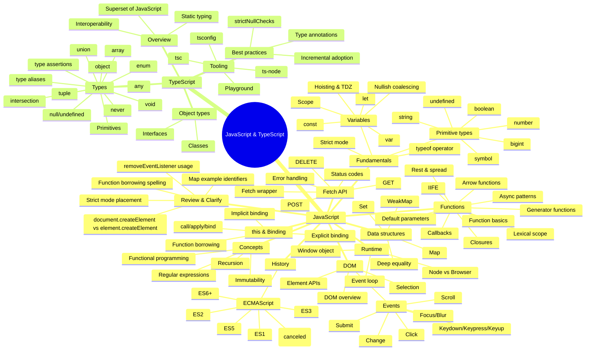

# JavaScript & TypeScript Concept Map

This mind map groups the existing JavaScript and TypeScript notes into a navigable concept structure.
It is designed to make relationships between topics easier to see and to highlight where to add or refine explanations.

## Suggested navigation pattern
- Use this map as the top-level index.
- Link each node to a dedicated section or file (if you want to split the notes later).
- Use the **Review & Clarify** branch as a backlog for tightening explanations and examples.
